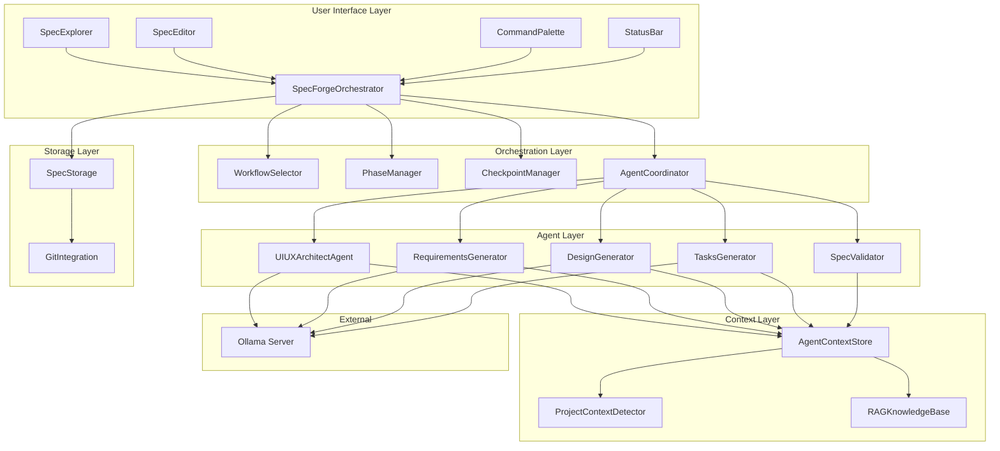
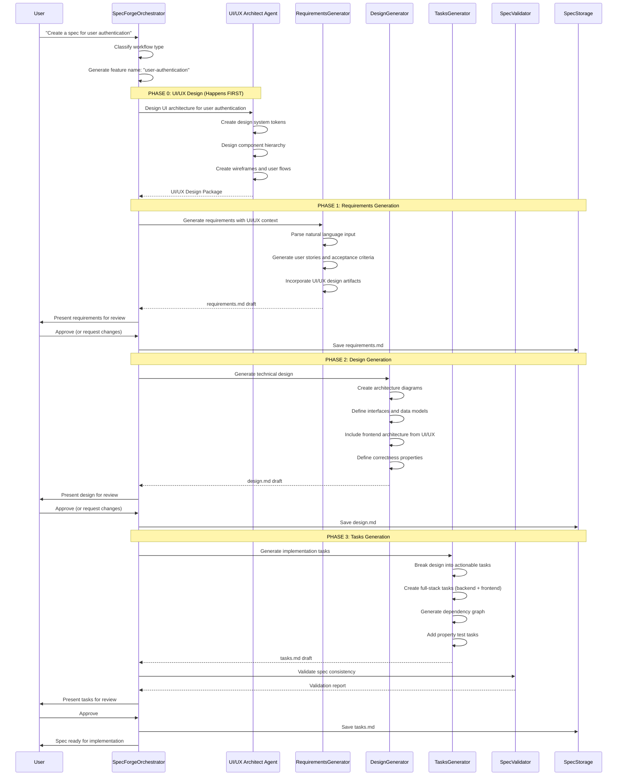

# Design Document: SpecForge

## Overview

SpecForge is the AI-powered specification generation feature for ForgeAI. It transforms natural language descriptions into structured, implementation-ready specifications with a unique approach: UI/UX design happens FIRST, ensuring every task is inherently full-stack from Task 1.

### Purpose

Enable developers to:

- Generate complete specifications (requirements, design, tasks) from natural language
- Collaborate with UI/UX Architect Agent for integrated frontend/backend planning
- Execute spec-driven development with human validation checkpoints
- Maintain living specifications synchronized with implementation
- Run entirely on local LLMs with zero cloud API costs

### Key Technical Decisions

| Decision               | Choice                                           | Rationale                                      |
| ---------------------- | ------------------------------------------------ | ---------------------------------------------- |
| **LLM Backend**        | Ollama (Llama 3.1, Qwen 2.5)                     | Zero cost, local execution, privacy-preserving |
| **Spec Storage**       | `.forge/{feature-name}/` directory               | Persistent, version-controllable, accessible   |
| **Document Format**    | Markdown with structured sections                | Human-readable, diffable, extensible           |
| **Agent Architecture** | Multi-agent coordination with shared context     | Specialized expertise per phase                |
| **UI/UX Integration**  | UI/UX Agent executes before spec generation      | Ensures full-stack tasks from the start        |
| **Validation**         | Property-based testing + cross-document analysis | Automated quality assurance                    |

### Constraints

- **Zero cloud cost**: All LLM operations via Ollama
- **Privacy-first**: No spec data leaves local machine
- **Human-in-the-loop**: Validation checkpoints at every phase
- **Full-stack by design**: Every task includes frontend and backend

---

## Architecture

### High-Level Architecture

```
┌─────────────────────────────────────────────────────────────────────────────────┐
│                              VS Code Extension Host                              │
│  ┌───────────────────────────────────────────────────────────────────────────┐  │
│  │                           ForgeAI Extension                                │  │
│  │  ┌────────────────┐  ┌────────────────┐  ┌────────────────────────────┐  │  │
│  │  │  SpecExplorer  │  │ SpecEditor     │  │   Command Palette          │  │  │
│  │  │  (Tree View)   │  │ (Preview)      │  │   Commands                 │  │  │
│  │  └───────┬────────┘  └───────┬────────┘  └─────────────┬──────────────┘  │  │
│  │          │                   │                         │                  │  │
│  │          └───────────────────┼─────────────────────────┘                  │  │
│  │                              ▼                                            │  │
│  │  ┌─────────────────────────────────────────────────────────────────────┐  │  │
│  │  │                     SpecForgeOrchestrator                            │  │  │
│  │  │  - Workflow selection and routing                                    │  │  │
│  │  │  - Phase management and checkpoints                                  │  │  │
│  │  │  - Agent coordination                                                │  │  │
│  │  │  - Context persistence                                               │  │  │
│  │  └─────────────────────────────┬───────────────────────────────────────┘  │  │
│  │                                │                                          │  │
│  │           ┌────────────────────┼────────────────────┐                    │  │
│  │           ▼                    ▼                    ▼                    │  │
│  │  ┌────────────────┐  ┌────────────────┐  ┌────────────────────────┐     │  │
│  │  │ UI/UX Architect│  │ SpecGenerator  │  │    SpecValidator       │     │  │
│  │  │     Agent      │  │    Agents      │  │                        │     │  │
│  │  │  (DESIGNS FIRST)│  │                │  │                        │     │  │
│  │  └───────┬────────┘  └───────┬────────┘  └───────────┬────────────┘     │  │
│  │          │                   │                       │                   │  │
│  │          └───────────────────┼───────────────────────┘                   │  │
│  │                              ▼                                            │  │
│  │  ┌─────────────────────────────────────────────────────────────────────┐  │  │
│  │  │                     AgentContextStore                                │  │  │
│  │  │  - Shared context between agents                                     │  │  │
│  │  │  - Conversation history                                               │  │  │
│  │  │  - UI/UX design artifacts                                             │  │  │
│  │  │  - Spec document state                                                │  │  │
│  │  └─────────────────────────────────────────────────────────────────────┘  │  │
│  └───────────────────────────────────────────────────────────────────────────┘  │
└─────────────────────────────────────────────────────────────────────────────────┘
                                     │
                                     ▼
┌─────────────────────────────────────────────────────────────────────────────────┐
│                          Supporting Services                                     │
│  ┌────────────────┐  ┌────────────────┐  ┌────────────────────────────────┐    │
│  │ SpecStorage    │  │ RAGKnowledge   │  │ OllamaClient                   │    │
│  │ (.forge/)      │  │ Base           │  │ (localhost:11434)              │    │
│  └────────────────┘  └────────────────┘  └────────────────────────────────┘    │
└─────────────────────────────────────────────────────────────────────────────────┘
```

### Component Diagram



### Spec Generation Flow (UI/UX-First)



---

## Components and Interfaces

### 1. SpecForgeOrchestrator

The main orchestrator that coordinates all spec creation activities.

```typescript
/**
 * SpecForgeOrchestrator - Main coordinator for spec creation
 *
 * Responsibilities:
 * - Workflow selection and routing
 * - Phase management and transitions
 * - Agent coordination and communication
 * - Checkpoint management
 * - Context persistence
 */
export class SpecForgeOrchestrator {
  readonly name = 'specforge-orchestrator';

  private workflowSelector: WorkflowSelector;
  private phaseManager: PhaseManager;
  private checkpointManager: CheckpointManager;
  private agentCoordinator: AgentCoordinator;
  private contextStore: AgentContextStore;
  private specStorage: SpecStorage;

  constructor(private context: vscode.ExtensionContext) {
    this.contextStore = new AgentContextStore(context);
    this.specStorage = new SpecStorage(context);
    this.workflowSelector = new WorkflowSelector();
    this.phaseManager = new PhaseManager();
    this.checkpointManager = new CheckpointManager();
    this.agentCoordinator = new AgentCoordinator(this.contextStore);
  }

  /**
   * Main entry point for spec creation
   */
  async createSpec(input: SpecCreationInput): Promise<Spec> {
    // 1. Analyze input and classify workflow
    const workflowType = await this.workflowSelector.classify(input.description);

    // 2. Generate feature name
    const featureName = this.generateFeatureName(input.description);

    // 3. Initialize spec context
    const specContext = await this.initializeSpecContext(featureName, workflowType);

    // 4. Execute UI/UX design phase FIRST
    const uiDesignPackage = await this.executeUIUXPhase(input, specContext);
    specContext.uiDesignPackage = uiDesignPackage;

    // 5. Execute workflow phases based on type
    switch (workflowType) {
      case 'requirements-first':
        return this.executeRequirementsFirstWorkflow(specContext);
      case 'design-first':
        return this.executeDesignFirstWorkflow(specContext);
      case 'bugfix':
        return this.executeBugfixWorkflow(specContext);
      case 'fast-task':
        return this.executeFastTaskWorkflow(specContext);
    }
  }

  /**
   * Execute UI/UX design phase before any spec generation
   */
  private async executeUIUXPhase(
    input: SpecCreationInput,
    context: SpecContext
  ): Promise<UIDesignPackage> {
    const uiuxAgent = this.agentCoordinator.getAgent('ui-ux-architect');

    // Request comprehensive UI/UX design
    const designRequest: UIUXDesignRequest = {
      featureDescription: input.description,
      featureName: context.featureName,
      projectContext: context.projectContext,
      includeDesignSystem: true,
      includeComponentHierarchy: true,
      includeWireframes: true,
      includeUserFlows: true,
    };

    const designPackage = await uiuxAgent.designFeature(designRequest);

    // Store design artifacts
    await this.specStorage.storeUIDesign(context.featureName, designPackage);

    return designPackage;
  }

  /**
   * Execute requirements-first workflow
   */
  private async executeRequirementsFirstWorkflow(context: SpecContext): Promise<Spec> {
    // Phase 1: Requirements
    const requirements = await this.generateRequirements(context);
    await this.checkpointManager.waitForApproval('requirements', requirements);

    // Phase 2: Design
    const design = await this.generateDesign(context, requirements);
    await this.checkpointManager.waitForApproval('design', design);

    // Phase 3: Tasks
    const tasks = await this.generateTasks(context, requirements, design);
    await this.checkpointManager.waitForApproval('tasks', tasks);

    return { requirements, design, tasks, uiDesignPackage: context.uiDesignPackage };
  }

  /**
   * Generate requirements document with UI/UX context
   */
  private async generateRequirements(context: SpecContext): Promise<RequirementsDocument> {
    const generator = this.agentCoordinator.getAgent('requirements-generator');

    return generator.generate({
      featureDescription: context.input.description,
      uiDesignPackage: context.uiDesignPackage,
      projectContext: context.projectContext,
      clarifications: context.clarifications,
    });
  }

  /**
   * Generate design document with UI/UX architecture
   */
  private async generateDesign(
    context: SpecContext,
    requirements: RequirementsDocument
  ): Promise<DesignDocument> {
    const generator = this.agentCoordinator.getAgent('design-generator');

    return generator.generate({
      requirements,
      uiDesignPackage: context.uiDesignPackage,
      projectContext: context.projectContext,
    });
  }

  /**
   * Generate tasks with full-stack pairing
   */
  private async generateTasks(
    context: SpecContext,
    requirements: RequirementsDocument,
    design: DesignDocument
  ): Promise<TasksDocument> {
    const generator = this.agentCoordinator.getAgent('tasks-generator');

    return generator.generate({
      requirements,
      design,
      uiDesignPackage: context.uiDesignPackage,
      projectContext: context.projectContext,
    });
  }
}

/**
 * Spec creation input
 */
interface SpecCreationInput {
  description: string;
  workflowType?: WorkflowType;
  clarifications?: Map<string, string>;
}

/**
 * Spec context shared across all phases
 */
interface SpecContext {
  featureName: string;
  workflowType: WorkflowType;
  input: SpecCreationInput;
  projectContext: ProjectContext;
  uiDesignPackage?: UIDesignPackage;
  clarifications: Map<string, string>;
  createdAt: number;
}
```

### 2. AgentCoordinator

Coordinates communication between specialized agents.

```typescript
/**
 * AgentCoordinator - Manages agent communication and context sharing
 *
 * Responsibilities:
 * - Agent registration and retrieval
 * - Inter-agent communication
 * - Context propagation
 * - Error handling and fallbacks
 */
export class AgentCoordinator {
  private agents: Map<AgentRole, SpecAgent> = new Map();
  private contextStore: AgentContextStore;

  constructor(contextStore: AgentContextStore) {
    this.contextStore = contextStore;
    this.registerDefaultAgents();
  }

  /**
   * Register default agents
   */
  private registerDefaultAgents(): void {
    this.registerAgent('ui-ux-architect', new UIUXArchitectAgent());
    this.registerAgent('requirements-generator', new RequirementsGeneratorAgent());
    this.registerAgent('design-generator', new DesignGeneratorAgent());
    this.registerAgent('tasks-generator', new TasksGeneratorAgent());
    this.registerAgent('spec-validator', new SpecValidatorAgent());
  }

  /**
   * Get agent by role
   */
  getAgent<T extends SpecAgent>(role: AgentRole): T {
    const agent = this.agents.get(role);
    if (!agent) {
      throw new Error(`Agent not found: ${role}`);
    }
    return agent as T;
  }

  /**
   * Execute agent with shared context
   */
  async executeAgent(
    role: AgentRole,
    input: AgentInput,
    options?: AgentExecutionOptions
  ): Promise<AgentOutput> {
    const agent = this.getAgent(role);

    // Load shared context
    const sharedContext = await this.contextStore.getContext();

    // Execute agent
    const output = await agent.execute(input, sharedContext);

    // Store updated context
    await this.contextStore.updateContext(output.contextUpdates);

    return output;
  }

  /**
   * Coordinate multi-agent workflow
   */
  async coordinateWorkflow(workflow: WorkflowType, context: SpecContext): Promise<Spec> {
    const workflowConfig = WORKFLOW_CONFIGS[workflow];

    for (const phase of workflowConfig.phases) {
      const agent = this.getAgent(phase.agent);
      const input = this.preparePhaseInput(phase, context);

      const output = await agent.execute(input, context);

      // Store phase output
      context[phase.outputKey] = output.document;

      // Check for checkpoint
      if (phase.requiresApproval) {
        await this.waitForHumanApproval(phase.name, output.document);
      }
    }

    return this.buildSpec(context);
  }
}

type AgentRole =
  | 'ui-ux-architect'
  | 'requirements-generator'
  | 'design-generator'
  | 'tasks-generator'
  | 'spec-validator';

interface AgentInput {
  type: string;
  payload: any;
  metadata?: Record<string, any>;
}

interface AgentOutput {
  document?: any;
  contextUpdates?: Partial<SpecContext>;
  validation?: ValidationResult;
  error?: Error;
}
```

### 3. UIUXArchitectAgent Integration

The UI/UX Architect Agent executes first and provides design context.

```typescript
/**
 * UIUXArchitectAgent - Specialized agent for UI/UX design
 *
 * This agent MUST execute before any spec generation to ensure
 * full-stack tasks from the start.
 */
export class UIUXArchitectAgent implements SpecAgent {
  readonly name = 'ui-ux-architect';
  readonly description = 'Creates comprehensive UI/UX architecture before spec generation';

  private ollamaClient: OllamaClient;
  private ragKnowledgeBase: RAGKnowledgeBase;
  private projectDetector: ProjectContextDetector;

  /**
   * Design the complete UI architecture for a feature
   */
  async designFeature(request: UIUXDesignRequest): Promise<UIDesignPackage> {
    // 1. Detect project context
    const projectContext = await this.projectDetector.detect(request.projectContext?.workspacePath);

    // 2. Query RAG for relevant design patterns
    const designPatterns = await this.ragKnowledgeBase.query(
      `UI/UX design patterns for ${request.featureDescription}`,
      { collection: 'design-patterns', nResults: 5 }
    );

    // 3. Generate design system if needed
    let designSystem: DesignSystem | undefined;
    if (request.includeDesignSystem) {
      designSystem = await this.generateDesignSystem(projectContext, request);
    }

    // 4. Generate component hierarchy
    const componentHierarchy = request.includeComponentHierarchy
      ? await this.generateComponentHierarchy(request, designSystem)
      : undefined;

    // 5. Generate wireframes
    const wireframes = request.includeWireframes
      ? await this.generateWireframes(request, componentHierarchy)
      : undefined;

    // 6. Generate user flows
    const userFlows = request.includeUserFlows ? await this.generateUserFlows(request) : undefined;

    return {
      featureName: request.featureName,
      designSystem,
      componentHierarchy,
      wireframes,
      userFlows,
      projectContext,
      generatedAt: Date.now(),
    };
  }

  /**
   * Generate design system tokens
   */
  private async generateDesignSystem(
    projectContext: ProjectContext,
    request: UIUXDesignRequest
  ): Promise<DesignSystem> {
    const prompt = this.buildDesignSystemPrompt(request, projectContext);

    const response = await this.ollamaClient.generate(prompt, {
      model: 'llama3.1:70b',
      stream: true,
    });

    return this.parseDesignSystemResponse(response);
  }

  /**
   * Generate component hierarchy following Atomic Design
   */
  private async generateComponentHierarchy(
    request: UIUXDesignRequest,
    designSystem?: DesignSystem
  ): Promise<ComponentHierarchy> {
    const prompt = this.buildComponentHierarchyPrompt(request, designSystem);

    const response = await this.ollamaClient.generate(prompt, {
      model: 'llama3.1:70b',
      stream: true,
    });

    return this.parseComponentHierarchyResponse(response);
  }

  /**
   * Build the system prompt for UI/UX design
   */
  getSystemPrompt(): string {
    return `You are the UI/UX Architect Agent, a specialized AI for designing user interfaces and experiences.

# Core Responsibilities

1. **Design System Creation**: Generate comprehensive design tokens (colors, typography, spacing, shadows, animations)
2. **Component Hierarchy**: Design components following Atomic Design methodology (atoms → molecules → organisms → templates → pages)
3. **Wireframe Generation**: Create detailed wireframe descriptions showing layout and structure
4. **User Flow Design**: Map out user journeys and interaction flows

# Design Principles

1. **Consistency**: Maintain visual and interaction consistency
2. **Accessibility**: All designs must meet WCAG 2.1 Level AA requirements
3. **Platform-Appropriate**: Respect platform conventions
4. **Scalable**: Design systems should grow with the project

# Output Format

When generating designs:
- Use JSON format for design tokens
- Use structured markdown for component definitions
- Include CSS/Tailwind code examples
- Provide accessibility annotations

Remember: You are designing the foundation that will guide the entire spec generation process.`;
  }
}

/**
 * UI/UX Design Package - Output of the UI/UX phase
 */
interface UIDesignPackage {
  featureName: string;
  designSystem?: DesignSystem;
  componentHierarchy?: ComponentHierarchy;
  wireframes?: Wireframe[];
  userFlows?: UserFlow[];
  projectContext: ProjectContext;
  generatedAt: number;
}

/**
 * Design System - Complete set of design tokens
 */
interface DesignSystem {
  colors: ColorTokens;
  typography: TypographyTokens;
  spacing: SpacingTokens;
  shadows: ShadowTokens;
  animation: AnimationTokens;
  breakpoints?: BreakpointTokens;
}

/**
 * Component Hierarchy - Atomic Design structure
 */
interface ComponentHierarchy {
  atoms: ComponentDefinition[];
  molecules: ComponentDefinition[];
  organisms: ComponentDefinition[];
  templates: TemplateDefinition[];
  pages: PageDefinition[];
}

/**
 * Component Definition
 */
interface ComponentDefinition {
  name: string;
  description: string;
  props: PropDefinition[];
  variants: ComponentVariant[];
  states: ComponentState[];
  accessibility: AccessibilityRequirements;
  designTokens: string[]; // References to design system tokens
}
```

### 4. TasksGenerator with Full-Stack Pairing

Generates tasks that include both backend and frontend components.

```typescript
/**
 * TasksGenerator - Generates implementation tasks with full-stack pairing
 *
 * Key Feature: Every task includes both backend AND frontend subtasks
 * when UI is involved, ensuring visible progress from Task 1.
 */
export class TasksGeneratorAgent implements SpecAgent {
  readonly name = 'tasks-generator';

  private ollamaClient: OllamaClient;
  private uiDesignPackage: UIDesignPackage | null = null;

  /**
   * Generate tasks document with full-stack task pairing
   */
  async generate(input: TasksGeneratorInput): Promise<TasksDocument> {
    this.uiDesignPackage = input.uiDesignPackage;

    // 1. Extract implementation units from design
    const implementationUnits = await this.extractImplementationUnits(
      input.design,
      input.requirements
    );

    // 2. Break down into appropriately-sized tasks
    const tasks = await this.breakIntoTasks(implementationUnits);

    // 3. Add full-stack pairing to each task
    const fullStackTasks = this.addFullStackPairing(tasks, input.uiDesignPackage);

    // 4. Generate dependency graph
    const dependencyGraph = this.generateDependencyGraph(fullStackTasks);

    // 5. Add property test tasks
    const tasksWithTests = this.addPropertyTestTasks(fullStackTasks, input.design);

    // 6. Add checkpoints between phases
    const tasksWithCheckpoints = this.addCheckpoints(tasksWithTests);

    return {
      overview: this.generateOverview(input),
      tasks: tasksWithCheckpoints,
      dependencyGraph,
      generatedAt: Date.now(),
    };
  }

  /**
   * Add full-stack pairing to tasks
   *
   * This is the KEY method that ensures every task has both
   * backend and frontend subtasks.
   */
  private addFullStackPairing(tasks: Task[], uiDesignPackage?: UIDesignPackage): Task[] {
    if (!uiDesignPackage) {
      return tasks; // No UI design, no frontend tasks needed
    }

    return tasks.map((task) => {
      // Check if this task involves user-facing functionality
      if (this.hasUserFacingComponents(task, uiDesignPackage)) {
        return this.pairWithFrontend(task, uiDesignPackage);
      }
      return task;
    });
  }

  /**
   * Check if task involves user-facing components
   */
  private hasUserFacingComponents(task: Task, uiDesignPackage: UIDesignPackage): boolean {
    // Check component hierarchy for relevant components
    const relevantComponents = this.findRelevantComponents(
      task,
      uiDesignPackage.componentHierarchy
    );

    return relevantComponents.length > 0;
  }

  /**
   * Pair a backend task with its frontend counterpart
   */
  private pairWithFrontend(task: Task, uiDesignPackage: UIDesignPackage): FullStackTask {
    const frontendSubtasks = this.generateFrontendSubtasks(task, uiDesignPackage);

    return {
      ...task,
      type: 'full-stack',
      subtasks: {
        backend: task.subtasks?.filter((s) => s.type === 'backend') || [],
        frontend: frontendSubtasks,
      },
      uiComponents: this.getUIComponentReferences(task, uiDesignPackage),
    };
  }

  /**
   * Generate frontend subtasks based on UI design
   */
  private generateFrontendSubtasks(
    task: Task,
    uiDesignPackage: UIDesignPackage
  ): FrontendSubtask[] {
    const components = this.findRelevantComponents(task, uiDesignPackage.componentHierarchy);

    return components.map((component) => ({
      id: `${task.id}-fe-${component.name.toLowerCase().replace(/\s+/g, '-')}`,
      title: `Implement ${component.name} component`,
      type: 'frontend' as const,
      description: `Create the ${component.name} component with the following specifications:\n${component.description}`,
      componentRef: component.name,
      designTokens: component.designTokens,
      props: component.props,
      accessibility: component.accessibility,
      requirements: this.mapComponentToRequirements(component, task.requirements),
      estimatedDuration: this.estimateFrontendDuration(component),
    }));
  }

  /**
   * Generate the task dependency graph with parallel waves
   */
  private generateDependencyGraph(tasks: Task[]): TaskDependencyGraph {
    const graph: TaskDependencyGraph = {
      waves: [],
      tasks: {},
    };

    // Build adjacency list
    const dependencies = new Map<string, string[]>();
    for (const task of tasks) {
      dependencies.set(task.id, task.dependsOn || []);
      graph.tasks[task.id] = {
        id: task.id,
        dependencies: task.dependsOn || [],
        dependents: [],
      };
    }

    // Build reverse dependencies
    for (const task of tasks) {
      for (const depId of task.dependsOn || []) {
        if (graph.tasks[depId]) {
          graph.tasks[depId].dependents.push(task.id);
        }
      }
    }

    // Topological sort with wave assignment
    const inDegree = new Map<string, number>();
    for (const [id, deps] of dependencies) {
      inDegree.set(id, deps.length);
    }

    let wave = 0;
    const queue: string[] = [];

    // Initialize with tasks that have no dependencies
    for (const [id, degree] of inDegree) {
      if (degree === 0) {
        queue.push(id);
      }
    }

    while (queue.length > 0) {
      graph.waves.push({ id: wave, tasks: [...queue] });

      const nextQueue: string[] = [];
      for (const taskId of queue) {
        for (const dependentId of graph.tasks[taskId].dependents) {
          const newDegree = (inDegree.get(dependentId) || 1) - 1;
          inDegree.set(dependentId, newDegree);
          if (newDegree === 0) {
            nextQueue.push(dependentId);
          }
        }
      }

      queue.length = 0;
      queue.push(...nextQueue);
      wave++;
    }

    return graph;
  }
}

/**
 * Full-Stack Task - Task with both backend and frontend subtasks
 */
interface FullStackTask extends Task {
  type: 'full-stack';
  subtasks: {
    backend: BackendSubtask[];
    frontend: FrontendSubtask[];
  };
  uiComponents: string[]; // References to UI design components
}

/**
 * Frontend Subtask
 */
interface FrontendSubtask {
  id: string;
  title: string;
  type: 'frontend';
  description: string;
  componentRef: string; // Reference to component in UI design
  designTokens: string[]; // Design tokens to use
  props: PropDefinition[]; // Component props
  accessibility: AccessibilityRequirements;
  requirements: string[]; // Requirement IDs this implements
  estimatedDuration: number; // Minutes
}

/**
 * Tasks Document
 */
interface TasksDocument {
  overview: string;
  tasks: Task[];
  dependencyGraph: TaskDependencyGraph;
  generatedAt: number;
}
```

### 5. SpecStorage

Manages persistence of spec documents and UI design artifacts.

```typescript
/**
 * SpecStorage - Manages spec persistence in .forge/{feature-name}/
 *
 * Directory structure:
 * .forge/{feature-name}/
 * ├── .config.forge          # Metadata
 * ├── requirements.md        # Requirements document
 * ├── design.md              # Design document
 * ├── tasks.md               # Tasks document
 * └── ui-design/             # UI/UX design artifacts
 *     ├── design-system.json
 *     ├── component-hierarchy.json
 *     ├── wireframes/
 *     └── user-flows/
 */
export class SpecStorage {
  private readonly basePath = '.forge';

  constructor(private context: vscode.ExtensionContext) {}

  /**
   * Initialize a new spec directory
   */
  async initializeSpec(featureName: string, config: SpecConfig): Promise<void> {
    const specPath = path.join(this.basePath, featureName);

    // Create directory structure
    await vscode.workspace.fs.createDirectory(vscode.Uri.file(specPath));
    await vscode.workspace.fs.createDirectory(vscode.Uri.file(path.join(specPath, 'ui-design')));

    // Write config
    await this.writeConfig(specPath, config);
  }

  /**
   * Store UI/UX design package
   */
  async storeUIDesign(featureName: string, designPackage: UIDesignPackage): Promise<void> {
    const uiDesignPath = path.join(this.basePath, featureName, 'ui-design');

    // Store design system
    if (designPackage.designSystem) {
      await this.writeJSON(
        path.join(uiDesignPath, 'design-system.json'),
        designPackage.designSystem
      );
    }

    // Store component hierarchy
    if (designPackage.componentHierarchy) {
      await this.writeJSON(
        path.join(uiDesignPath, 'component-hierarchy.json'),
        designPackage.componentHierarchy
      );
    }

    // Store wireframes
    if (designPackage.wireframes) {
      await vscode.workspace.fs.createDirectory(
        vscode.Uri.file(path.join(uiDesignPath, 'wireframes'))
      );
      for (const wireframe of designPackage.wireframes) {
        await this.writeJSON(
          path.join(uiDesignPath, 'wireframes', `${wireframe.name}.json`),
          wireframe
        );
      }
    }

    // Store user flows
    if (designPackage.userFlows) {
      await vscode.workspace.fs.createDirectory(
        vscode.Uri.file(path.join(uiDesignPath, 'user-flows'))
      );
      for (const flow of designPackage.userFlows) {
        await this.writeJSON(path.join(uiDesignPath, 'user-flows', `${flow.name}.json`), flow);
      }
    }
  }

  /**
   * Store requirements document
   */
  async storeRequirements(
    featureName: string,
    requirements: RequirementsDocument
  ): Promise<string> {
    const filePath = path.join(this.basePath, featureName, 'requirements.md');
    const content = this.serializeRequirements(requirements);

    await vscode.workspace.fs.writeFile(vscode.Uri.file(filePath), Buffer.from(content));

    return filePath;
  }

  /**
   * Store design document
   */
  async storeDesign(featureName: string, design: DesignDocument): Promise<string> {
    const filePath = path.join(this.basePath, featureName, 'design.md');
    const content = this.serializeDesign(design);

    await vscode.workspace.fs.writeFile(vscode.Uri.file(filePath), Buffer.from(content));

    return filePath;
  }

  /**
   * Store tasks document
   */
  async storeTasks(featureName: string, tasks: TasksDocument): Promise<string> {
    const filePath = path.join(this.basePath, featureName, 'tasks.md');
    const content = this.serializeTasks(tasks);

    await vscode.workspace.fs.writeFile(vscode.Uri.file(filePath), Buffer.from(content));

    return filePath;
  }

  /**
   * Load complete spec
   */
  async loadSpec(featureName: string): Promise<Spec | null> {
    const specPath = path.join(this.basePath, featureName);

    try {
      const [config, requirements, design, tasks, uiDesignPackage] = await Promise.all([
        this.loadConfig(specPath),
        this.loadRequirements(specPath),
        this.loadDesign(specPath),
        this.loadTasks(specPath),
        this.loadUIDesignPackage(specPath),
      ]);

      return {
        config,
        requirements,
        design,
        tasks,
        uiDesignPackage,
      };
    } catch (error) {
      console.error(`Failed to load spec: ${featureName}`, error);
      return null;
    }
  }

  /**
   * Load UI design package
   */
  private async loadUIDesignPackage(specPath: string): Promise<UIDesignPackage | undefined> {
    const uiDesignPath = path.join(specPath, 'ui-design');

    try {
      const [designSystem, componentHierarchy] = await Promise.all([
        this.readJSON<DesignSystem>(path.join(uiDesignPath, 'design-system.json')),
        this.readJSON<ComponentHierarchy>(path.join(uiDesignPath, 'component-hierarchy.json')),
      ]);

      return {
        featureName: path.basename(specPath),
        designSystem,
        componentHierarchy,
        generatedAt: Date.now(),
      } as UIDesignPackage;
    } catch {
      return undefined;
    }
  }
}

/**
 * Spec configuration stored in .config.forge
 */
interface SpecConfig {
  id: string;
  featureName: string;
  workflowType: WorkflowType;
  specType: SpecType;
  status: SpecStatus;
  createdAt: number;
  updatedAt: number;
  phases: {
    requirements?: { status: PhaseStatus; approvedAt?: number };
    design?: { status: PhaseStatus; approvedAt?: number };
    tasks?: { status: PhaseStatus; approvedAt?: number };
  };
}

type SpecStatus = 'in-progress' | 'complete' | 'archived';
type PhaseStatus = 'pending' | 'generated' | 'approved' | 'needs-revision';
```

---

## State Management

### Spec Generation State

```typescript
/**
 * Spec generation state machine
 */
interface SpecGenerationState {
  // Overall status
  status: 'idle' | 'ui-designing' | 'generating' | 'waiting-approval' | 'complete' | 'error';

  // Current phase
  currentPhase: 'ui-design' | 'requirements' | 'design' | 'tasks' | null;

  // Phase progress
  phaseProgress{}
```

phaseProgress: {
uiDesign: PhaseProgress;
requirements: PhaseProgress;
design: PhaseProgress;
tasks: PhaseProgress;
};

// Generated documents
documents: {
requirements?: RequirementsDocument;
design?: DesignDocument;
tasks?: TasksDocument;
};

// UI design package
uiDesignPackage?: UIDesignPackage;

// Validation results
validation: ValidationResult | null;

// Error state
error?: {
phase: string;
message: string;
recoverable: boolean;
};
}

interface PhaseProgress {
status: 'pending' | 'in-progress' | 'complete' | 'error';
percentage: number; // 0-100
message: string;
startedAt?: number;
completedAt?: number;
}

````

### State Transitions

```mermaid
stateDiagram-v2
    [*] --> Idle

    Idle --> UIDesigning: User initiates spec creation

    UIDesigning --> RequirementsGenerating: UI/UX design complete
    UIDesigning --> Error: UI/UX Agent fails

    RequirementsGenerating --> WaitingApproval: Requirements generated
    RequirementsGenerating --> Error: Generation fails

    WaitingApproval --> DesignGenerating: User approves
    WaitingApproval --> RequirementsGenerating: User requests changes

    DesignGenerating --> WaitingApproval: Design generated
    DesignGenerating --> Error: Generation fails

    DesignGenerating --> WaitingApproval: User approves
    DesignGenerating --> DesignGenerating: User requests changes

    TasksGenerating --> WaitingApproval: Tasks generated
    TasksGenerating --> Error: Generation fails

    WaitingApproval --> Complete: User approves tasks
    WaitingApproval --> TasksGenerating: User requests changes

    Error --> Idle: User retries
    Error --> Idle: User cancels

    Complete --> [*]
````

---

## Error Handling

### Error Categories

```typescript
/**
 * Error categories for spec generation
 */
enum SpecErrorCode {
  // Ollama errors
  OLLAMA_UNAVAILABLE = 'OLLAMA_UNAVAILABLE',
  OLLAMA_TIMEOUT = 'OLLAMA_TIMEOUT',
  OLLAMA_MODEL_NOT_FOUND = 'OLLAMA_MODEL_NOT_FOUND',

  // Generation errors
  GENERATION_FAILED = 'GENERATION_FAILED',
  VALIDATION_FAILED = 'VALIDATION_FAILED',
  PARSING_FAILED = 'PARSING_FAILED',

  // Storage errors
  STORAGE_WRITE_FAILED = 'STORAGE_WRITE_FAILED',
  STORAGE_READ_FAILED = 'STORAGE_READ_FAILED',

  // Workflow errors
  INVALID_WORKFLOW_TYPE = 'INVALID_WORKFLOW_TYPE',
  MISSING_PREREQUISITE = 'MISSING_PREREQUISITE',
  CHECKPOINT_REJECTED = 'CHECKPOINT_REJECTED',
}

/**
 * Error recovery strategies
 */
interface ErrorRecoveryStrategy {
  code: SpecErrorCode;
  strategy: 'retry' | 'fallback' | 'abort';
  maxRetries: number;
  fallbackAction?: () => Promise<void>;
  userMessage: string;
}

const ERROR_RECOVERY_STRATEGIES: ErrorRecoveryStrategy[] = [
  {
    code: SpecErrorCode.OLLAMA_UNAVAILABLE,
    strategy: 'abort',
    maxRetries: 0,
    userMessage: 'Ollama server is not running. Please start Ollama and try again.',
  },
  {
    code: SpecErrorCode.GENERATION_FAILED,
    strategy: 'retry',
    maxRetries: 3,
    userMessage: 'Generation failed. Retrying...',
  },
  {
    code: SpecErrorCode.VALIDATION_FAILED,
    strategy: 'fallback',
    maxRetries: 0,
    fallbackAction: async () => {
      // Generate simpler spec
    },
    userMessage: 'Validation detected issues. Generating simplified spec.',
  },
];
```

---

## Testing Strategy

### Unit Tests

1. **WorkflowSelector Tests**
   - Test classification of natural language inputs
   - Test workflow recommendation logic

2. **RequirementsGenerator Tests**
   - Test parsing natural language to structured requirements
   - Test EARS notation generation
   - Test clarifying question generation

3. **DesignGenerator Tests**
   - Test architecture diagram generation
   - Test interface definition generation
   - Test UI/UX integration

4. **TasksGenerator Tests**
   - Test task breakdown logic
   - Test full-stack pairing
   - Test dependency graph generation

### Integration Tests

1. **End-to-End Spec Generation**
   - Test complete workflow from input to final spec
   - Test UI/UX first integration
   - Test human approval checkpoints

2. **Multi-Agent Coordination**
   - Test agent communication
   - Test context propagation
   - Test error handling between agents

### Property-Based Tests

```typescript
import fc from 'fast-check';
import { describe, it } from 'vitest';

describe('SpecForge Property Tests', () => {
  it('should generate valid requirements for any feature description', () => {
    fc.assert(
      fc.property(fc.string({ minLength: 10, maxLength: 500 }), (description) => {
        const requirements = generateRequirements(description);
        return (
          requirements.every((r) => r.id !== undefined) &&
          requirements.every((r) => r.userStory !== undefined) &&
          requirements.every((r) => r.acceptanceCriteria.length > 0)
        );
      }),
      { numRuns: 100 }
    );
  });

  it('should generate acyclic dependency graph for any task set', () => {
    fc.assert(
      fc.property(
        fc.array(
          fc.record({
            id: fc.string(),
            dependsOn: fc.array(fc.string()),
          })
        ),
        (tasks) => {
          const graph = generateDependencyGraph(tasks);
          return isAcyclic(graph);
        }
      ),
      { numRuns: 100 }
    );
  });

  it('should pair all backend tasks with frontend when UI exists', () => {
    fc.assert(
      fc.property(
        fc.record({
          hasUI: fc.boolean(),
          tasks: fc.array(
            fc.record({
              id: fc.string(),
              type: fc.constant('backend'),
            })
          ),
        }),
        (input) => {
          const result = addFullStackPairing(input.tasks, input.hasUI ? {} : null);
          if (input.hasUI) {
            return result.every((t) => t.type === 'full-stack');
          }
          return result.every((t) => t.type === 'backend');
        }
      ),
      { numRuns: 100 }
    );
  });
});
```

---

## Correctness Properties

### Property 1: UI/UX First Guarantee

**Statement:** For any spec with user-facing functionality, the UI/UX design package SHALL be generated before any requirements document.

**Validation:**

```typescript
function validateUIUXFirst(context: SpecContext): boolean {
  if (hasUserFacingComponents(context.featureName)) {
    return (
      context.uiDesignPackage !== undefined &&
      context.uiDesignPackage.generatedAt < context.requirementsGeneratedAt
    );
  }
  return true;
}
```

### Property 2: Full-Stack Task Pairing

**Statement:** For any task involving user-facing functionality, there SHALL be both backend and frontend subtasks.

**Validation:**

```typescript
function validateFullStackPairing(tasks: Task[], uiDesign: UIDesignPackage): boolean {
  return tasks.every((task) => {
    if (hasUserFacingComponents(task, uiDesign)) {
      return task.subtasks.backend.length > 0 && task.subtasks.frontend.length > 0;
    }
    return true;
  });
}
```

### Property 3: Requirement Coverage

**Statement:** For any generated tasks document, all requirements SHALL have at least one implementing task.

**Validation:**

```typescript
function validateRequirementCoverage(
  requirements: RequirementsDocument,
  tasks: TasksDocument
): boolean {
  const coveredRequirements = new Set<string>();

  for (const task of tasks.tasks) {
    for (const reqId of task.requirements || []) {
      coveredRequirements.add(reqId);
    }
  }

  return requirements.requirements.every((r) => coveredRequirements.has(r.id));
}
```

### Property 4: Dependency Acyclicity

**Statement:** For any generated dependency graph, the graph SHALL be a directed acyclic graph (DAG).

**Validation:**

```typescript
function validateDependencyGraphAcyclic(graph: TaskDependencyGraph): boolean {
  // Use Kahn's algorithm to detect cycles
  const inDegree = new Map<string, number>();
  const adjacencyList = new Map<string, string[]>();

  // Initialize
  for (const [id, task] of Object.entries(graph.tasks)) {
    inDegree.set(id, task.dependencies.length);
    for (const dep of task.dependencies) {
      if (!adjacencyList.has(dep)) {
        adjacencyList.set(dep, []);
      }
      adjacencyList.get(dep)!.push(id);
    }
  }

  // Process nodes with no incoming edges
  const queue = Array.from(inDegree.entries())
    .filter(([_, degree]) => degree === 0)
    .map(([id]) => id);

  let processed = 0;
  while (queue.length > 0) {
    const node = queue.shift()!;
    processed++;

    for (const dependent of adjacencyList.get(node) || []) {
      const newDegree = inDegree.get(dependent)! - 1;
      inDegree.set(dependent, newDegree);
      if (newDegree === 0) {
        queue.push(dependent);
      }
    }
  }

  // If all nodes processed, graph is acyclic
  return processed === Object.keys(graph.tasks).length;
}
```

---

## Integration Points

### 1. VS Code Extension Integration

```typescript
// Register SpecForge commands
export function registerSpecForgeCommands(
  context: vscode.ExtensionContext,
  orchestrator: SpecForgeOrchestrator
): void {
  // Create new spec
  context.subscriptions.push(
    vscode.commands.registerCommand('specforge.newSpec', async () => {
      const input = await collectSpecInput();
      const spec = await orchestrator.createSpec(input);
      displaySpec(spec);
    })
  );

  // Continue spec
  context.subscriptions.push(
    vscode.commands.registerCommand('specforge.continueSpec', async () => {
      const activeSpec = await getActiveSpec();
      if (activeSpec) {
        await orchestrator.continueSpec(activeSpec);
      }
    })
  );

  // Validate spec
  context.subscriptions.push(
    vscode.commands.registerCommand('specforge.validateSpec', async () => {
      const activeSpec = await getActiveSpec();
      if (activeSpec) {
        const result = await orchestrator.validateSpec(activeSpec);
        displayValidationResults(result);
      }
    })
  );
}
```

### 2. UI/UX Architect Agent Integration

```typescript
// Hook into UI/UX Architect Agent
export class UIUXIntegration {
  private uiuxAgent: UIUXArchitectAgent;

  async designForSpec(request: UIUXDesignRequest): Promise<UIDesignPackage> {
    // Call UI/UX Agent to design the feature
    const designPackage = await this.uiuxAgent.designFeature(request);

    // Store for spec generation use
    await this.storeDesignPackage(request.featureName, designPackage);

    return designPackage;
  }
}
```

### 3. Ollama Integration

```typescript
// Ollama client for spec generation
export class OllamaSpecClient {
  private baseUrl = 'http://localhost:11434';

  async generateSpecContent(
    prompt: string,
    options: { model: string; stream: boolean }
  ): Promise<string> {
    const response = await fetch(`${this.baseUrl}/api/generate`, {
      method: 'POST',
      headers: { 'Content-Type': 'application/json' },
      body: JSON.stringify({
        model: options.model,
        prompt,
        stream: options.stream,
      }),
    });

    return this.parseResponse(response);
  }
}
```

---

## Performance Optimization

### Caching Strategy

```typescript
interface SpecCache {
  // Generated documents
  documents: Map<string, CachedDocument>;

  // Validation results
  validation: Map<string, ValidationResult>;

  // Context retrieval
  context: Map<string, RAGQueryResult[]>;

  // TTL configuration
  ttl: {
    documents: 3600; // 1 hour
    validation: 300; // 5 minutes
    context: 600; // 10 minutes
  };
}

class SpecCacheManager {
  private cache: SpecCache;

  async getOrGenerate<T>(key: string, generator: () => Promise<T>, ttl: number): Promise<T> {
    const cached = this.cache.documents.get(key);
    if (cached && !this.isExpired(cached)) {
      return cached.content as T;
    }

    const content = await generator();
    this.cache.documents.set(key, {
      content,
      timestamp: Date.now(),
      ttl,
    });

    return content;
  }

  private isExpired(cached: CachedDocument): boolean {
    return Date.now() - cached.timestamp > cached.ttl;
  }
}
```

### Streaming Generation

```typescript
// Stream spec generation for real-time feedback
async function* streamSpecGeneration(
  orchestrator: SpecForgeOrchestrator,
  input: SpecCreationInput
): AsyncGenerator<GenerationProgress> {
  // UI/UX Design phase
  yield { phase: 'ui-design', status: 'starting', message: 'Designing UI architecture...' };
  const uiDesign = await orchestrator.executeUIUXPhase(input);
  yield { phase: 'ui-design', status: 'complete', result: uiDesign };

  // Requirements phase
  yield { phase: 'requirements', status: 'starting', message: 'Generating requirements...' };
  for await (const chunk of orchestrator.streamRequirements(input, uiDesign)) {
    yield { phase: 'requirements', status: 'progress', chunk };
  }
  yield { phase: 'requirements', status: 'complete' };

  // Design phase
  yield { phase: 'design', status: 'starting', message: 'Generating technical design...' };
  for await (const chunk of orchestrator.streamDesign()) {
    yield { phase: 'design', status: 'progress', chunk };
  }
  yield { phase: 'design', status: 'complete' };

  // Tasks phase
  yield { phase: 'tasks', status: 'starting', message: 'Generating implementation tasks...' };
  for await (const chunk of orchestrator.streamTasks()) {
    yield { phase: 'tasks', status: 'progress', chunk };
  }
  yield { phase: 'tasks', status: 'complete' };
}
```

---

## Summary

This design document outlines the architecture for SpecForge, a specification generation feature that:

1. **Integrates UI/UX Design First**: The UI/UX Architect Agent designs the complete UI architecture before any spec generation, ensuring full-stack tasks from the start.

2. **Supports Multiple Workflows**: Requirements-first, design-first, bugfix, and fast-task workflows to match different development scenarios.

3. **Generates Full-Stack Tasks**: Every task includes both backend and frontend subtasks when UI is involved, ensuring visible progress from Task 1.

4. **Enables Human Validation**: Checkpoints at every phase allow users to review and approve generated content.

5. **Runs Locally**: All operations via Ollama ensure zero cloud costs and maximum privacy.

6. **Maintains Quality**: Property-based testing, validation, and cross-document consistency checking ensure high-quality specs.

The architecture follows the multi-agent coordination pattern with shared context, enabling specialized agents to work together on spec generation while maintaining the UI/UX-first guarantee.
