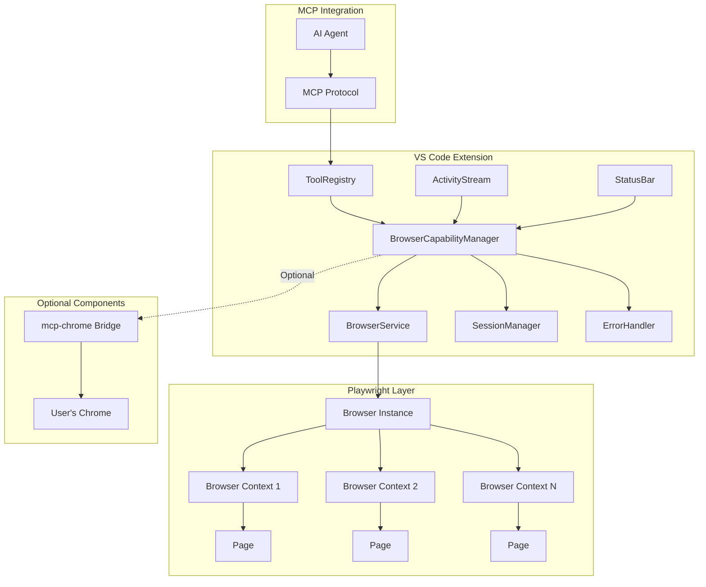
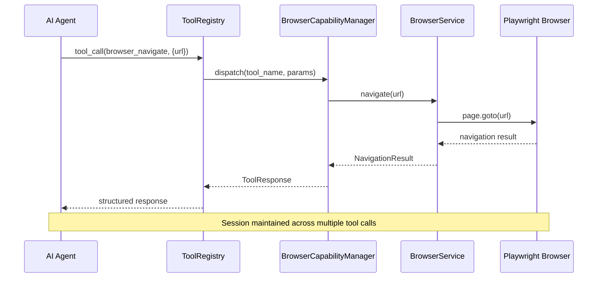
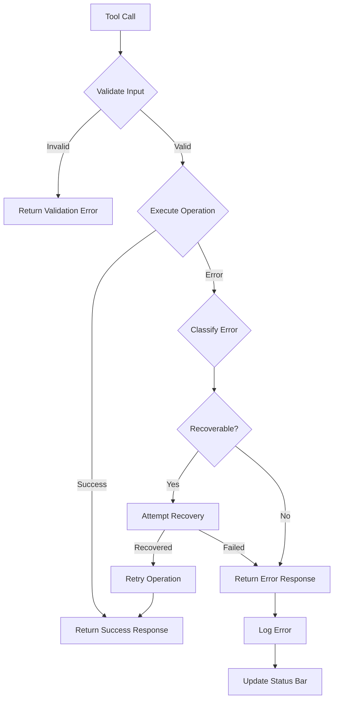

# Design Document: Browser Capability

## Overview

The Browser Capability feature enables ForgeAI's AI agent to perform real web browsing for research and information gathering. Unlike browser testing tools, this feature is designed for autonomous navigation, interaction, and data extraction from live websites.

### Purpose

Enable the AI agent to:
- Research API documentation and technical resources
- Browse GitHub issues and repositories
- Gather and compare data from multiple sources
- Navigate authenticated content (with user consent)

### Key Technical Decisions

| Decision | Choice | Rationale |
|----------|--------|-----------|
| **Browser Automation** | Playwright | Multi-browser support, auto-waiting, accessibility snapshots, official MCP integration |
| **MCP Integration** | Playwright MCP Server | Official Microsoft server, token-efficient, $0 cost |
| **VS Code Integration** | Headless browser + Simple Browser | Built-in VS Code capabilities, no external dependencies |
| **Optional Chrome Integration** | mcp-chrome | Access to logged-in sessions (opt-in feature) |

### Constraints

- **Zero cloud cost**: All operations run locally with no external services
- **Security first**: No credentials or session data transmitted externally
- **User transparency**: Headful mode for visibility, optional headless for speed

---

## Architecture

### High-Level Architecture

```
┌─────────────────────────────────────────────────────────────────────────────┐
│                           VS Code Extension Host                             │
│  ┌─────────────────────────────────────────────────────────────────────┐   │
│  │                        ForgeAI Extension                             │   │
│  │  ┌──────────────────┐  ┌──────────────────┐  ┌──────────────────┐  │   │
│  │  │   ToolRegistry   │  │  ActivityStream  │  │   StatusBar      │  │   │
│  │  │  (MCP Tools)     │  │   (UI Display)   │  │  (State Ind.)    │  │   │
│  │  └────────┬─────────┘  └────────▲─────────┘  └────────▲─────────┘  │   │
│  │           │                     │                     │            │   │
│  │           ▼                     │                     │            │   │
│  │  ┌────────────────────────────────────────────────────────────────┐ │   │
│  │  │                   BrowserCapabilityManager                     │ │   │
│  │  │  - Session lifecycle management                                │ │   │
│  │  │  - Tool registration and dispatch                              │ │   │
│  │  │  - Error handling and recovery                                 │ │   │
│  │  │  - Resource management                                         │ │   │
│  │  └─────────────────────────┬──────────────────────────────────────┘ │   │
│  │                            │                                         │   │
│  │                            ▼                                         │   │
│  │  ┌────────────────────────────────────────────────────────────────┐ │   │
│  │  │                     BrowserService                             │ │   │
│  │  │  - Playwright browser management                               │ │   │
│  │  │  - Context isolation                                           │ │   │
│  │  │  - Page operations                                             │ │   │
│  │  │  - Screenshot capture                                          │ │   │
│  │  └─────────────────────────┬──────────────────────────────────────┘ │   │
│  │                            │                                         │   │
│  └────────────────────────────┼─────────────────────────────────────────┘   │
│                               │                                             │
│                               ▼                                             │
│  ┌────────────────────────────────────────────────────────────────────────┐ │
│  │                        Playwright Layer                                │ │
│  │  ┌──────────────┐  ┌──────────────┐  ┌──────────────┐                  │ │
│  │  │  Chromium    │  │   Firefox    │  │   WebKit     │                  │ │
│  │  │  Browser     │  │   Browser    │  │   Browser    │                  │ │
│  │  └──────────────┘  └──────────────┘  └──────────────┘                  │ │
│  └────────────────────────────────────────────────────────────────────────┘ │
│                                                                             │
│  ┌────────────────────────────────────────────────────────────────────────┐ │
│  │                     Optional: mcp-chrome Bridge                        │ │
│  │  - Connect to user's existing Chrome (CDP)                            │ │
│  │  - Access logged-in sessions                                          │ │
│  │  - Preserve user data                                                 │ │
│  └────────────────────────────────────────────────────────────────────────┘ │
└─────────────────────────────────────────────────────────────────────────────┘
```

### Component Diagram



### Data Flow



---

## Components and Interfaces

### Core Components

#### 1. BrowserCapabilityManager

Central coordinator for all browser capability operations.

```typescript
/**
 * BrowserCapabilityManager - Central coordinator for browser operations
 * 
 * Responsibilities:
 * - Session lifecycle management (launch, cleanup, recovery)
 * - MCP tool registration and dispatch
 * - Error handling and recovery
 * - Resource management and cleanup
 * - Settings and configuration
 */
export class BrowserCapabilityManager implements vscode.Disposable {
  private browserService: BrowserService;
  private sessionManager: SessionManager;
  private errorHandler: BrowserErrorHandler;
  private config: BrowserConfig;
  private statusBarItem: vscode.StatusBarItem;
  
  constructor(context: vscode.ExtensionContext) {
    this.config = this.loadConfig();
    this.browserService = new BrowserService(this.config);
    this.sessionManager = new SessionManager();
    this.errorHandler = new BrowserErrorHandler();
    this.setupStatusBar();
  }
  
  /**
   * Register all MCP tools with the tool registry
   */
  registerTools(registry: ToolRegistry): void {
    registry.registerTool({
      name: 'browser_navigate',
      description: 'Navigate to a URL and wait for page load',
      parameters: NavigateParamsSchema,
      handler: this.handleNavigate.bind(this)
    });
    
    registry.registerTool({
      name: 'browser_click',
      description: 'Click an element by selector',
      parameters: ClickParamsSchema,
      handler: this.handleClick.bind(this)
    });
    
    // ... additional tool registrations
  }
  
  /**
   * Get current browser state for status display
   */
  getStatus(): BrowserStatus {
    return {
      active: this.browserService.isActive(),
      contextCount: this.sessionManager.getContextCount(),
      mode: this.config.headless ? 'headless' : 'headful',
      browser: this.config.browserType
    };
  }
  
  dispose(): void {
    this.browserService.close();
    this.statusBarItem.dispose();
  }
}
```

#### 2. BrowserService

Low-level Playwright browser management.

```typescript
/**
 * BrowserService - Playwright browser management
 * 
 * Responsibilities:
 * - Browser instance lifecycle
 * - Context creation and isolation
 * - Page operations (navigate, click, fill, extract)
 * - Screenshot and snapshot capture
 * - Resource cleanup
 */
export class BrowserService {
  private browser: Browser | null = null;
  private contexts: Map<string, BrowserContext> = new Map();
  private activeContext: string = 'default';
  private config: BrowserConfig;
  private lastActivity: number = Date.now();
  private idleTimeoutId: NodeJS.Timeout | null = null;
  
  constructor(config: BrowserConfig) {
    this.config = config;
    this.setupIdleMonitoring();
  }
  
  /**
   * Launch browser instance (lazy initialization)
   */
  async launch(): Promise<Browser> {
    if (this.browser) {
      return this.browser;
    }
    
    const browserType = this.getBrowserType();
    this.browser = await browserType.launch({
      headless: this.config.headless,
      args: this.getBrowserArgs(),
      timeout: this.config.launchTimeout
    });
    
    // Setup crash recovery
    this.browser.on('disconnected', () => {
      this.handleBrowserCrash();
    });
    
    return this.browser;
  }
  
  /**
   * Create isolated browser context
   */
  async createContext(name: string, options?: ContextOptions): Promise<BrowserContext> {
    const browser = await this.launch();
    
    const context = await browser.newContext({
      viewport: options?.viewport ?? { width: 1280, height: 720 },
      userAgent: options?.userAgent ?? 'ForgeAI/1.0',
      // Private mode by default - no persistent storage
      storageState: undefined,
      // Proxy configuration
      proxy: this.config.proxy,
      // Geolocation and timezone
      locale: options?.locale,
      timezoneId: options?.timezoneId
    });
    
    this.contexts.set(name, context);
    return context;
  }
  
  /**
   * Navigate to URL with wait strategies
   */
  async navigate(url: string, options?: NavigateOptions): Promise<NavigationResult> {
    const page = await this.getActivePage();
    const startTime = Date.now();
    
    try {
      const response = await page.goto(url, {
        waitUntil: options?.waitUntil ?? 'networkidle',
        timeout: options?.timeout ?? this.config.pageLoadTimeout
      });
      
      this.updateActivity();
      
      return {
        success: true,
        url: page.url(),
        title: await page.title(),
        statusCode: response?.status(),
        duration: Date.now() - startTime
      };
    } catch (error) {
      return this.handleNavigationError(error, url);
    }
  }
  
  /**
   * Click element with auto-waiting and fallback selectors
   */
  async click(selector: string, options?: ClickOptions): Promise<ClickResult> {
    const page = await this.getActivePage();
    
    try {
      // Try multiple selector strategies
      const locator = this.createResilientLocator(page, selector, options);
      
      await locator.click({
        timeout: options?.timeout ?? 10000,
        force: options?.force ?? false,
        modifiers: options?.modifiers
      });
      
      this.updateActivity();
      
      return {
        success: true,
        selector: selector
      };
    } catch (error) {
      return this.handleClickError(error, selector, page);
    }
  }
  
  /**
   * Extract content from page
   */
  async extract(options: ExtractOptions): Promise<ExtractResult> {
    const page = await this.getActivePage();
    
    if (options.type === 'text') {
      return this.extractText(page, options);
    } else if (options.type === 'structured') {
      return this.extractStructured(page, options);
    } else if (options.type === 'accessibility') {
      return this.extractAccessibilitySnapshot(page);
    }
    
    throw new Error(`Unknown extract type: ${options.type}`);
  }
  
  /**
   * Capture screenshot
   */
  async screenshot(options?: ScreenshotOptions): Promise<ScreenshotResult> {
    const page = await this.getActivePage();
    
    const buffer = await page.screenshot({
      type: options?.type ?? 'png',
      quality: options?.quality,
      fullPage: options?.fullPage ?? false,
      clip: options?.clip,
      timeout: options?.timeout ?? 30000
    });
    
    return {
      success: true,
      data: buffer.toString('base64'),
      mimeType: 'image/png',
      dimensions: {
        width: options?.clip?.width ?? (await page.viewport())?.width ?? 0,
        height: options?.clip?.height ?? (await page.viewport())?.height ?? 0
      }
    };
  }
  
  /**
   * Get accessibility snapshot (token-efficient page representation)
   */
  async getAccessibilitySnapshot(): Promise<AccessibilitySnapshot> {
    const page = await this.getActivePage();
    
    const snapshot = await page.accessibility.snapshot();
    
    return {
      nodes: this.flattenAccessibilityTree(snapshot),
      nodeCount: this.countNodes(snapshot),
      timestamp: Date.now()
    };
  }
  
  /**
   * Close browser and cleanup
   */
  async close(): Promise<void> {
    this.clearIdleTimeout();
    
    for (const context of this.contexts.values()) {
      await context.close();
    }
    this.contexts.clear();
    
    if (this.browser) {
      await this.browser.close();
      this.browser = null;
    }
  }
  
  // ... additional methods
}
```

#### 3. SessionManager

Manages browser session state and history.

```typescript
/**
 * SessionManager - Browser session state management
 * 
 * Responsibilities:
 * - Track active sessions and contexts
 * - Maintain navigation history
 * - Session persistence across VS Code restarts
 * - Context isolation enforcement
 */
export class SessionManager {
  private sessions: Map<string, BrowserSession> = new Map();
  private history: NavigationHistory = new NavigationHistory();
  private maxContexts: number = 10;
  
  /**
   * Create new browser session
   */
  async createSession(sessionId: string, options?: SessionOptions): Promise<BrowserSession> {
    if (this.sessions.size >= this.maxContexts) {
      throw new BrowserLimitExceededError(this.maxContexts);
    }
    
    const session: BrowserSession = {
      id: sessionId,
      createdAt: Date.now(),
      lastActivity: Date.now(),
      context: await this.browserService.createContext(sessionId),
      history: [],
      state: 'active'
    };
    
    this.sessions.set(sessionId, session);
    return session;
  }
  
  /**
   * Get or create session
   */
  async getOrCreateSession(sessionId: string = 'default'): Promise<BrowserSession> {
    if (this.sessions.has(sessionId)) {
      return this.sessions.get(sessionId)!;
    }
    return this.createSession(sessionId);
  }
  
  /**
   * Persist session configuration
   */
  async persistSessions(context: vscode.ExtensionContext): Promise<void> {
    const sessionData = Array.from(this.sessions.entries()).map(([id, session]) => ({
      id,
      createdAt: session.createdAt,
      history: session.history.slice(-100) // Keep last 100 entries
    }));
    
    await context.globalState.update('browserSessions', sessionData);
  }
  
  /**
   * Restore sessions on extension activation
   */
  async restoreSessions(context: vscode.ExtensionContext): Promise<void> {
    const sessionData = context.globalState.get<SessionData[]>('browserSessions', []);
    
    for (const data of sessionData) {
      // Recreate session with persisted data
      await this.createSession(data.id);
    }
  }
}
```

#### 4. BrowserErrorHandler

Centralized error handling with recovery strategies.

```typescript
/**
 * BrowserErrorHandler - Centralized error handling and recovery
 * 
 * Responsibilities:
 * - Error classification and categorization
 * - Recovery strategy selection
 * - Alternative selector suggestions
 * - Error logging and reporting
 */
export class BrowserErrorHandler {
  private errorLog: ErrorLogEntry[] = [];
  
  /**
   * Classify error and determine recovery strategy
   */
  classifyError(error: Error): BrowserErrorClassification {
    // Navigation errors
    if (error.message.includes('net::ERR_NAME_NOT_RESOLVED')) {
      return {
        category: 'dns_error',
        recoverable: false,
        userMessage: 'DNS resolution failed. The domain does not exist.',
        agentGuidance: 'Check the URL for typos. Verify the domain is correct.'
      };
    }
    
    if (error.message.includes('net::ERR_CONNECTION_REFUSED')) {
      return {
        category: 'connection_refused',
        recoverable: false,
        userMessage: 'Connection refused. The server is not responding.',
        agentGuidance: 'The server may be down. Try again later or check if the URL is correct.'
      };
    }
    
    if (error.message.includes('Timeout')) {
      return {
        category: 'timeout',
        recoverable: true,
        userMessage: 'Operation timed out.',
        agentGuidance: 'The page may be slow to load. Try increasing timeout or check network.'
      };
    }
    
    // Element interaction errors
    if (error.message.includes('strict mode violation')) {
      return {
        category: 'multiple_elements',
        recoverable: true,
        userMessage: 'Multiple elements matched the selector.',
        agentGuidance: 'Use a more specific selector or use .first() / .nth() to select specific element.'
      };
    }
    
    if (error.message.includes('Element is not attached')) {
      return {
        category: 'detached_element',
        recoverable: true,
        userMessage: 'Element was removed from the page.',
        agentGuidance: 'The page may have changed. Re-fetch the element or retry navigation.'
      };
    }
    
    // Default
    return {
      category: 'unknown',
      recoverable: false,
      userMessage: 'An unexpected error occurred.',
      agentGuidance: error.message
    };
  }
  
  /**
   * Find alternative selectors for failed element interaction
   */
  async findAlternativeSelectors(
    page: Page, 
    failedSelector: string
  ): Promise<AlternativeSelector[]> {
    const alternatives: AlternativeSelector[] = [];
    
    // Try to find similar elements by text content
    const textMatch = /text=(.+)/.exec(failedSelector);
    if (textMatch) {
      alternatives.push({
        type: 'role',
        selector: `role=button[name="${textMatch[1]}"i]`,
        confidence: 0.8
      });
    }
    
    // Try to find by role and name
    const elements = await page.locator('*').all();
    for (const el of elements.slice(0, 20)) { // Limit search
      const role = await el.getAttribute('role');
      const name = await el.getAttribute('aria-label') || 
                   await el.getAttribute('name') ||
                   await el.textContent();
      
      if (role && name) {
        alternatives.push({
          type: 'role',
          selector: `role=${role}[name="${name.slice(0, 50)}"i]`,
          confidence: 0.7
        });
      }
    }
    
    return alternatives.slice(0, 3); // Return top 3 alternatives
  }
  
  /**
   * Log error for debugging
   */
  logError(error: Error, context: ErrorContext): void {
    this.errorLog.push({
      timestamp: Date.now(),
      error: error.message,
      stack: error.stack,
      context
    });
    
    // Keep log size manageable
    if (this.errorLog.length > 1000) {
      this.errorLog = this.errorLog.slice(-500);
    }
  }
}
```

### MCP Tool Definitions

#### Tool Schemas

```typescript
/**
 * MCP Tool parameter schemas (JSON Schema format)
 */

// browser_navigate
export const NavigateParamsSchema = {
  type: 'object',
  required: ['url'],
  properties: {
    url: {
      type: 'string',
      format: 'uri',
      description: 'The URL to navigate to'
    },
    waitUntil: {
      type: 'string',
      enum: ['load', 'domcontentloaded', 'networkidle'],
      default: 'networkidle',
      description: 'When to consider navigation complete'
    },
    timeout: {
      type: 'number',
      minimum: 1000,
      maximum: 60000,
      default: 30000,
      description: 'Maximum time to wait for navigation in milliseconds'
    }
  }
};

// browser_click
export const ClickParamsSchema = {
  type: 'object',
  required: ['selector'],
  properties: {
    selector: {
      type: 'string',
      description: 'Element selector (CSS, role, text, or test-id)'
    },
    selectorType: {
      type: 'string',
      enum: ['css', 'role', 'text', 'test-id', 'auto'],
      default: 'auto',
      description: 'Type of selector to use'
    },
    timeout: {
      type: 'number',
      minimum: 1000,
      maximum: 30000,
      default: 10000,
      description: 'Maximum time to wait for element'
    },
    force: {
      type: 'boolean',
      default: false,
      description: 'Skip visibility checks and force click'
    }
  }
};

// browser_fill
export const FillParamsSchema = {
  type: 'object',
  required: ['selector', 'value'],
  properties: {
    selector: {
      type: 'string',
      description: 'Element selector for the input field'
    },
    value: {
      type: 'string',
      maxLength: 10000,
      description: 'Text to enter into the field'
    },
    clear: {
      type: 'boolean',
      default: true,
      description: 'Clear existing content before filling'
    },
    timeout: {
      type: 'number',
      minimum: 1000,
      maximum: 30000,
      default: 10000,
      description: 'Maximum time to wait for element'
    }
  }
};

// browser_scroll
export const ScrollParamsSchema = {
  type: 'object',
  properties: {
    direction: {
      type: 'string',
      enum: ['up', 'down', 'left', 'right'],
      default: 'down',
      description: 'Direction to scroll'
    },
    amount: {
      type: 'number',
      minimum: 1,
      maximum: 10000,
      default: 300,
      description: 'Amount to scroll in pixels'
    },
    selector: {
      type: 'string',
      description: 'Optional: scroll within a specific element'
    }
  }
};

// browser_extract
export const ExtractParamsSchema = {
  type: 'object',
  required: ['type'],
  properties: {
    type: {
      type: 'string',
      enum: ['text', 'structured', 'accessibility', 'screenshot'],
      description: 'Type of content to extract'
    },
    selector: {
      type: 'string',
      description: 'Optional: extract from specific element'
    },
    includeHidden: {
      type: 'boolean',
      default: false,
      description: 'Include hidden elements in extraction'
    },
    maxNodes: {
      type: 'number',
      minimum: 100,
      maximum: 10000,
      default: 5000,
      description: 'Maximum nodes for accessibility snapshot'
    }
  }
};

// browser_screenshot
export const ScreenshotParamsSchema = {
  type: 'object',
  properties: {
    fullPage: {
      type: 'boolean',
      default: false,
      description: 'Capture entire scrollable page'
    },
    quality: {
      type: 'number',
      minimum: 1,
      maximum: 100,
      default: 80,
      description: 'Image quality (for JPEG)'
    },
    clip: {
      type: 'object',
      properties: {
        x: { type: 'number' },
        y: { type: 'number' },
        width: { type: 'number' },
        height: { type: 'number' }
      },
      description: 'Clip area to capture'
    }
  }
};

// browser_close
export const CloseParamsSchema = {
  type: 'object',
  properties: {
    sessionId: {
      type: 'string',
      description: 'Optional: close specific session. If not provided, closes active session.'
    },
    clearData: {
      type: 'boolean',
      default: true,
      description: 'Clear session data (cookies, localStorage)'
    }
  }
};
```

#### Tool Handlers

```typescript
/**
 * MCP Tool Handlers - Implementation of each tool
 */
export class BrowserToolHandlers {
  
  /**
   * browser_navigate - Navigate to URL
   */
  async handleNavigate(params: NavigateParams): Promise<ToolResponse> {
    const { url, waitUntil, timeout } = params;
    
    // Validate URL
    if (!this.isValidUrl(url)) {
      return this.createErrorResponse(
        'invalid_url',
        `Invalid URL: ${url}`,
        'Provide a valid HTTP or HTTPS URL.'
      );
    }
    
    // Check for sensitive sites
    if (await this.isSensitiveSite(url)) {
      const confirmed = await this.promptUserConfirmation(
        `The AI agent wants to navigate to: ${url}\nThis appears to be a sensitive site. Proceed?`
      );
      
      if (!confirmed) {
        return this.createErrorResponse(
          'user_declined',
          'User declined navigation to sensitive site',
          'Choose a different URL or ask user for permission.'
        );
      }
    }
    
    // Navigate
    const result = await this.browserService.navigate(url, { waitUntil, timeout });
    
    if (result.success) {
      return this.createSuccessResponse({
        url: result.url,
        title: result.title,
        statusCode: result.statusCode,
        duration: result.duration
      });
    } else {
      return this.createErrorResponse(
        result.errorCategory!,
        result.errorMessage!,
        result.agentGuidance!
      );
    }
  }
  
  /**
   * browser_click - Click element
   */
  async handleClick(params: ClickParams): Promise<ToolResponse> {
    const { selector, selectorType, timeout, force } = params;
    
    const result = await this.browserService.click(selector, {
      selectorType,
      timeout,
      force
    });
    
    if (result.success) {
      return this.createSuccessResponse({
        clicked: true,
        selector: result.selector
      });
    } else {
      // Include alternative selectors on failure
      return this.createErrorResponse(
        result.errorCategory!,
        result.errorMessage!,
        result.agentGuidance!,
        { alternativeSelectors: result.alternativeSelectors }
      );
    }
  }
  
  /**
   * browser_extract - Extract content
   */
  async handleExtract(params: ExtractParams): Promise<ToolResponse> {
    const { type, selector, includeHidden, maxNodes } = params;
    
    const result = await this.browserService.extract({
      type,
      selector,
      includeHidden,
      maxNodes
    });
    
    if (result.success) {
      return this.createSuccessResponse({
        type,
        content: result.content,
        metadata: result.metadata
      });
    } else {
      return this.createErrorResponse(
        result.errorCategory!,
        result.errorMessage!,
        result.agentGuidance!
      );
    }
  }
  
  /**
   * browser_screenshot - Capture screenshot
   */
  async handleScreenshot(params: ScreenshotParams): Promise<ToolResponse> {
    // Check if page is loaded
    if (!await this.browserService.isPageLoaded()) {
      return this.createErrorResponse(
        'page_not_loaded',
        'Page has not completed loading',
        'Wait for page load before taking screenshot.'
      );
    }
    
    const result = await this.browserService.screenshot(params);
    
    return this.createSuccessResponse({
      data: result.data,
      mimeType: result.mimeType,
      dimensions: result.dimensions
    });
  }
  
  /**
   * browser_close - Close browser session
   */
  async handleClose(params: CloseParams): Promise<ToolResponse> {
    const { sessionId, clearData } = params;
    
    await this.browserService.close(sessionId);
    
    return this.createSuccessResponse({
      closed: true,
      sessionId: sessionId ?? 'active',
      dataCleared: clearData
    });
  }
  
  // Helper methods
  private createSuccessResponse(result: any): ToolResponse {
    return {
      success: true,
      result,
      timestamp: Date.now()
    };
  }
  
  private createErrorResponse(
    category: string,
    message: string,
    guidance: string,
    additional?: any
  ): ToolResponse {
    return {
      success: false,
      error: {
        category,
        message,
        guidance
      },
      ...additional,
      timestamp: Date.now()
    };
  }
}
```

---

## Data Models

### Core Types

```typescript
/**
 * BrowserConfig - Configuration for browser service
 */
export interface BrowserConfig {
  // Browser selection
  browserType: 'chromium' | 'firefox' | 'webkit';
  
  // Display mode
  headless: boolean;
  
  // Timeouts
  launchTimeout: number;      // ms, default: 5000
  pageLoadTimeout: number;    // ms, default: 30000
  actionTimeout: number;      // ms, default: 10000
  
  // Limits
  maxContexts: number;        // default: 10
  maxPagesPerContext: number; // default: 10
  
  // Resource management
  idleTimeout: number;        // ms, default: 300000 (5 min)
  maxMemoryMB: number;        // MB, default: 500
  
  // Proxy
  proxy?: {
    server: string;
    username?: string;
    password?: string;
  };
  
  // mcp-chrome integration (optional)
  mcpChrome?: {
    enabled: boolean;
    port: number;             // default: 12306
    fallbackToPlaywright: boolean;
  };
}

/**
 * BrowserSession - Active browser session
 */
export interface BrowserSession {
  id: string;
  createdAt: number;
  lastActivity: number;
  context: BrowserContext;
  history: HistoryEntry[];
  state: 'active' | 'idle' | 'error';
}

/**
 * NavigationResult - Result of navigation operation
 */
export interface NavigationResult {
  success: boolean;
  url?: string;
  title?: string;
  statusCode?: number;
  duration: number;
  
  // Error fields (when success is false)
  errorCategory?: string;
  errorMessage?: string;
  agentGuidance?: string;
}

/**
 * ClickResult - Result of click operation
 */
export interface ClickResult {
  success: boolean;
  selector?: string;
  
  // Error fields
  errorCategory?: string;
  errorMessage?: string;
  agentGuidance?: string;
  alternativeSelectors?: AlternativeSelector[];
}

/**
 * ExtractResult - Result of content extraction
 */
export interface ExtractResult {
  success: boolean;
  type: 'text' | 'structured' | 'accessibility';
  content?: string | StructuredData | AccessibilitySnapshot;
  metadata?: {
    nodeCount?: number;
    wordCount?: number;
    structureType?: string;
  };
  
  // Error fields
  errorCategory?: string;
  errorMessage?: string;
  agentGuidance?: string;
}

/**
 * StructuredData - Extracted structured data
 */
export interface StructuredData {
  type: 'table' | 'list' | 'articles' | 'custom';
  items: any[];
  metadata: {
    source: string;
    extractedAt: number;
    structureStatus: 'valid' | 'empty' | 'malformed';
  };
}

/**
 * AccessibilitySnapshot - Token-efficient page representation
 */
export interface AccessibilitySnapshot {
  nodes: AccessibilityNode[];
  nodeCount: number;
  timestamp: number;
}

/**
 * AccessibilityNode - Single node in accessibility tree
 */
export interface AccessibilityNode {
  role: string;
  name: string;
  ref?: string;
  enabled?: boolean;
  visible?: boolean;
  children?: AccessibilityNode[];
}

/**
 * ToolResponse - Standard MCP tool response
 */
export interface ToolResponse {
  success: boolean;
  result?: any;
  error?: {
    category: string;
    message: string;
    guidance: string;
  };
  timestamp: number;
}

/**
 * BrowserStatus - Current browser state for UI display
 */
export interface BrowserStatus {
  active: boolean;
  contextCount: number;
  mode: 'headless' | 'headful';
  browser: 'chromium' | 'firefox' | 'webkit';
  currentUrl?: string;
  pageTitle?: string;
}

/**
 * AlternativeSelector - Alternative selector suggestion
 */
export interface AlternativeSelector {
  type: 'css' | 'role' | 'text' | 'test-id';
  selector: string;
  confidence: number;  // 0-1
}

/**
 * HistoryEntry - Navigation history entry
 */
export interface HistoryEntry {
  url: string;
  title: string;
  timestamp: number;
  sessionId: string;
}
```

### Error Categories

```typescript
/**
 * BrowserErrorCategory - Standard error categories
 */
export type BrowserErrorCategory = 
  // Navigation errors
  | 'dns_error'
  | 'connection_refused'
  | 'timeout'
  | 'ssl_error'
  | 'http_error'
  
  // Element interaction errors
  | 'element_not_found'
  | 'element_not_visible'
  | 'element_disabled'
  | 'multiple_elements'
  | 'detached_element'
  
  // Session errors
  | 'session_not_found'
  | 'session_limit_exceeded'
  | 'browser_crashed'
  
  // Permission errors
  | 'user_declined'
  | 'sensitive_site'
  
  // State errors
  | 'page_not_loaded'
  | 'invalid_url'
  | 'invalid_selector'
  
  // System errors
  | 'out_of_memory'
  | 'browser_unavailable'
  | 'unknown';

/**
 * BrowserErrorClassification - Detailed error info
 */
export interface BrowserErrorClassification {
  category: BrowserErrorCategory;
  recoverable: boolean;
  userMessage: string;
  agentGuidance: string;
  retryStrategy?: 'retry' | 'wait_and_retry' | 'alternative_approach';
}
```

### Settings Schema

```typescript
/**
 * BrowserSettings - VS Code settings schema
 */
export interface BrowserSettings {
  // Default browser
  'forgeai.browser.defaultBrowser': {
    type: 'string';
    enum: ['chromium', 'firefox', 'webkit'];
    default: 'chromium';
    description: 'Default browser for automation';
  };
  
  // Default mode
  'forgeai.browser.defaultMode': {
    type: 'string';
    enum: ['headful', 'headless'];
    default: 'headful';
    description: 'Default browser display mode';
  };
  
  // Page load timeout
  'forgeai.browser.pageLoadTimeout': {
    type: 'number';
    minimum: 5;
    maximum: 60;
    default: 30;
    description: 'Default page load timeout in seconds';
  };
  
  // Auto-recovery
  'forgeai.browser.autoRecovery': {
    type: 'boolean';
    default: true;
    description: 'Automatically restart browser on crash';
  };
  
  // Proxy
  'forgeai.browser.proxy': {
    type: 'object';
    properties: {
      server: { type: 'string' },
      username: { type: 'string' },
      password: { type: 'string' }
    };
    description: 'Proxy server configuration';
  };
  
  // Idle timeout
  'forgeai.browser.idleTimeout': {
    type: 'number';
    minimum: 1;
    maximum: 60;
    default: 5;
    description: 'Idle timeout in minutes before automatic cleanup';
  };
  
  // mcp-chrome integration
  'forgeai.browser.mcpChrome.enabled': {
    type: 'boolean';
    default: false;
    description: 'Enable mcp-chrome integration for logged-in sessions';
  };
  
  // Sensitive sites
  'forgeai.browser.promptForSensitiveSites': {
    type: 'boolean';
    default: true;
    description: 'Prompt for confirmation before navigating to sensitive sites';
  };
}
```

---

## Error Handling

### Error Handling Strategy

The Browser Capability implements a comprehensive error handling strategy with three layers:

1. **Prevention** - Validate inputs and check conditions before operations
2. **Recovery** - Attempt automatic recovery when possible
3. **Communication** - Provide clear, actionable error messages

### Error Flow



### Recovery Strategies

| Error Category | Recovery Strategy | Automatic? |
|---------------|-------------------|------------|
| `timeout` | Retry with increased timeout | Yes |
|{}
| `element_not_found` | Try alternative selectors | Yes (up to 3 attempts) |
| `browser_crashed` | Restart browser, restore state | Yes |
| `dns_error` | Cannot recover | No |
| `connection_refused` | Cannot recover | No |
| `user_declined` | Cannot recover | No |

### Error Response Format

All error responses follow a consistent format:

```typescript
{
  "success": false,
  "error": {
    "category": "element_not_found",
    "message": "Element with selector 'button.submit' not found",
    "guidance": "Try alternative selectors: [role=button[name=\"Submit\"i], text=Submit, data-testid=submit-btn]"
  },
  "timestamp": 1715000000000
}
```

---

## Security Considerations

### Security Model

The Browser Capability implements a **defense-in-depth** security model:

```
┌─────────────────────────────────────────────────────────────┐
│                    Security Layers                           │
│                                                              │
│  Layer 1: Input Validation                                   │
│  - Validate URLs (scheme, host, port)                       │
│  - Sanitize selectors                                        │
│  - Limit input sizes                                         │
│                                                              │
│  Layer 2: Access Control                                     │
│  - Prompt for sensitive sites                                │
│  - Require user consent for credentials                     │
│  - Block file:// URLs by default                            │
│                                                              │
│  Layer 3: Data Protection                                    │
│  - No external data transmission                            │
│  - Private contexts by default                              │
│  - Clear session data on close                              │
│                                                              │
│  Layer 4: Audit Logging                                      │
│  - Log all browser actions                                   │
│  - Track navigation history                                  │
│  - Record security events                                    │
│                                                              │
└─────────────────────────────────────────────────────────────┘
```

### Security Rules

1. **No External Transmission**
   - All operations execute locally
   - No data sent to cloud services
   - No telemetry on browsing activity

2. **Credential Protection**
   - Never auto-fill passwords
   - Never submit forms with password fields without consent
   - Clear credential fields from memory after use

3. **Sensitive Site Detection**
   - Detect banking, email, healthcare sites
   - Prompt for user confirmation before navigation
   - Log sensitive site access attempts

4. **Context Isolation**
   - Each session in isolated browser context
   - No cookie/session sharing between contexts
   - Clear all data on session close

5. **URL Restrictions**
   - Block file:// URLs by default (configurable)
   - Block internal network IPs by default (configurable)
   - Validate URL scheme (http/https only)

### Sensitive Site Detection

```typescript
const SENSITIVE_SITE_PATTERNS = [
  // Banking
  /bank/i, /paypal/i, /chase/i, /wellsfargo/i, /citibank/i,
  
  // Email
  /mail\.google\.com/i, /outlook\.com/i, /yahoo\.mail/i,
  
  // Healthcare
  /healthcare/i, /hospital/i, /medical/i, /patient/i,
  
  // Government
  /gov/i, /irs/i, /ssa\.gov/i,
  
  // Authentication
  /login/i, /signin/i, /auth/i, /oauth/i
];

function isSensitiveSite(url: string): boolean {
  const hostname = new URL(url).hostname;
  return SENSITIVE_SITE_PATTERNS.some(pattern => pattern.test(hostname));
}
```

---

## Performance Optimizations

### Resource Management

1. **Lazy Browser Launch**
   - Browser launches on first tool call
   - Not initialized on extension activation
   - Reduces startup time

2. **Context Reuse**
   - Reuse existing contexts when possible
   - Avoid creating new contexts for simple operations
   - Context pool for parallel operations

3. **Idle Cleanup**
   - Close browser after 5 minutes of inactivity
   - Configurable idle timeout
   - Clear resources on VS Code close

4. **Memory Limits**
   - Limit to 500MB per browser instance
   - Close and restart if exceeded
   - Warn user if approaching limit

### Optimization Techniques

```typescript
// Accessibility snapshots instead of full HTML (4x token reduction)
const snapshot = await browserService.getAccessibilitySnapshot();

// Parallel operations where possible
const [title, content, screenshot] = await Promise.all([
  page.title(),
  page.content(),
  page.screenshot()
]);

// Streaming large content
async function* streamContent(page: Page) {
  const chunks = await page.evaluate(() => {
    // Return content in chunks for large pages
    return document.body.innerText.match(/.{1,5000}/g) || [];
  });
  
  for (const chunk of chunks) {
    yield chunk;
  }
}
```

---

## Testing Strategy

This feature involves browser automation and integration with external systems (Playwright, MCP). Property-based testing is **not appropriate** for most components because:

1. **External Dependencies** - Playwright browser behavior, network responses, page rendering
2. **Side Effects** - Browser operations have side effects (navigation, clicks, form submissions)
3. **Non-Deterministic** - Browser timing, network latency, page load states vary

### Testing Approach

| Component | Test Type | Strategy |
|-----------|-----------|----------|
| BrowserService | Integration Tests | Test against real Playwright browsers |
| BrowserCapabilityManager | Integration Tests | Test with mock MCP client |
| Error Handling | Unit Tests | Test error classification logic |
| Tool Schemas | Unit Tests | Test validation functions |
| Session Persistence | Integration Tests | Test VS Code globalState |
| Performance | Manual Tests | Monitor memory and timing |

### Unit Tests (Pure Logic)

```typescript
// Test error classification (pure function)
describe('BrowserErrorHandler', () => {
  it('should classify DNS errors correctly', () => {
    const error = new Error('net::ERR_NAME_NOT_RESOLVED');
    const classification = handler.classifyError(error);
    
    expect(classification.category).toBe('dns_error');
    expect(classification.recoverable).toBe(false);
  });
  
  it('should provide alternative selectors on element not found', async () => {
    // Mock page with elements
    const alternatives = await handler.findAlternativeSelectors(mockPage, 'button.submit');
    
    expect(alternatives.length).toBeLessThanOrEqual(3);
    expect(alternatives[0].confidence).toBeGreaterThan(0);
  });
});
```

### Integration Tests (With Real Browser)

```typescript
// Test navigation with real Playwright
describe('BrowserService Integration', () => {
  let browserService: BrowserService;
  
  beforeAll(async () => {
    browserService = new BrowserService(testConfig);
  });
  
  afterAll(async () => {
    await browserService.close();
  });
  
  it('should navigate to URL and return result', async () => {
    const result = await browserService.navigate('https://example.com');
    
    expect(result.success).toBe(true);
    expect(result.url).toContain('example.com');
    expect(result.title).toBeDefined();
  });
  
  it('should handle timeout errors gracefully', async () => {
    const result = await browserService.navigate('https://httpstat.us/200?sleep=5000', {
      timeout: 1000
    });
    
    expect(result.success).toBe(false);
    expect(result.errorCategory).toBe('timeout');
  });
});
```

### Smoke Tests (Configuration)

```typescript
// Verify browser installation
describe('Browser Setup', () => {
  it('should have Chromium installed', async () => {
    const browser = await chromium.launch();
    expect(browser.isConnected()).toBe(true);
    await browser.close();
  });
  
  it('should have Firefox installed', async () => {
    const browser = await firefox.launch();
    expect(browser.isConnected()).toBe(true);
    await browser.close();
  });
  
  it('should have WebKit installed', async () => {
    const browser = await webkit.launch();
    expect(browser.isConnected()).toBe(true);
    await browser.close();
  });
});
```

### Manual Testing Checklist

- [ ] Browser launches in headful mode
- [ ] Browser launches in headless mode
- [ ] Navigation succeeds for standard websites
- [ ] Navigation fails gracefully for invalid URLs
- [ ] Element click works with various selector types
- [ ] Form filling works with various input types
- [ ] Content extraction returns valid data
- [ ] Screenshots are captured correctly
- [ ] Browser closes and cleans up resources
- [ ] Idle timeout closes browser automatically
- [ ] Crash recovery restarts browser
- [ ] Memory usage stays under 500MB
- [ ] mcp-chrome integration works (optional)

---

## VS Code Integration

### Commands

| Command | Description |
|---------|-------------|
| `forgeai.browser.start` | Start browser session |
| `forgeai.browser.stop` | Stop browser session |
| `forgeai.browser.preview` | Open browser preview panel |
| `forgeai.browser.settings` | Open browser settings |

### Status Bar

```
┌──────────────────────────────────────────────────────────┐
│ $(globe) Browser: Active (Chromium, headful)            │
└──────────────────────────────────────────────────────────┘

States:
- Active: $(check) Browser: Active (Chromium, headful)
- Idle: $(clock) Browser: Idle
- Error: $(error) Browser: Error - click for details
- Disabled: $(circle-slash) Browser: Disabled
```

### Activity Stream Integration

Browser tool calls appear in the activity stream with:

```
┌──────────────────────────────────────────────────────────┐
│ 🌐 browser_navigate                                       │
│                                                           │
│ URL: https://docs.python.org/3/library/json.html        │
│ Status: 200 OK                                            │
│ Title: json — JSON encoder and decoder                   │
│ Duration: 1.2s                                            │
└──────────────────────────────────────────────────────────┘

┌──────────────────────────────────────────────────────────┐
│ 🖱️ browser_click                                          │
│                                                           │
│ Selector: role=link[name="JSON objects and arrays"]     │
│ Result: Clicked successfully                             │
│ Duration: 0.3s                                            │
└──────────────────────────────────────────────────────────┘
```

---

## Implementation Notes

### Phase 1: Core Infrastructure (Week 1-2)

1. Install Playwright dependency
2. Implement BrowserService class
3. Implement BrowserCapabilityManager
4. Add VS Code settings
5. Create basic tool handlers

### Phase 2: MCP Integration (Week 3-4)

1. Register MCP tools with ToolRegistry
2. Implement tool handlers with error handling
3. Add activity stream integration
4. Add status bar integration
5. Test with AI agent

### Phase 3: Polish and Optimization (Week 5-6)

1. Add crash recovery
2. Implement idle cleanup
3. Add sensitive site detection
4. Performance optimization
5. Documentation

### Phase 4: Optional Features (Week 7+)

1. mcp-chrome integration
2. WebMCP detection (when stable)
3. Advanced extraction patterns
4. Custom browser profiles

---

## Dependencies

```json
{
  "dependencies": {
    "playwright": "^1.45.0"
  },
  "devDependencies": {
    "@playwright/test": "^1.45.0"
  },
  "scripts": {
    "postinstall": "playwright install chromium firefox webkit"
  }
}
```

---

## References

- [Playwright Documentation](https://playwright.dev)
- [Playwright MCP Server](https://github.com/microsoft/playwright-mcp)
- [VS Code Extension API](https://code.visualstudio.com/api)
- [Model Context Protocol](https://modelcontextprotocol.io)
- [Browser Automation Research](../docs/research/browser-capability-2026.md)
