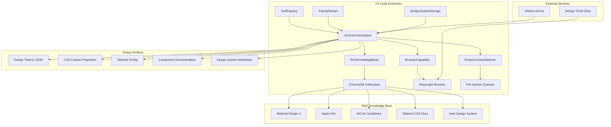
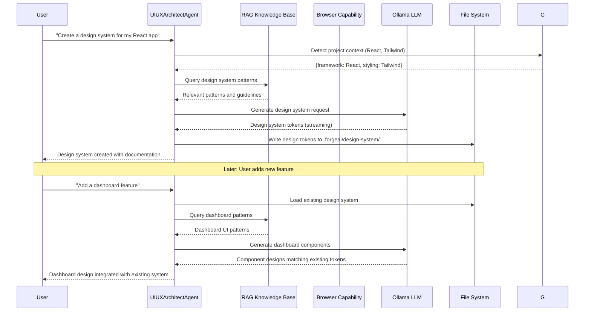
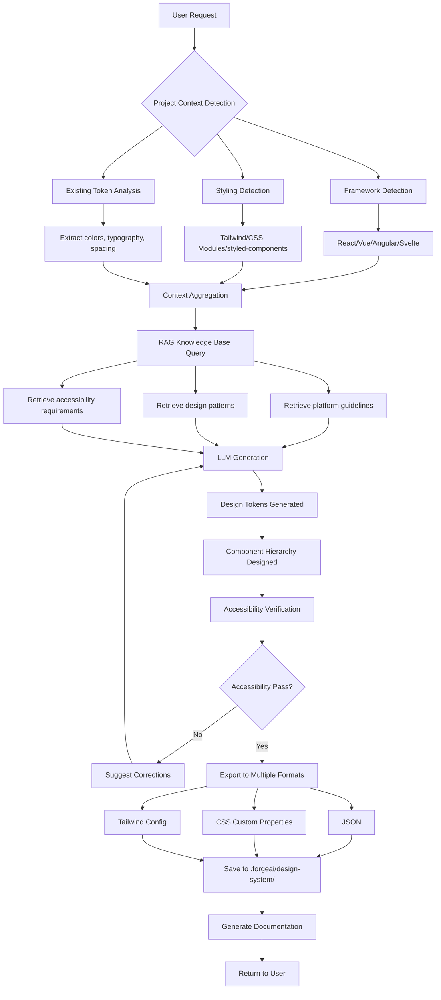
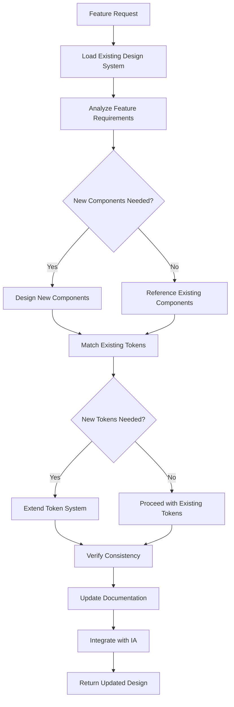
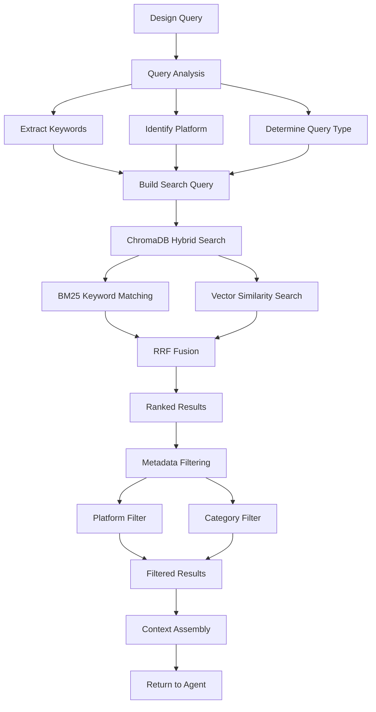

# Design Document: UI/UX Architect Agent

## Overview

The UI/UX Architect Agent is a specialized AI agent for ForgeAI that provides professional-grade UI/UX design expertise. It operates entirely through local LLM execution via Ollama with RAG knowledge management, ensuring zero cloud API costs while delivering comprehensive design system creation, information architecture planning, and multi-platform design guidance.

### Purpose

Enable developers to:
- Create comprehensive design systems with design tokens
- Plan information architecture and navigation structures
- Design component hierarchies following Atomic Design
- Adapt designs for web, mobile, desktop, and extension platforms
- Ensure WCAG 2.1 accessibility compliance
- Generate design tokens in multiple formats (JSON, CSS, Tailwind)
- Maintain design consistency throughout project lifecycle

### Key Technical Decisions

| Decision | Choice | Rationale |
|----------|--------|-----------|
| **LLM Backend** | Ollama (Llama 3.1, Qwen 2.5) | Zero cost, local execution, privacy-preserving |
| **RAG Vector Database** | ChromaDB (embedded mode) | Zero cost, runs in-process, TypeScript support |
| **Knowledge Base Schema** | Platform-specific collections | Optimized retrieval by platform (web, mobile, desktop) |
| **Design Token Storage** | `.forgeai/design-system/` directory | Persistent, version-controllable, accessible to tools |
| **Token Export Formats** | JSON, CSS custom properties, Tailwind config | Broad compatibility with modern frontend stacks |
| **Browser Capability** | Playwright via MCP | Research current UI/UX trends from live sources |

### Constraints

- **Zero cloud cost**: All LLM operations via Ollama, no external API calls
- **Privacy-first**: No design data leaves local machine
- **Project-aware**: Detect and adapt to existing project's UI framework
- **Foundation-to-end support**: Works from project start through feature additions

---

## Architecture

### High-Level Architecture

```
┌─────────────────────────────────────────────────────────────────────────────┐
│                           VS Code Extension Host                             │
│  ┌───────────────────────────────────────────────────────────────────────┐ │
│  │                        ForgeAI Extension                               │ │
│  │  ┌──────────────────┐  ┌──────────────────┐  ┌──────────────────┐    │ │
│  │  │   ToolRegistry   │  │  ActivityStream  │  │ DesignSystemFS   │    │ │
│  │  │  (Agent Tools)   │  │   (UI Display)   │  │   (File I/O)     │    │ │
│  │  └────────┬─────────┘  └────────▲─────────┘  └────────▲─────────┘    │ │
│  │           │                     │                     │              │ │
│  │           ▼                     │                     │              │ │
│  │  ┌────────────────────────────────────────────────────────────────┐  │ │
│  │  │                   UIUXArchitectAgent                            │  │ │
│  │  │  - Design System Creation & Management                          │  │ │
│  │  │  - Information Architecture Planning                             │  │ │
│  │  │  - Component Hierarchy Design                                    │  │ │
│  │  │  - Multi-Platform Design Support                                 │  │ │
│  │  │  - Accessibility Compliance Checking                             │  │ │
│  │  │  - Design Token Generation & Export                              │  │ │
│  │  └─────────────────────────┬───────────────────────────────────────┘  │ │
│  │                            │                                          │ │
│  │           ┌────────────────┼────────────────┐                        │ │
│  │           ▼                ▼                ▼                        │ │
│  │  ┌──────────────┐  ┌──────────────┐  ┌──────────────┐               │ │
│  │  │    RAG       │  │   Browser    │  │   Project    │               │ │
│  │  │  Knowledge   │  │  Capability  │  │   Context    │               │ │
│  │  │    Base      │  │   Manager    │  │   Detector   │               │ │
│  │  └──────┬───────┘  └──────┬───────┘  └──────┬───────┘               │ │
│  │         │                 │                 │                        │ │
│  └─────────┼─────────────────┼─────────────────┼────────────────────────┘ │
│            │                 │                 │                          │
│            ▼                 ▼                 ▼                          │
│  ┌─────────────────────────────────────────────────────────────────────┐  │
│  │                      Supporting Services                             │  │
│  │  ┌──────────────┐  ┌──────────────┐  ┌──────────────┐              │  │
│  │  │   ChromaDB   │  │  Playwright  │  │   VS Code    │              │  │
│  │  │  (Embedded)  │  │   Browser    │  │    APIs      │              │  │
│  │  └──────────────┘  └──────────────┘  └──────────────┘              │  │
│  └─────────────────────────────────────────────────────────────────────┘  │
└─────────────────────────────────────────────────────────────────────────────┘
                                    │
                                    ▼
┌─────────────────────────────────────────────────────────────────────────────┐
│                         Ollama Server (localhost:11434)                      │
│  ┌─────────────────────────────────────────────────────────────────────────┐│
│  │  Llama 3.1 70B / Qwen 2.5 72B - Primary models for UI/UX reasoning      ││
│  │  - Design pattern recognition                                           ││
│  │  - Accessibility compliance analysis                                     ││
│  │  - Component hierarchy generation                                        ││
│  │  - Multi-platform adaptation                                             ││
│  └─────────────────────────────────────────────────────────────────────────┘│
└─────────────────────────────────────────────────────────────────────────────┘
```

### Component Diagram



### Agent Request Flow



---

## Components and Interfaces

### Core Components

#### 1. UIUXArchitectAgent

The main agent class that orchestrates all UI/UX design operations.

```typescript
/**
 * UIUXArchitectAgent - Specialized agent for UI/UX design expertise
 * 
 * Responsibilities:
 * - Design system creation and management
 * - Information architecture planning
 * - Component hierarchy design
 * - Multi-platform design adaptation
 * - Accessibility compliance verification
 * - Design token generation and export
 */
export class UIUXArchitectAgent implements Agent {
  readonly name = 'ui-ux-architect';
  readonly description = 'UI/UX Architect specializing in design systems, information architecture, and multi-platform design';
  
  private ragKnowledgeBase: RAGKnowledgeBase;
  private browserCapability: BrowserCapabilityManager;
  private projectContext: ProjectContextDetector;
  private designSystemStorage: DesignSystemStorage;
  private ollamaClient: OllamaClient;
  
  constructor(context: vscode.ExtensionContext) {
    this.ollamaClient = new OllamaClient('http://localhost:11434');
    this.ragKnowledgeBase = new RAGKnowledgeBase(context);
    this.browserCapability = new BrowserCapabilityManager(context);
    this.projectContext = new ProjectContextDetector();
    this.designSystemStorage = new DesignSystemStorage(context);
  }
  
  /**
   * Register all UI/UX tools with the tool registry
   */
  registerTools(registry: ToolRegistry): void {
    // Design System Tools
    registry.registerTool({
      name: 'uiux_create_design_system',
      description: 'Create a comprehensive design system with tokens, components, and documentation',
      parameters: CreateDesignSystemParamsSchema,
      handler: this.handleCreateDesignSystem.bind(this)
    });
    
    registry.registerTool({
      name: 'uiux_generate_design_tokens',
      description: 'Generate design tokens in JSON, CSS, or Tailwind format',
      parameters: GenerateTokensParamsSchema,
      handler: this.handleGenerateTokens.bind(this)
    });
    
    registry.registerTool({
      name: 'uiux_export_tokens',
      description: 'Export design tokens to specified format and file path',
      parameters: ExportTokensParamsSchema,
      handler: this.handleExportTokens.bind(this)
    });
    
    // Information Architecture Tools
    registry.registerTool({
      name: 'uiux_plan_information_architecture',
      description: 'Plan information architecture with navigation and sitemap',
      parameters: PlanIAParamsSchema,
      handler: this.handlePlanIA.bind(this)
    });
    
    registry.registerTool({
      name: 'uiux_design_navigation',
      description: 'Design navigation structure for the application',
      parameters: DesignNavigationParamsSchema,
      handler: this.handleDesignNavigation.bind(this)
    });
    
    // Component Design Tools
    registry.registerTool({
      name: 'uiux_design_component_hierarchy',
      description: 'Design component hierarchy following Atomic Design principles',
      parameters: ComponentHierarchyParamsSchema,
      handler: this.handleDesignComponentHierarchy.bind(this)
    });
    
    registry.registerTool({
      name: 'uiux_define_component',
      description: 'Define a component with props API, variants, states, and accessibility requirements',
      parameters: DefineComponentParamsSchema,
      handler: this.handleDefineComponent.bind(this)
    });
    
    // Platform Adaptation Tools
    registry.registerTool({
      name: 'uiux_adapt_for_platform',
      description: 'Adapt existing design for a specific platform (web, mobile, desktop, extension)',
      parameters: AdaptPlatformParamsSchema,
      handler: this.handleAdaptForPlatform.bind(this)
    });
    
    registry.registerTool({
      name: 'uiux_generate_responsive_breakpoints',
      description: 'Generate responsive breakpoints and layout adaptations',
      parameters: ResponsiveBreakpointsParamsSchema,
      handler: this.handleGenerateBreakpoints.bind(this)
    });
    
    // Accessibility Tools
    registry.registerTool({
      name: 'uiux_check_accessibility',
      description: 'Check design against WCAG 2.1 accessibility requirements',
      parameters: CheckAccessibilityParamsSchema,
      handler: this.handleCheckAccessibility.bind(this)
    });
    
    registry.registerTool({
      name: 'uiux_fix_accessibility_issue',
      description: 'Suggest fixes for accessibility violations',
      parameters: FixAccessibilityParamsSchema,
      handler: this.handleFixAccessibility.bind(this)
    });
    
    // Design Critique Tools
    registry.registerTool({
      name: 'uiux_critique_design',
      description: 'Critique existing design and suggest improvements',
      parameters: CritiqueDesignParamsSchema,
      handler: this.handleCritiqueDesign.bind(this)
    });
    
    // Knowledge Base Tools
    registry.registerTool({
      name: 'uiux_ingest_documentation',
      description: 'Ingest design documentation into the RAG knowledge base',
      parameters: IngestDocsParamsSchema,
      handler: this.handleIngestDocumentation.bind(this)
    });
    
    registry.registerTool({
      name: 'uiux_research_trends',
      description: 'Research current UI/UX trends using browser capability',
      parameters: ResearchTrendsParamsSchema,
      handler: this.handleResearchTrends.bind(this)
    });
  }
  
  /**
   * Generate system prompt for UI/UX expertise
   */
  getSystemPrompt(): string {
    return `You are a UI/UX Architect Agent, a specialized AI assistant for professional user interface and user experience design.

# Core Expertise

1. **Design Systems**: Create comprehensive design systems with tokens, components, and documentation
2. **Information Architecture**: Plan navigation structures, sitemaps, and user flows
3. **Component Design**: Design component hierarchies following Atomic Design methodology
4. **Multi-Platform Design**: Adapt designs for web, mobile (iOS/Android), desktop, and extensions
5. **Accessibility**: Ensure WCAG 2.1 Level AA compliance for all designs
6. **Design Tokens**: Generate tokens in JSON, CSS, and Tailwind formats

# Available Tools

You have access to specialized tools for:
- Creating and managing design systems
- Planning information architecture
- Designing component hierarchies
- Adapting designs for different platforms
- Checking accessibility compliance
- Researching current UI/UX trends

# Design Principles

1. **Consistency**: Maintain visual and interaction consistency across the application
2. **Accessibility**: All designs must meet WCAG 2.1 Level AA requirements
3. **Platform-Appropriate**: Respect platform conventions while maintaining brand consistency
4. **Scalable**: Design systems should grow with the project
5. **Documented**: All design decisions should be clearly documented

# Response Format

When presenting designs:
- Use formatted code blocks with syntax highlighting
- Use markdown tables for token values
- Use ASCII diagrams for layout descriptions
- Provide actionable next steps

Remember: You are a professional UI/UX Architect. Provide expert guidance, not just options.`;
  }
  
  // ... tool handler implementations
}
```

#### 2. RAGKnowledgeBase

Manages the vector database for UI/UX knowledge retrieval.

```typescript
/**
 * RAGKnowledgeBase - Vector database for UI/UX knowledge
 * 
 * Responsibilities:
 * - Store and retrieve UI/UX design patterns
 * - Index platform-specific guidelines (Material Design 3, Apple HIG)
 * - Store WCAG accessibility requirements
 * - Manage user's custom design documentation
 * - Hybrid search (BM25 + vector) for optimal retrieval
 */
export class RAGKnowledgeBase {
  private chromaClient: ChromaClient;
  private collections: Map<string, Collection> = new Map();
  private embeddingFunction: EmbeddingFunction;
  
  constructor(private context: vscode.ExtensionContext) {
    this.initializeCollections();
  }
  
  /**
   * Initialize ChromaDB collections for different knowledge domains
   */
  private async initializeCollections(): Promise<void> {
    const dbPath = path.join(
      this.context.globalStorageUri.fsPath,
      'uiux-knowledge-chromadb'
    );
    
    this.chromaClient = new ChromaClient({ path: dbPath });
    
    // Create collections for different knowledge domains
    const collectionConfigs = [
      { name: 'material-design-3', description: 'Material Design 3 guidelines' },
      { name: 'apple-hig', description: 'Apple Human Interface Guidelines' },
      { name: 'wcag-guidelines', description: 'WCAG 2.1 accessibility requirements' },
      { name: 'tailwind-docs', description: 'Tailwind CSS documentation' },
      { name: 'design-patterns', description: 'General UI/UX design patterns' },
      { name: 'user-design-system', description: 'User\'s custom design system' },
      { name: 'component-library', description: 'Component library patterns' },
      { name: 'animation-patterns', description: 'Animation and interaction patterns' }
    ];
    
    for (const config of collectionConfigs) {
      const collection = await this.chromaClient.getOrCreateCollection({
        name: config.name,
        metadata: { 
          description: config.description,
          'hnsw:space': 'cosine'
        }
      });
      this.collections.set(config.name, collection);
    }
  }
  
  /**
   * Query knowledge base with hybrid search
   */
  async query(
    queryText: string, 
    options?: QueryOptions
  ): Promise<QueryResult[]> {
    const collection = this.collections.get(options?.collection || 'design-patterns');
    if (!collection) {
      throw new Error(`Collection not found: ${options?.collection}`);
    }
    
    // ChromaDB automatically performs hybrid search (BM25 + vector)
    const results = await collection.query({
      queryTexts: [queryText],
      nResults: options?.nResults ?? 5,
      where: options?.where, // Metadata filtering
      whereDocument: options?.whereDocument // Content filtering
    });
    
    return this.formatResults(results);
  }
  
  /**
   * Add documents to knowledge base
   */
  async addDocuments(
    collectionName: string,
    documents: Document[]
  ): Promise<void> {
    const collection = this.collections.get(collectionName);
    if (!collection) {
      throw new Error(`Collection not found: ${collectionName}`);
    }
    
    await collection.add({
      ids: documents.map(d => d.id),
      documents: documents.map(d => d.content),
      metadatas: documents.map(d => d.metadata)
    });
  }
  
  /**
   * Ingest design documentation with appropriate chunking
   */
  async ingestDesignDoc(
    doc: DesignDocument,
    options?: IngestOptions
  ): Promise<void> {
    const chunks = await this.chunkDocument(doc, options?.chunkStrategy);
    
    await this.addDocuments(doc.collection, chunks.map(chunk => ({
      id: `${doc.id}-${chunk.index}`,
      content: chunk.text,
      metadata: {
        source: doc.source,
        type: doc.type,
        platform: doc.platform,
        section: chunk.section,
        timestamp: Date.now()
      }
    })));
  }
  
  /**
   * Chunk document based on content type
   */
  private async chunkDocument(
    doc: DesignDocument, 
    strategy?: ChunkStrategy
  ): DocumentChunk[] {
    const defaultStrategy = this.detectChunkStrategy(doc);
    const chunker = this.getChunker(strategy ?? defaultStrategy);
    return chunker.chunk(doc.content);
  }
  
  /**
   * Detect appropriate chunking strategy based on content type
   */
  private detectChunkStrategy(doc: DesignDocument): ChunkStrategy {
    if (doc.type === 'code') return 'ast-based';
    if (doc.type === 'guideline') return 'semantic';
    if (doc.type === 'api-reference') return 'section-based';
    return 'semantic';
  }
}
```

#### 3. ProjectContextDetector

Detects project context for design recommendations.

```typescript
/**
 * ProjectContextDetector - Detects UI framework and styling approach
 * 
 * Responsibilities:
 * - Detect UI framework (React, Vue, Angular, Svelte)
 * - Detect styling approach (Tailwind, CSS Modules, styled-components)
 * - Identify existing design systems and component libraries
 * - Analyze existing color schemes and typography
 * - Extract current design tokens from codebase
 */
export class ProjectContextDetector {
  
  /**
   * Analyze project and return design context
   */
  async detect(workspacePath: string): Promise<ProjectDesignContext> {
    const [framework, styling, existingDesignSystem, existingTokens] = await Promise.all([
      this.detectFramework(workspacePath),
      this.detectStylingApproach(workspacePath),
      this.detectExistingDesignSystem(workspacePath),
      this.extractExistingTokens(workspacePath)
    ]);
    
    return {
      framework,
      styling,
      existingDesignSystem,
      existingTokens,
      timestamp: Date.now()
    };
  }
  
  /**
   * Detect UI framework from package.json and file structure
   */
  private async detectFramework(workspacePath: string): Promise<UIFramework> {
    const packageJson = await this.readPackageJson(workspacePath);
    
    if (packageJson?.dependencies?.react || packageJson?.dependencies?.next) {
      return {
        name: 'react',
        version: packageJson.dependencies.react || packageJson.dependencies.next,
        metaFramework: packageJson.dependencies.next ? 'nextjs' : undefined
      };
    }
    
    if (packageJson?.dependencies?.vue) {
      return {
        name: 'vue',
        version: packageJson.dependencies.vue,
        metaFramework: packageJson.dependencies.nuxt ? 'nuxt' : undefined
      };
    }
    
    if (packageJson?.dependencies?.angular) {
      return { name: 'angular', version: packageJson.dependencies.angular };
    }
    
    if (packageJson?.dependencies?.svelte) {
      return { name: 'svelte', version: packageJson.dependencies.svelte };
    }
    
    return { name: 'unknown', version: undefined };
  }
  
  /**
   * Detect styling approach from dependencies and config files
   */
  private async detectStylingApproach(workspacePath: string): Promise<StylingApproach> {
    const packageJson = await this.readPackageJson(workspacePath);
    const files = await this.scanDirectory(workspacePath);
    
    // Check for Tailwind CSS
    if (packageJson?.dependencies?.tailwindcss || 
        files.some(f => f.includes('tailwind.config'))) {
      const configPath = files.find(f => f.includes('tailwind.config'));
      return {
        name: 'tailwind',
        configPath,
        version: packageJson?.dependencies?.tailwindcss
      };
    }
    
    // Check for CSS Modules
    if (files.some(f => f.endsWith('.module.css'))) {
      return { name: 'css-modules' };
    }
    
    // Check for styled-components
    if (packageJson?.dependencies?.['styled-components']) {
      return { 
        name: 'styled-components',
        version: packageJson.dependencies['styled-components']
      };
    }
    
    // Check for emotion
    if (packageJson?.dependencies?.['@emotion/react']) {
      return { 
        name: 'emotion',
        version: packageJson.dependencies['@emotion/react']
      };
    }
    
    return { name: 'plain-css' };
  }
  
  /**
   * Detect existing design system (Radix, MUI, Chakra, etc.)
   */
  private async detectExistingDesignSystem(workspacePath: string): Promise<DesignSystemInfo | null> {
    const packageJson = await this.readPackageJson(workspacePath);
    
    const designSystemPatterns = [
      { name: 'mui', packages: ['@mui/material', '@mui/core'] },
      { name: 'chakra', packages: ['@chakra-ui/react'] },
      { name: 'radix', packages: ['@radix-ui/react-dialog', '@radix-ui/themes'] },
      { name: 'mantine', packages: ['@mantine/core'] },
      { name: 'shadcn', packages: [], files: ['components/ui'] },
      { name: 'ant-design', packages: ['antd'] }
    ];
    
    for (const pattern of designSystemPatterns) {
      const hasPackage = pattern.packages.some(
        pkg => packageJson?.dependencies?.[pkg] || packageJson?.devDependencies?.[pkg]
      );
      if (hasPackage) {
        return { name: pattern.name, detected: true };
      }
    }
    
    return null;
  }
  
  /**
   * Extract existing design tokens from CSS/Tailwind config
   */
  private async extractExistingTokens(workspacePath: string): Promise<ExistingTokens | null> {
    // Try to extract from Tailwind config
    const tailwindTokens = await this.extractTailwindTokens(workspacePath);
    if (tailwindTokens) return tailwindTokens;
    
    // Try to extract from CSS custom properties
    const cssTokens = await this.extractCSSCustomProperties(workspacePath);
    if (cssTokens) return cssTokens;
    
    return null;
  }
}
```

#### 4. DesignSystemStorage

Manages design system persistence in the workspace.

```typescript
/**
 * DesignSystemStorage - Manages design system file persistence
 * 
 * Responsibilities:
 * - Store design tokens in .forgeai/design-system/ directory
 * - Manage version history of design changes
 * - Export tokens in multiple formats
 * - Sync design system with codebase
 */
export class DesignSystemStorage {
  private readonly designSystemPath = '.forgeai/design-system';
  
  constructor(private context: vscode.ExtensionContext) {}
  
  /**
   * Save design system to workspace
   */
  async save(workspacePath: string, designSystem: DesignSystem): Promise<void> {
    const systemPath = path.join(workspacePath, this.designSystemPath);
    
    // Ensure directory exists
    await vscode.workspace.fs.createDirectory(vscode.Uri.file(systemPath));
    
    // Save each component of the design system
    await Promise.all([
      this.saveTokens(systemPath, designSystem.tokens),
      this.saveComponents(systemPath, designSystem.components),
      this.saveDocumentation(systemPath, designSystem.documentation),
      this.saveMetadata(systemPath, designSystem.metadata)
    ]);
  }
  
  /**
   * Load existing design system from workspace
   */
  async load(workspacePath: string): Promise<DesignSystem | null> {
    const systemPath = path.join(workspacePath, this.designSystemPath);
    
    try {
      const [tokens, components, documentation, metadata] = await Promise.all([
        this.loadTokens(systemPath),
        this.loadComponents(systemPath),
        this.loadDocumentation(systemPath),
        this.loadMetadata(systemPath)
      ]);
      
      return { tokens, components, documentation, metadata };
    } catch {
      return null;
    }
  }
  
  /**
   * Export design tokens to specified format
   */
  async exportTokens(
    workspacePath: string,
    format: 'json' | 'css' | 'tailwind',
    outputPath?: string
  ): Promise<string> {
    const designSystem = await this.load(workspacePath);
    if (!designSystem) {
      throw new Error('No design system found in workspace');
    }
    
    const exported = await this.formatTokens(designSystem.tokens, format);
    const filePath = outputPath ?? this.getDefaultExportPath(workspacePath, format);
    
    await vscode.workspace.fs.writeFile(
      vscode.Uri.file(filePath),
      Buffer.from(exported)
    );
    
    return filePath;
  }
  
  /**
   * Format tokens according to target format
   */
  private async formatTokens(
    tokens: DesignTokens, 
    format: 'json' | 'css' | 'tailwind'
  ): Promise<string> {
    switch (format) {
      case 'json':
        return this.formatAsJSON(tokens);
      case 'css':
        return this.formatAsCSS(tokens);
      case 'tailwind':
        return this.formatAsTailwind(tokens);
    }
  }
  
  /**
   * Format tokens as Style Dictionary compatible JSON
   */
  private formatAsJSON(tokens: DesignTokens): string {
    return JSON.stringify({
      color: this.transformTokenStructure(tokens.colors),
      typography: this.transformTokenStructure(tokens.typography),
      spacing: this.transformTokenStructure(tokens.spacing),
      shadow: this.transformTokenStructure(tokens.shadows),
      animation: this.transformTokenStructure(tokens.animation)
    }, null, 2);
  }
  
  /**
   * Format tokens as CSS custom properties
   */
  private formatAsCSS(tokens: DesignTokens): string {
    const lines: string[] = [
      ':root {',
      '  /* Colors */',
      ...this.formatTokenCategoryCSS('color', tokens.colors),
      '',
      '  /* Typography */',
      ...this.formatTokenCategoryCSS('typography', tokens.typography),
      '',
      '  /* Spacing */',
      ...this.formatTokenCategoryCSS('spacing', tokens.spacing),
      '',
      '  /* Shadows */',
      ...this.formatTokenCategoryCSS('shadow', tokens.shadows),
      '',
      '  /* Animation */',
      ...this.formatTokenCategoryCSS('animation', tokens.animation),
      '}',
      '',
      '/* Dark Mode */',
      '@media (prefers-color-scheme: dark) {',
      '  :root {',
      ...this.formatDarkModeTokens(tokens.colors),
      '  }',
      '}'
    ];
    
    return lines.join('\n');
  }
  
  /**
   * Format tokens as Tailwind configuration
   */
  private formatAsTailwind(tokens: DesignTokens): string {
    return `/** @type {import('tailwindcss').Config} */
module.exports = {
  theme: {
    extend: {
      colors: ${this.formatTailwindColors(tokens.colors)},
      fontFamily: ${this.formatTailwindFonts(tokens.typography)},
      fontSize: ${this.formatTailwindFontSizes(tokens.typography)},
      spacing: ${this.formatTailwindSpacing(tokens.spacing)},
      boxShadow: ${this.formatTailwindShadows(tokens.shadows)},
      transitionDuration: ${this.formatTailwindDurations(tokens.animation)},
      transitionTimingFunction: ${this.formatTailwindEasing(tokens.animation)}
    }
  }
}`;
  }
  
  // ... additional helper methods
}
```

---

## Data Models

### Design System Core Types

```typescript
/**
 * DesignSystem - Complete design system structure
 */
export interface DesignSystem {
  tokens: DesignTokens;
  components: ComponentLibrary;
  documentation: DesignDocumentation;
  metadata: DesignSystemMetadata;
}

/**
 * DesignTokens - Atomic design decisions encoded as data
 */
export interface DesignTokens {
  colors: ColorTokens;
  typography: TypographyTokens;
  spacing: SpacingTokens;
  shadows: ShadowTokens;
  animation: AnimationTokens;
  breakpoints?: BreakpointTokens;
  radii?: RadiusTokens;
}

/**
 * ColorTokens - Color palette with semantic naming
 */
export interface ColorTokens {
  // Primary color scale (50-950)
  primary: ColorScale;
  
  // Secondary color scale
  secondary: ColorScale;
  
  // Accent color scale
  accent: ColorScale;
  
  // Neutral color scale
  neutral: ColorScale;
  
  // Semantic colors
  success: ColorScale;
  warning: ColorScale;
  error: ColorScale;
  
  // Semantic tokens (theme-aware)
  semantic: {
    background: SemanticColorTokens;
    foreground: SemanticColorTokens;
    border: SemanticColorTokens;
    interactive: SemanticColorTokens;
  };
  
  // Dark mode variants
  dark?: Partial<ColorTokens>;
}

/**
 * ColorScale - Full color scale with all shades
 */
export interface ColorScale {
  '50': string;
  '100': string;
  '200': string;
  '300': string;
  '400': string;
  '500': string;
  '600': string;
  '700': string;
  '800': string;
  '900': string;
  '950': string;
}

/**
 * SemanticColorTokens - Theme-aware color tokens
 */
export interface SemanticColorTokens {
  primary: string;
  secondary: string;
  muted: string;
  accent: string;
  destructive: string;
}

/**
 * TypographyTokens - Typography scale definitions
 */
export interface TypographyTokens {
  fonts: {
    heading: FontFamily;
    body: FontFamily;
    mono: FontFamily;
  };
  
  sizes: {
    xs: TypographySize;
    sm: TypographySize;
    base: TypographySize;
    lg: TypographySize;
    xl: TypographySize;
    '2xl': TypographySize;
    '3xl': TypographySize;
    '4xl': TypographySize;
    '5xl': TypographySize;
  };
  
  weights: {
    light: number;
    normal: number;
    medium: number;
    semibold: number;
    bold: number;
  };
  
  lineHeights: Record<string, number>;
  letterSpacings: Record<string, string>;
}

/**
 * FontFamily - Font family definition
 */
export interface FontFamily {
  family: string;
  fallbacks: string[];
  webFont?: {
    url: string;
    format: 'woff2' | 'woff' | 'ttf';
  };
}

/**
 * TypographySize - Typography size definition
 */
export interface TypographySize {
  fontSize: string;
  lineHeight: string;
  letterSpacing?: string;
}

/**
 * SpacingTokens - Spacing scale
 */
export interface SpacingTokens {
  base: number; // Base unit (e.g., 4)
  scale: Record<string, string>; // 0, 1, 2, 3, 4, 5, 6, 8, 10, 12, 16, 20, 24, 32, 40, 48, 56, 64
}

/**
 * ShadowTokens - Shadow definitions
 */
export interface ShadowTokens {
  sm: string;
  base: string;
  md: string;
  lg: string;
  xl: string;
  '2xl': string;
  inner: string;
  none: 'none';
}

/**
 * AnimationTokens - Animation and transition definitions
 */
export interface AnimationTokens {
  durations: {
    instant: string;
    fast: string;
    normal: string;
    slow: string;
    slower: string;
  };
  
  easings: {
    linear: string;
    easeIn: string;
    easeOut: string;
    easeInOut: string;
    easeInQuad: string;
    easeOutQuad: string;
    easeInOutQuad: string;
    easeInCubic: string;
    easeOutCubic: string;
    easeInOutCubic: string;
  };
  
  transitions: {
    default: string;
    fast: string;
    slow: string;
    color: string;
    opacity: string;
    shadow: string;
    transform: string;
  };
}

/**
 * BreakpointTokens - Responsive breakpoint definitions
 */
export interface BreakpointTokens {
  sm: string;  // 640px
  md: string;  // 768px
  lg: string;  // 1024px
  xl: string;  // 1280px
  '2xl': string; // 1536px
}
```

### Component Library Types

```typescript
/**
 * ComponentLibrary - Collection of designed components
 */
export interface ComponentLibrary {
  atoms: AtomComponent[];
  molecules: MoleculeComponent[];
  organisms: OrganismComponent[];
  templates: TemplateComponent[];
}

/**
 * BaseComponent - Shared component properties
 */
export interface BaseComponent {
  id: string;
  name: string;
  description: string;
  category: 'atom' | 'molecule' | 'organism' | 'template';
  tokens: string[]; // References to design tokens used
  accessibility: AccessibilityRequirements;
  platforms: Platform[];
}

/**
 * AtomComponent - Atomic UI elements
 */
export interface AtomComponent extends BaseComponent {
  category: 'atom';
  examples: ComponentExample[];
  props: PropDefinition[];
  variants: ComponentVariant[];
  states: ComponentState[];
}

/**
 * MoleculeComponent - Combinations of atoms
 */
export interface MoleculeComponent extends BaseComponent {
  category: 'molecule';
  composition: string[]; // IDs of atom components
  examples: ComponentExample[];
  props: PropDefinition[];
  variants: ComponentVariant[];
}

/**
 * OrganismComponent - Complex UI sections
 */
export interface OrganismComponent extends BaseComponent {
  category: 'organism';
  composition: string[]; // IDs of molecule/atom components
  examples: ComponentExample[];
  props: PropDefinition[];
}

/**
 * TemplateComponent - Page-level layouts
 */
export interface TemplateComponent extends BaseComponent {
  category: 'template';
  layout: LayoutDefinition;
  slots: SlotDefinition[];
}

/**
 * PropDefinition - Component prop specification
 */
export interface PropDefinition {
  name: string;
  type: string;
  required: boolean;
  default?: string;
  description: string;
}

/**
 * ComponentVariant - Component variant definition
 */
export interface ComponentVariant {
  name: string;
  description: string;
  tokenOverrides: Record<string, string>;
}

/**
 * ComponentState - Component state definition
 */
export interface ComponentState {
  name: 'default' | 'hover' | 'focus' | 'active' | 'disabled' | 'loading';
  description: string;
  tokenOverrides: Record<string, string>;
}

/**
 * AccessibilityRequirements - WC{}
AG compliance requirements for a component
 */
export interface AccessibilityRequirements {
  wcagLevel: 'A' | 'AA' | 'AAA';
  contrastRatio?: {
    minimum: number;
    large: number;
  };
  focusIndicator: boolean;
  ariaRoles: string[];
  ariaProperties: string[];
  keyboardNavigation: boolean;
  screenReaderSupport: boolean;
}

/**
 * ComponentExample - Example usage of a component
 */
export interface ComponentExample {
  name: string;
  description: string;
  code: string;
  framework: 'react' | 'vue' | 'angular' | 'svelte' | 'html';
}
```

### Information Architecture Types

```typescript
/**
 * InformationArchitecture - Application structure and navigation
 */
export interface InformationArchitecture {
  sitemap: SitemapNode[];
  navigation: NavigationStructure;
  userFlows: UserFlow[];
  labeling: LabelingSystem;
}

/**
 * SitemapNode - Node in the application sitemap
 */
export interface SitemapNode {
  id: string;
  title: string;
  url: string;
  description: string;
  children?: SitemapNode[];
  metadata?: {
    template?: string;
    authentication?: boolean;
    permissions?: string[];
  };
}

/**
 * NavigationStructure - Navigation hierarchy
 */
export interface NavigationStructure {
  primary: NavigationItem[];
  secondary?: NavigationItem[];
  footer?: NavigationItem[];
  breadcrumbs: boolean;
  search: boolean;
}

/**
 * NavigationItem - Navigation item definition
 */
export interface NavigationItem {
  id: string;
  label: string;
  url: string;
  icon?: string;
  children?: NavigationItem[];
  activePattern?: string; // Regex for active state
}

/**
 * UserFlow - User task flow definition
 */
export interface UserFlow {
  id: string;
  name: string;
  description: string;
  steps: FlowStep[];
  entryPoints: string[];
  successCriteria: string[];
}

/**
 * FlowStep - Step in a user flow
 */
export interface FlowStep {
  id: string;
  type: 'screen' | 'action' | 'decision' | 'external';
  title: string;
  description: string;
  screen?: string; // Reference to sitemap node
  actions?: string[];
  branches?: {
    condition: string;
    nextStep: string;
  }[];
}

/**
 * LabelingSystem - Terminology and naming conventions
 */
export interface LabelingSystem {
  terminology: Record<string, string>;
  namingConventions: {
    components: string;
    tokens: string;
    files: string;
  };
}
```

### Platform Adaptation Types

```typescript
/**
 * PlatformDesign - Platform-specific design adaptation
 */
export interface PlatformDesign {
  platform: Platform;
  adaptations: PlatformAdaptation[];
  designTokens: Partial<DesignTokens>;
  components: PlatformComponent[];
}

/**
 * Platform - Supported platform types
 */
export type Platform = 
  | 'web'
  | 'ios'
  | 'android'
  | 'macos'
  | 'windows'
  | 'vscode-extension'
  | 'browser-extension';

/**
 * PlatformAdaptation - Platform-specific design adaptation
 */
export interface PlatformAdaptation {
  element: string;
  platform: Platform;
  changes: {
    property: string;
    value: string;
    reason: string;
  }[];
}

/**
 * ResponsiveBreakpoint - Responsive design breakpoint
 */
export interface ResponsiveBreakpoint {
  name: string;
  minWidth: number;
  maxWidth?: number;
  columns: number;
  margins: string;
  gutters: string;
}
```

### RAG Knowledge Base Schema

```typescript
/**
 * RAGCollectionSchema - Schema for ChromaDB collections
 */
export const RAGCollectionSchemas = {
  'material-design-3': {
    name: 'material-design-3',
    metadata: {
      type: 'platform-guideline',
      platform: 'android',
      version: '3.0',
      source: 'https://m3.material.io'
    },
    fields: {
      component: 'string',
      category: 'string', // components, styles, patterns
      section: 'string',
      tokens: 'string[]'
    }
  },
  
  'apple-hig': {
    name: 'apple-hig',
    metadata: {
      type: 'platform-guideline',
      platform: 'ios',
      source: 'https://developer.apple.com/design/human-interface-guidelines'
    },
    fields: {
      component: 'string',
      category: 'string', // foundations, components, patterns
      platform: 'string', // ios, macos, watchos, tvos
      section: 'string'
    }
  },
  
  'wcag-guidelines': {
    name: 'wcag-guidelines',
    metadata: {
      type: 'accessibility-standard',
      version: '2.1',
      source: 'https://www.w3.org/WAI/WCAG21/'
    },
    fields: {
      criterion: 'string',
      level: 'string', // A, AA, AAA
      category: 'string', // perceivable, operable, understandable, robust
      techniques: 'string[]'
    }
  },
  
  'tailwind-docs': {
    name: 'tailwind-docs',
    metadata: {
      type: 'framework-docs',
      framework: 'tailwindcss',
      source: 'https://tailwindcss.com/docs'
    },
    fields: {
      section: 'string',
      category: 'string',
      utility: 'string',
      version: 'string'
    }
  },
  
  'design-patterns': {
    name: 'design-patterns',
    metadata: {
      type: 'general-patterns'
    },
    fields: {
      pattern: 'string',
      category: 'string', // layout, navigation, forms, feedback
      useCase: 'string',
      platforms: 'string[]'
    }
  },
  
  'user-design-system': {
    name: 'user-design-system',
    metadata: {
      type: 'user-content',
      projectId: 'string'
    },
    fields: {
      component: 'string',
      category: 'string',
      version: 'string',
      modified: 'number'
    }
  }
};

/**
 * RAGDocument - Document stored in knowledge base
 */
export interface RAGDocument {
  id: string;
  content: string;
  metadata: {
    source: string;
    type: string;
    platform?: string;
    category?: string;
    section?: string;
    timestamp: number;
    url?: string;
  };
}

/**
 * RAGQueryResult - Result from knowledge base query
 */
export interface RAGQueryResult {
  id: string;
  content: string;
  metadata: RAGDocument['metadata'];
  distance: number;
}
```

---

## Data Flow

### Design System Creation Flow



### Design Adaptation Flow for New Features



### RAG Knowledge Retrieval Flow



---

## State Management

### Design System Persistence

Design systems are persisted in the workspace under `.forgeai/design-system/` with the following structure:

```
.forgeai/design-system/
├── tokens/
│   ├── colors.json          # Color palette tokens
│   ├── typography.json      # Typography scale tokens
│   ├── spacing.json         # Spacing scale tokens
│   ├── shadows.json         # Shadow tokens
│   ├── animation.json       # Animation tokens
│   └── breakpoints.json     # Responsive breakpoints
├── components/
│   ├── atoms.json           # Atomic components
│   ├── molecules.json       # Molecule components
│   ├── organisms.json       # Organism components
│   └── templates.json       # Template components
├── exports/
│   ├── tokens.json          # Style Dictionary format
│   ├── tokens.css           # CSS custom properties
│   └── tailwind.config.js   # Tailwind configuration
├── documentation/
│   ├── design-system.md     # Main documentation
│   ├── components.md        # Component catalog
│   └── accessibility.md     # Accessibility guide
└── metadata.json            # Design system metadata
```

### State Interfaces

```typescript
/**
 * DesignSystemState - State for design system management
 */
export interface DesignSystemState {
  // Current design system
  active: DesignSystem | null;
  
  // Loading states
  isLoading: boolean;
  loadingMessage?: string;
  
  // Error states
  error?: {
    message: string;
    code: string;
    guidance?: string;
  };
  
  // History for undo/redo
  history: {
    past: DesignSystem[];
    future: DesignSystem[];
  };
  
  // Dirty state for unsaved changes
  isDirty: boolean;
  
  // Project context
  projectContext: ProjectDesignContext | null;
}

/**
 * RAGState - State for RAG knowledge base
 */
export interface RAGState {
  // Connection status
  isConnected: boolean;
  
  // Collection stats
  collectionStats: Record<string, {
    documentCount: number;
    lastUpdated: number;
  }>;
  
  // Ingestion status
  ingestionStatus: {
    inProgress: boolean;
    currentDoc?: string;
    progress?: number;
  };
  
  // Query cache
  queryCache: Map<string, {
    results: RAGQueryResult[];
    timestamp: number;
  }>;
}
```

---

## Error Handling

### Error Categories

```typescript
/**
 * UIUXAgentError - Error types for UI/UX Architect Agent
 */
export type UIUXAgentErrorType = 
  | 'ollama_unavailable'
  | 'rag_query_failed'
  | 'design_system_not_found'
  | 'invalid_design_tokens'
  | 'accessibility_violation'
  | 'browser_capability_unavailable'
  | 'file_write_failed'
  | 'unsupported_platform'
  | 'ambiguous_request';

/**
 * UIUXAgentError - Structured error response
 */
export interface UIUXAgentError {
  type: UIUXAgentErrorType;
  message: string;
  userMessage: string;
  agentGuidance: string;
  recoverable: boolean;
  recoveryAction?: string;
}

/**
 * Error handling strategies
 */
export const ErrorHandlingStrategies: Record<UIUXAgentErrorType, ErrorHandler> = {
  ollama_unavailable: {
    recoverable: true,
    userMessage: 'The Ollama server is not running. Please start Ollama to continue.',
    agentGuidance: 'Check if Ollama is installed and running. Suggest: "ollama serve" in terminal.',
    recoveryAction: 'Wait for Ollama to start, then retry.'
  },
  
  rag_query_failed: {
    recoverable: true,
    userMessage: 'Could not retrieve design knowledge. Using base knowledge instead.',
    agentGuidance: 'Fall back to base LLM knowledge. Add disclaimer about limited context.',
    recoveryAction: 'Continue with degraded knowledge, offer to re-index.'
  },
  
  accessibility_violation: {
    recoverable: true,
    userMessage: 'The generated design has accessibility issues that need attention.',
    agentGuidance: 'Identify specific WCAG violations and suggest corrections.',
    recoveryAction: 'Automatically apply corrections or present options to user.'
  },
  
  browser_capability_unavailable: {
    recoverable: true,
    userMessage: 'Browser research is unavailable. Using cached knowledge instead.',
    agentGuidance: 'Use RAG knowledge base for trend information instead of live browsing.',
    recoveryAction: 'Continue with cached knowledge.'
  },
  
  ambiguous_request: {
    recoverable: true,
    userMessage: 'Your request needs clarification to provide the best design.',
    agentGuidance: 'Ask specific clarifying questions about platform, style, or constraints.',
    recoveryAction: 'Prompt user for additional details.'
  }
};
```

---

## Testing Strategy

### Unit Tests

Unit tests will cover:
- Design token generation algorithms
- Color contrast calculation
- Token format conversion (JSON, CSS, Tailwind)
- Project context detection
- Component hierarchy validation

### Integration Tests

Integration tests will cover:
- RAG knowledge base queries with hybrid search
- Design system persistence and retrieval
- Multi-platform adaptation logic
- Accessibility compliance verification
- Browser capability integration for trend research

### Property-Based Tests

Property-based tests will verify:
- **Token Serialization Round-Trip**: For any design tokens, serializing to any format and parsing back produces equivalent tokens
- **Color Contrast Invariants**: All generated color combinations meet WCAG requirements
- **Token Composition**: Any design token can be referenced and resolved correctly
- **Component Hierarchy Consistency**: All component references resolve to valid components

---

## Integration Points

### VS Code Extension Integration

```typescript
/**
 * Integration with ForgeAI VS Code extension
 */
export interface UIUXAgentIntegration {
  // Command palette commands
  commands: [
    { id: 'forgeai.uiux.createDesignSystem', title: 'Create Design System' },
    { id: 'forgeai.uiux.generateTokens', title: 'Generate Design Tokens' },
    { id: 'forgeai.uiux.critiqueDesign', title: 'Critique Current Design' },
    { id: 'forgeai.uiux.checkAccessibility', title: 'Check Accessibility' }
  ];
  
  // File context menus
  contextMenus: [
    { selector: '**/*.css', command: 'forgeai.uiux.extractTokens' },
    { selector: '**/tailwind.config.*', command: 'forgeai.uiux.analyzeConfig' }
  ];
  
  // Webview panels
  webviewPanels: [
    { id: 'forgeai.uiux.preview', title: 'Design System Preview' },
    { id: 'forgeai.uiux.components', title: 'Component Catalog' }
  ];
}
```

### Browser Capability Integration

```typescript
/**
 * Integration with Browser Capability for trend research
 */
export class TrendResearchIntegration {
  
  async researchCurrentTrends(topic: string): Promise<TrendResearchResult> {
    // Use Browser Capability to browse design sites
    const sources = [
      'https://www.smashingmagazine.com',
      'https://alistapart.com',
      'https://www.nngroup.com',
      'https://dribbble.com',
      'https://www.behance.net'
    ];
    
    const findings = await this.browserCapability.browseMultiple(sources, {
      searchQuery: topic,
      extractPattern: 'design-trend'
    });
    
    // Add findings to RAG knowledge base
    await this.ragKnowledgeBase.addDocuments('design-patterns', 
      findings.map(f => ({
        id: `trend-${Date.now()}-${f.source}`,
        content: f.content,
        metadata: {
          source: f.source,
          type: 'trend-research',
          timestamp: Date.now(),
          url: f.url
        }
      }))
    );
    
    return {
      findings,
      addedToKnowledgeBase: true
    };
  }
}
```

---

## Future Enhancements

1. **Design System Versioning**: Track changes to design systems over time with semantic versioning
2. **Team Collaboration**: Share design systems across team members via Git
3. **Figma Integration**: Export design tokens to Figma via Token Studio
4. **A/B Testing Support**: Generate variant designs for A/B testing
5. **Performance Optimization**: Lazy load design system components for large projects
6. **AI Training Feedback**: Learn from user modifications to improve design suggestions
---

## Correctness Properties

*A property is a characteristic or behavior that should hold true across all valid executions of a system—essentially, a formal statement about what the system should do. Properties serve as the bridge between human-readable specifications and machine-verifiable correctness guarantees.*

The UI/UX Architect Agent includes significant pure logic functions (color contrast calculation, token serialization, spacing ratios, component hierarchy validation) that benefit from property-based testing. The following properties are designed to verify the correctness of these core algorithms.

### Property 1: Color Contrast Compliance

*For any* generated color pair intended for text and background use, the contrast ratio SHALL meet or exceed WCAG 2.1 Level AA requirements (4.5:1 for normal text, 3:1 for large text, 3:1 for UI components).

**Validates: Requirements 1.4, 5.2, 15.2**

### Property 2: Color Palette Completeness

*For any* generated color scale, all required shade values (50, 100, 200, 300, 400, 500, 600, 700, 800, 900, 950) SHALL be present and each SHALL be a valid CSS color value.

**Validates: Requirements 1.3**

### Property 3: Spacing Scale Ratio Consistency

*For any* generated spacing scale, all spacing values SHALL follow the specified ratio relative to the base unit (e.g., multiples of 4px for the default scale).

**Validates: Requirements 1.6**

### Property 4: Atomic Design Hierarchy Integrity

*For any* component hierarchy, atoms SHALL NOT reference molecules or organisms, molecules SHALL NOT reference organisms, and all component references SHALL resolve to existing components within the library.

**Validates: Requirements 3.1, 3.6**

### Property 5: Component Definition Completeness

*For any* defined component, the component SHALL include all required fields: props API, variants, states, and accessibility requirements.

**Validates: Requirements 3.5**

### Property 6: Design Token Serialization Round-Trip

*For any* design token set, serializing to any supported format (JSON, CSS custom properties, Tailwind configuration) and parsing back SHALL produce an equivalent token set.

**Validates: Requirements 6.1, 6.2, 6.3**

### Property 7: Semantic Token Naming Convention

*For any* generated token reference, the name SHALL follow semantic naming patterns (e.g., `--color-text-primary`, `--spacing-md`) rather than literal value naming (e.g., `--color-blue-900`, `--spacing-16px`).

**Validates: Requirements 6.5**

### Property 8: Touch Target Minimum Size

*For any* interactive component designed for mobile platforms, the touch target dimensions SHALL meet or exceed platform minimums (44x44 points for iOS, 48x48dp for Android).

**Validates: Requirements 4.3**

### Property 9: Interactive State Completeness

*For any* interactive component, all required states (default, hover, focus, active, disabled) SHALL be defined with appropriate visual feedback.

**Validates: Requirements 5.3, 16.3**

### Property 10: Animation Reduced Motion Alternative

*For any* defined animation or transition, a `prefers-reduced-motion` alternative SHALL be specified that either removes or significantly reduces motion.

**Validates: Requirements 5.7, 16.4**

### Property 11: Form Accessibility Completeness

*For any* form component design, all inputs SHALL have associated labels and error message specifications.

**Validates: Requirements 5.5**

### Property 12: Image Alternative Text Presence

*For any* non-decorative image in a component design, alternative text SHALL be specified.

**Validates: Requirements 5.4**

### Property 13: Animation Duration Range Compliance

*For any* defined animation duration, the value SHALL fall within the appropriate range based on animation type (micro: 100-200ms, standard: 200-400ms, complex: 400-600ms).

**Validates: Requirements 16.2**

### Property 14: CSS Timing Function Validity

*For any* defined timing function, the value SHALL be a valid CSS timing function (keyword or valid cubic-bezier notation).

**Validates: Requirements 16.1**

### Property 15: Token Category Organization

*For any* exported design token, the token SHALL be organized under a valid category (color, typography, spacing, shadow, animation, breakpoint, radii).

**Validates: Requirements 6.4**

### Property 16: Theme Token Consistency

*For any* design system with both light and dark themes, all semantic tokens defined in the light theme SHALL have corresponding values in the dark theme that meet WCAG contrast requirements.

**Validates: Requirements 15.1, 15.4**

### Property 17: New Token Consistency with Existing System

*For any* newly created design token added to an existing design system, the token SHALL follow the existing naming conventions and scale patterns.

**Validates: Requirements 9.5**

### Property 18: Document Chunk Size Compliance

*For any* document chunked for RAG ingestion, the chunk size SHALL be within acceptable limits (typically 300-600 tokens) while preserving semantic boundaries.

**Validates: Requirements 18.5**

### Property 19: Layout Terminology Validity

*For any* layout description, all terminology used SHALL be valid CSS layout terms (flexbox, grid, absolute, fixed, relative, sticky).

**Validates: Requirements 7.6**

### Property 20: Project Context Detection Accuracy

*For any* valid package.json with UI framework dependencies, the detection algorithm SHALL correctly identify the framework (React, Vue, Angular, Svelte) based on the dependencies present.

**Validates: Requirements 14.1**

---

## Testing Strategy

### Dual Testing Approach

The UI/UX Architect Agent employs a dual testing approach combining property-based tests for pure logic functions with integration tests for LLM and RAG interactions.

### Unit Tests

Unit tests verify:
- **Color Contrast Calculation**: Verify contrast ratio math for various color pairs
- **Token Format Conversion**: Test JSON, CSS, and Tailwind format outputs
- **Spacing Scale Generation**: Verify ratio-based spacing calculations
- **Naming Convention Validation**: Test semantic naming pattern matching
- **Timing Function Parsing**: Verify CSS timing function validation

### Integration Tests

Integration tests verify:
- **RAG Knowledge Base Operations**: Storage, retrieval, and hybrid search
- **Design System Persistence**: File system operations in `.forgeai/design-system/`
- **Browser Capability Integration**: Trend research and content extraction
- **Ollama LLM Integration**: Model loading, streaming, and tool calling
- **Project Context Detection**: Framework and styling detection from project files
- **Accessibility Violation Handling**: Error detection and correction suggestions

### Property-Based Test Configuration

- **Framework**: Vitest with fast-check for TypeScript
- **Minimum Iterations**: 100 per property test
- **Test Tags**: Each test tagged with `Feature: ui-ux-architect-agent, Property N: [description]`
- **Generators**: Custom arbitraries for design tokens, color values, component hierarchies

### Example Property Test Structure

```typescript
import fc from 'fast-check';
import { describe, it } from 'vitest';
import { calculateContrastRatio, meetsWCAGAA } from './contrast';

describe('Property 1: Color Contrast Compliance', () => {
  it('should meet WCAG AA for any generated text/background pair', () => {
    fc.assert(
      fc.property(
        fc.hexaString({ minLength: 6, maxLength: 6 }).map(s => `#${s}`),
        fc.hexaString({ minLength: 6, maxLength: 6 }).map(s => `#${s}`),
        fc.boolean(), // isLargeText
        (foreground, background, isLargeText) => {
          const ratio = calculateContrastRatio(foreground, background);
          const minRatio = isLargeText ? 3 : 4.5;
          return ratio >= minRatio || !meetsWCAGAA(foreground, background, isLargeText);
        }
      ),
      { numRuns: 100 }
    );
  });
});
```

### Smoke Tests

Smoke tests verify:
- Ollama server connectivity
- ChromaDB embedded mode initialization
- VS Code extension activation
- Command palette command registration
- Webview panel rendering
- Markdown output rendering

### Manual Testing Requirements

The following aspects require manual testing and human judgment:
- Design quality and aesthetics
- Information architecture clarity
- User flow intuitiveness
- Navigation terminology user-centeredness
- Visual hierarchy effectiveness
- Design consistency across platforms
