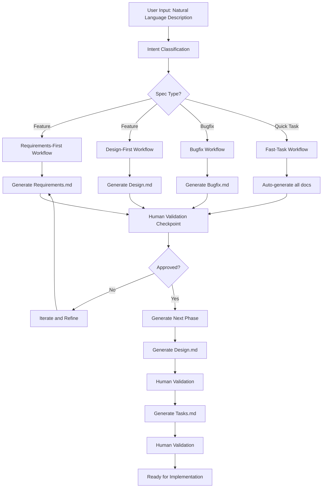
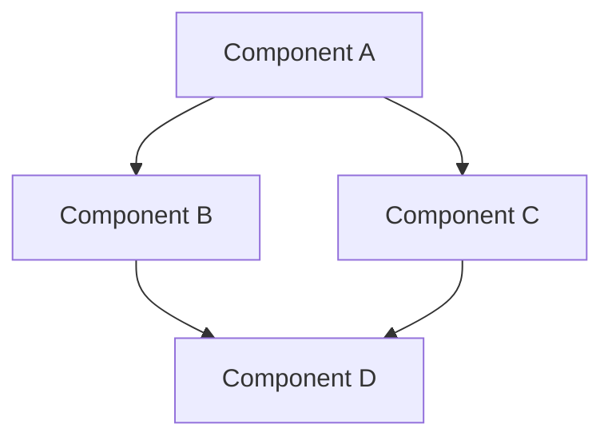
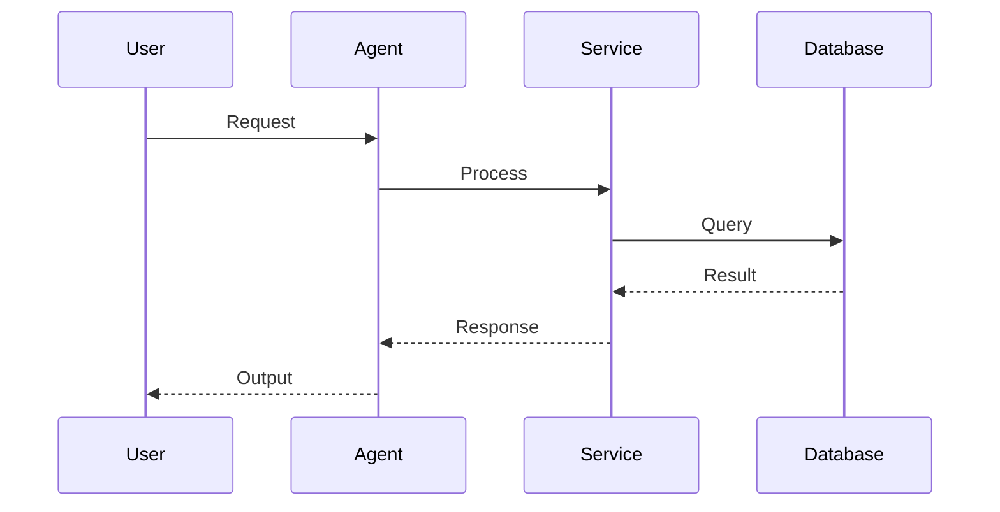
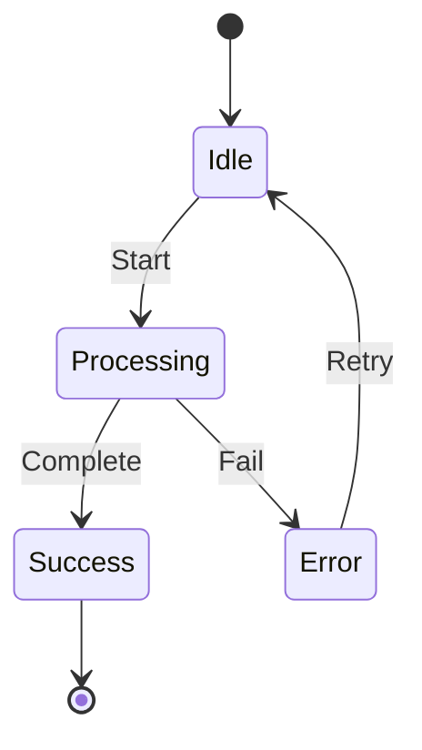

# Spec Creation Architecture Research — 2026

**Project:** ForgeAI - Autonomous AI Coding Assistant  
**Research Date:** May 10, 2026  
**Focus Areas:** Spec-Driven Development, AI-Assisted Specification Generation, Specification Workflow Architecture, Requirements Engineering  
**Primary Sources:**

- [Augment Code - Spec-Driven Development](https://www.augmentcode.com/guides/automating-spec-driven-development-with-ai-agents)
- [ArXiv - From Code to Contract in the Age of AI Coding Assistants](https://arxiv.org/html/2602.00180)
- [MindStudio - How to Write a Software Spec](https://www.mindstudio.ai/blog/how-to-write-a-software-spec)
- [Jama Software - System Requirements Specification](https://www.jamasoftware.com/requirements-management-guide/writing-requirements/system-requirements-specification/)
- [SpecDriven.ai](https://specdriven.ai/)
- [GitHub - Claude Code Spec Workflow](https://github.com/Pimzino/claude-code-spec-workflow)

---

## Executive Summary

This research provides a comprehensive analysis of spec creation architecture for building an AI-powered specification generation feature in ForgeAI. The key finding is that **spec-driven development (SDD) represents a fundamental paradigm shift from code-first to specification-first workflows**, where specifications become executable contracts that drive AI code generation.

**Key Findings:**

- ✅ **Four-Phase Specification Workflow**: Specify → Plan → Tasks → Implement delivers 56% programming time reduction
- ✅ **Machine-Readable Specifications**: Specs as executable contracts validated through CI/CD pipelines
- ✅ **AI Agent Coordination**: Multi-agent systems for spec generation, validation, and implementation
- ✅ **Living Specifications**: Synchronized documentation that stays current with implementation
- ✅ **Property-Based Testing Integration**: Correctness properties derived from specifications
- ✅ **Human Validation Checkpoints**: Quality gates at every phase to prevent AI drift
- ⚠️ **Specification Drift**: Without automated enforcement, specs become outdated within weeks
- ⚠️ **Context Gap**: AI agents need 400,000+ file context for enterprise-scale spec accuracy

**Critical Insight from ArXiv:**

> "Spec-driven development (SDD) inverts the traditional workflow by treating specifications as the source of truth and code as a generated or verified secondary artifact. This prevents architectural drift through automated enforcement rather than passive documentation."

**Recommended Architecture for ForgeAI:**

- **Primary Workflow**: Requirements → Design → Tasks → Implementation (SDD)
- **Specification Format**: Machine-readable Markdown with structured sections
- **AI Integration**: Multi-agent coordination for spec generation and validation
- **Validation Engine**: Property-based testing + CI/CD integration
- **Persistence Layer**: Git-tracked `.kiro/specs/` directory with version control
- **UI Integration**: VS Code webview with real-time spec preview

---

## Table of Contents

1. [Spec-Driven Development Methodology](#1-spec-driven-development-methodology)
2. [Specification Document Architecture](#2-specification-document-architecture)
3. [AI-Assisted Spec Generation](#3-ai-assisted-spec-generation)
4. [Workflow Phases and Checkpoints](#4-workflow-phases-and-checkpoints)
5. [Requirements Engineering Best Practices](#5-requirements-engineering-best-practices)
6. [Design Document Patterns](#6-design-document-patterns)
7. [Task Generation and Breakdown](#7-task-generation-and-breakdown)
8. [Property-Based Testing Integration](#8-property-based-testing-integration)
9. [Multi-Agent Coordination](#9-multi-agent-coordination)
10. [VS Code Integration Patterns](#10-vs-code-integration-patterns)
11. [Implementation Recommendations](#11-implementation-recommendations)
12. [Best Practices and Anti-Patterns](#12-best-practices-and-anti-patterns)

---

## 1. Spec-Driven Development Methodology

### Status: ✅ **CRITICAL - Paradigm Shift for AI Coding**

Spec-driven development (SDD) represents a fundamental shift in how AI coding assistants operate. Instead of generating code from natural language prompts, SDD treats specifications as the primary artifact and code as a generated output.

### Core Principles

1. **Specification as Source of Truth**: Specs define what the system does, code implements it
2. **Machine-Readable Format**: Structured format that AI can parse and validate
3. **Automated Enforcement**: CI/CD pipelines validate code against specs
4. **Living Documentation**: Specs stay synchronized with implementation
5. **Incremental Refinement**: Human validation at each phase prevents drift

### Traditional vs. Spec-Driven Workflow

```
Traditional Workflow:
Idea → Code → Test → Document → Spec (often skipped)

Spec-Driven Workflow:
Idea → Spec (Requirements → Design → Tasks) → Code → Test → Validate → Deploy
```

### Benefits (From Research)

| Metric                      | Improvement                             | Source                              |
| --------------------------- | --------------------------------------- | ----------------------------------- |
| Programming time reduction  | 56%                                     | Augment Code enterprise deployments |
| Time-to-market acceleration | 30-40% faster                           | Augment Code enterprise deployments |
| Project success rate        | 97% more likely with clear requirements | TestGrid study                      |
| Code drift prevention       | Automated enforcement                   | SDD practitioners                   |

### When to Use SDD

✅ **Ideal for:**

- AI-assisted development workflows
- Complex multi-feature projects
- Team collaboration scenarios
- Long-lived codebases with evolving requirements
- Regulatory compliance environments

⚠️ **Less suitable for:**

- Simple one-off scripts
- Rapid prototyping without production intent
- Exploration/spike work

---

## 2. Specification Document Architecture

### Status: ✅ **CORE PATTERN - Three Document Structure**

Based on research from multiple sources, the optimal specification structure consists of three core documents: Requirements, Design, and Tasks.

### Document Structure

```
.kiro/specs/{feature-name}/
├── .config.kiro           # Metadata (spec ID, workflow type, spec type)
├── requirements.md         # WHAT to build
├── design.md              # HOW to build it
└── tasks.md               # IMPLEMENTATION plan
```

### 2.1 Requirements Document (requirements.md)

**Purpose:** Define WHAT the system should do from a user perspective.

**Structure:**

```markdown
# Requirements Document: {Feature Name}

## Introduction

- Brief overview of the feature
- Context and motivation
- High-level goals

## Glossary

- Definitions of domain-specific terms
- Acronyms and abbreviations
- Key concepts

## Requirements

### Requirement 1: {Title}

**User Story:** As a [role], I want [feature], so that [benefit]

#### Acceptance Criteria

1. WHEN [condition], THE system SHALL [behavior]
2. WHEN [condition], THE system SHALL [behavior]
3. IF [condition], THEN THE system SHALL [behavior]

---

### Requirement 2: {Title}

...
```

**Key Principles:**

- **User-Centric**: Start with user stories, not technical details
- **Testable**: Every acceptance criterion must be verifiable
- **Unambiguous**: Use SHALL/SHOULD/MAY consistently
- **Complete**: Cover all scenarios including edge cases
- **EARS Notation**: Use Easy Approach to Requirements Syntax for consistency

### 2.2 Design Document (design.md)

**Purpose:** Define HOW to implement the requirements technically.

**Structure:**

```markdown
# Design Document: {Feature Name}

## Overview

- Purpose and goals
- Key technical decisions
- Constraints

## Architecture

- High-level architecture diagram
- Component diagram
- Sequence diagrams
- Data flow diagrams

## Components and Interfaces

- Core component definitions
- Interface specifications
- API contracts
- Data models

## State Management

- State diagrams
- Persistence strategies
- Caching approaches

## Error Handling

- Error categories
- Recovery strategies
- User-facing error messages

## Testing Strategy

- Unit tests
- Integration tests
- Property-based tests
- Manual testing requirements

## Correctness Properties

- Formal properties for property-based testing
- Invariants that must hold

## Integration Points

- External service integrations
- Extension APIs
- Event hooks
```

**Key Principles:**

- **Architectural Clarity**: Show how components interact
- **Interface-First**: Define contracts before implementation
- **Data Flow Transparency**: Show how data moves through the system
- **Error Resilience**: Plan for failure modes
- **Testability**: Design for verification

### 2.3 Tasks Document (tasks.md)

**Purpose:** Break down implementation into actionable, ordered tasks.

**Structure:**

```markdown
# Implementation Plan: {Feature Name}

## Overview

- Brief description
- Implementation approach
- Estimated effort

## Tasks

### Phase 1: Foundation

- [ ] 1. {Task title}
  - Description of the task
  - _Requirements: 1.1, 1.2, 1.3_
  - [ ] 1.1 {Sub-task title}
    - Description
    - _Requirements: 1.1_
  - [ ]\* 1.2 Write property test for {property}
    - **Property X: {Property Name}**
    - **Validates: Requirements 1.1**
    - _Optional test task (marked with \*)_

- [ ] 2. Checkpoint - Foundation complete
  - Verify all foundation tasks
  - Run type checking
  - Ensure compilation

---

### Phase 2: Core Implementation

...

## Task Dependency Graph

\`\`\`json
{
"waves": [
{ "id": 0, "tasks": ["1.1", "1.5", "1.8"] },
{ "id": 1, "tasks": ["1.2", "1.6", "1.9"] },
...
]
}
\`\`\`
```

**Key Principles:**

- **Actionable**: Each task is a concrete, implementable unit
- **Ordered**: Dependencies are explicit
- **Traceable**: Tasks reference specific requirements
- **Checkpoints**: Validation points between phases
- **Parallelizable**: Wave-based execution graph

---

## 3. AI-Assisted Spec Generation

### Status: ✅ **CRITICAL - Core Feature of ForgeAI**

AI-assisted specification generation transforms natural language descriptions into structured specifications. This is the core capability that makes spec-driven development practical.

### 3.1 Generation Workflow



### 3.2 Multi-Agent Coordination Pattern

Based on research, the most effective pattern uses specialized agents for each phase:

```typescript
interface SpecGenerationAgents {
  requirementsAgent: {
    role: 'Generate user stories and acceptance criteria from natural language';
    input: 'Feature description, user research, domain knowledge';
    output: 'requirements.md with structured requirements';
    validation: 'Clarity, completeness, testability';
  };

  designAgent: {
    role: 'Translate requirements into technical design';
    input: 'requirements.md, architectural constraints, tech stack';
    output: 'design.md with architecture, interfaces, data models';
    validation: 'Consistency with requirements, technical feasibility';
  };

  taskAgent: {
    role: 'Break down design into actionable implementation tasks';
    input: 'design.md, requirements.md, codebase context';
    output: 'tasks.md with ordered, traceable tasks';
    validation: 'Coverage, dependency order, effort estimation';
  };

  validatorAgent: {
    role: 'Validate spec consistency across all documents';
    input: 'requirements.md, design.md, tasks.md';
    output: 'Validation report, consistency issues';
    validation: 'Cross-document consistency, requirement coverage';
  };
}
```

### 3.3 Context Requirements

**Critical Finding:** AI agents need significant context for accurate spec generation:

| Context Type         | Minimum Required | Optimal           | Source                   |
| -------------------- | ---------------- | ----------------- | ------------------------ |
| Codebase files       | 10,000 files     | 400,000+ files    | Augment Code             |
| Conversation history | Last 10 messages | Full conversation | SDD practitioners        |
| Domain knowledge     | Project docs     | Full RAG index    | Research papers          |
| Existing specs       | Similar features | All related specs | Multi-agent coordination |

**Implementation Recommendation:**

```typescript
interface SpecGenerationContext {
  // Codebase context
  codebaseFiles: string[]; // Related files
  projectStructure: DirectoryTree; // Project layout

  // Knowledge context
  domainKnowledge: RAGQueryResult[]; // From RAG knowledge base
  relatedSpecs: Spec[]; // Similar existing specs

  // Conversation context
  conversationHistory: Message[]; // User's questions and clarifications
  userPreferences: UserPreferences; // Styling, conventions

  // Technical context
  techStack: TechStackDetection; // Framework, language, tools
  architecturalConstraints: Constraint[]; // Existing patterns, limitations
}
```

### 3.4 Generation Quality Factors

**Factors that improve spec quality:**

1. **Structured Input**: Guided prompts vs. free-form text
2. **Iterative Refinement**: Multiple passes with human feedback
3. **Example-Based**: Show the AI examples of good specs
4. **Validation Loops**: Automatic consistency checking
5. **Domain Knowledge**: RAG-enriched context
6. **Constraint Specification**: Tell the AI what NOT to do

**Factors that degrade spec quality:**

1. **Ambiguous Requirements**: Vague or contradictory inputs
2. **Missing Context**: Insufficient codebase or domain knowledge
3. **Scope Creep**: Trying to cover too much in one spec
4. **No Validation**: Skipping human review checkpoints
5. **Over-Specification**: Too much detail at wrong abstraction level

---

## 4. Workflow Phases and Checkpoints

### Status: ✅ **CORE PATTERN - Four-Phase Methodology**

The four-phase methodology (Specify, Plan, Tasks, Implement) is the most researched and proven approach for spec-driven development.

### 4.1 Phase Overview

```
Phase 1: SPECIFY (Requirements)
├── Goal: Define WHAT to build
├── Output: requirements.md
├── Validation: Human review, requirement analysis
└── Checkpoint: Requirements complete and approved

Phase 2: PLAN (Design)
├── Goal: Define HOW to build
├── Output: design.md
├── Validation: Human review, consistency check
└── Checkpoint: Design approved and consistent with requirements

Phase 3: TASKS (Implementation Plan)
├── Goal: Break into actionable units
├── Output: tasks.md
├── Validation: Human review, dependency order
└── Checkpoint: Tasks ready for execution

Phase 4: IMPLEMENT (Execution)
├── Goal: Execute tasks
├── Output: Working code
├── Validation: Tests pass, requirements met
└── Checkpoint: Feature complete and validated
```

### 4.2 Human Validation Checkpoints

**Critical Finding:** "SDDD is a multi-phase workflow with explicit Human Validation checkpoints at every stage. These checkpoints ensure quality, prevent misunderstandings, and guarantee that AI-generated code adheres to architectural standards." — Francesca Tabor

**Checkpoint Structure:**

```typescript
interface ValidationCheckpoint {
  phase: 'requirements' | 'design' | 'tasks' | 'implementation';

  questions: {
    question: string;
    type: 'approval' | 'clarification' | 'choice';
    options?: string[];
    defaultAnswer?: string;
  }[];

  validation: {
    automated: ValidationTest[]; // Can be run automatically
    manual: ValidationQuestion[]; // Require human judgment
  };

  outcomes: {
    approved: 'Proceed to next phase';
    needsRefinement: 'Return to previous phase with feedback';
    blocked: 'Cannot proceed without clarification';
  };
}
```

**Example Checkpoint Questions:**

```typescript
const requirementsCheckpoint: ValidationCheckpoint = {
  phase: 'requirements',
  questions: [
    {
      question: 'Do these requirements capture all user needs?',
      type: 'approval',
      defaultAnswer: 'Yes, proceed to design',
    },
    {
      question: 'Are there any edge cases or error scenarios missing?',
      type: 'clarification',
    },
    {
      question: 'Which acceptance criteria need more detail?',
      type: 'clarification',
    },
  ],
  validation: {
    automated: [
      { test: 'All requirements have acceptance criteria' },
      { test: 'No duplicate requirement IDs' },
      { test: 'All user stories follow standard format' },
    ],
    manual: [
      { question: 'Is the scope appropriate for one spec?' },
      { question: 'Are business requirements accurately captured?' },
    ],
  },
};
```

### 4.3 Workflow Entry Points

**Different entry points for different needs:**

```typescript
type WorkflowEntryPoint =
  | 'requirements-first' // Start with requirements
  | 'design-first' // Start with technical design
  | 'bugfix' // Bug fix workflow
  | 'fast-task'; // Quick task without full spec

const workflowSelection = {
  'requirements-first': {
    when: 'Clear business needs, unclear technical approach',
    workflow: 'Requirements → Design → Tasks → Implement',
    bestFor: 'New features, user-facing functionality',
  },

  'design-first': {
    when: 'Clear technical vision, need to formalize requirements',
    workflow: 'Design → Requirements → Tasks → Implement',
    bestFor: 'Refactoring, system redesign, technical upgrades',
  },

  bugfix: {
    when: 'Something is broken and needs fixing',
    workflow: 'Bug Condition → Design → Tasks → Fix → Verify',
    bestFor: 'Bug fixes, error corrections, regression fixes',
  },

  'fast-task': {
    when: "Simple task doesn't need full spec",
    workflow: 'Clarify → Auto-generate spec → Execute',
    bestFor: 'Simple features, quick fixes, small enhancements',
  },
};
```

---

## 5. Requirements Engineering Best Practices

### Status: ✅ **CRITICAL - Foundation of Good Specs**

Requirements are the foundation of the entire spec-driven workflow. Poor requirements lead to poor designs and failed implementations.

### 5.1 User Story Format

**Standard Format:**

```markdown
**User Story:** As a [role], I want [feature], so that [benefit]
```

**Principles:**

- **Role**: Who benefits? (User, Admin, Developer, System)
- **Feature**: What do they want to do?
- **Benefit**: Why do they want it? (Value proposition)

**Example:**

```markdown
**User Story:** As a developer, I want the UI/UX Architect Agent to create
comprehensive design systems, so that I can maintain visual consistency
throughout my project without manual design work.
```

### 5.2 Acceptance Criteria Formats

**Format 1: Scenario-Based (Gherkin-style)**

```markdown
GIVEN [initial context]
WHEN [action occurs]
THEN [expected outcome]
```

**Format 2: Conditional (EARS Notation)**

```markdown
WHEN [condition], THE system SHALL [behavior]
IF [condition], THEN THE system SHALL [behavior]
WHERE [scope], THE system SHALL [behavior]
```

**Format 3: List-Based**

```markdown
- [ ] Criterion 1: Description of expected behavior
- [ ] Criterion 2: Description of expected behavior
- [ ] Criterion 3: Description of expected behavior
```

**Recommendation:** Use EARS notation for structured, testable criteria:

```markdown
#### Acceptance Criteria

1. WHEN a user requests a new design system, THE system SHALL generate
   a complete design system including color palette, typography scale,
   and spacing system

2. WHEN generating a color palette, THE system SHALL produce primary,
   secondary, accent, neutral, success, warning, and error color scales
   with 50-950 shades

3. THE system SHALL ensure all color combinations meet WCAG 2.1 AA
   contrast requirements (minimum 4.5:1 for normal text)
```

### 5.3 Requirements Quality Characteristics

**IEEE 830 Standard Characteristics:**

| Characteristic            | Description                                   | How to Achieve                                      |
| ------------------------- | --------------------------------------------- | --------------------------------------------------- |
| **Correct**               | Accurately represents stakeholder needs       | Validate with stakeholders                          |
| **Unambiguous**           | Only one interpretation possible              | Use precise language, avoid "fast", "user-friendly" |
| **Complete**              | Covers all scenarios and edge cases           | Systematic analysis of all paths                    |
| **Consistent**            | No contradictions between requirements        | Cross-reference validation                          |
| **Ranked for importance** | Prioritized (MoSCoW: Must/Should/Could/Won't) | Explicit priority labeling                          |
| **Verifiable**            | Can be tested objectively                     | Measurable acceptance criteria                      |
| **Modifiable**            | Easy to change without breaking structure     | Modular organization                                |
| **Traceable**             | Can track from requirement to implementation  | Unique IDs, cross-references                        |

### 5.4 Requirements Anti-Patterns

**Avoid These:**

❌ **Implementation Details in Requirements**

```markdown
# Bad

THE system SHALL use Redis for caching user sessions with 30-minute TTL
```

```markdown
# Good

THE system SHALL persist user sessions for a minimum of 30 minutes
with automatic expiration
```

❌ **Vague or Unmeasurable Criteria**

```markdown
# Bad

THE system SHALL be fast
```

```markdown
# Good

THE system SHALL respond to user queries within 200 milliseconds
for 95% of requests
```

❌ **Compound Requirements**

```markdown
# Bad

THE system SHALL validate user input, sanitize data, and log all errors
```

```markdown
# Good

THE system SHALL validate user input against the schema
THE system SHALL sanitize all user-provided data before storage
THE system SHALL log all validation errors with timestamps
```

---

## 6. Design Document Patterns

### Status: ✅ **CORE PATTERN - Technical Blueprint**

Design documents translate requirements into technical implementation plans. They bridge the gap between "what" and "how."

### 6.1 Architecture Diagram Types

**1. High-Level Architecture (System Context)**

```
Shows the system in its environment, interacting with users and external systems.

┌─────────────────────────────────────────────────────────┐
│                     External Systems                     │
│  ┌──────────┐  ┌──────────┐  ┌──────────┐              │
│  │ Database │  │   API    │  │   Auth   │              │
│  └────┬─────┘  └────┬─────┘  └────┬─────┘              │
└───────┼─────────────┼─────────────┼────────────────────┘
        │             │             │
        └─────────────┼─────────────┘
                      │
        ┌─────────────▼─────────────┐
        │    Core Application       │
        │  ┌───────────────────┐   │
        │  │   Agent Layer     │   │
        │  └───────────────────┘   │
        │  ┌───────────────────┐   │
        │  │   Service Layer   │   │
        │  └───────────────────┘   │
        └───────────────────────────┘
```

**2. Component Diagram**



**3. Sequence Diagram**



**4. Data Flow Diagram**

Shows how data moves through the system:

```
Input → Validation → Processing → Storage → Output
```

### 6.2 Interface Definition Pattern

**TypeScript Interface Pattern (Recommended):**

```typescript
/**
 * ComponentName - Brief description
 *
 * Responsibilities:
 * - Responsibility 1
 * - Responsibility 2
 */
export interface ComponentName {
  // Properties
  property1: string;
  property2: number;

  // Methods
  methodName(param: ParamType): ReturnType;
}

/**
 * MethodName - Brief description
 * @param param - Parameter description
 * @returns Return value description
 */
methodName(param: ParamType): ReturnType;
```

### 6.3 State Management Pattern

**State Diagram:**



**State Definition:**

```typescript
interface SystemState {
  // Current state
  status: 'idle' | 'processing' | 'success' | 'error';

  // Loading states
  isLoading: boolean;
  loadingMessage?: string;

  // Error states
  error?: {
    message: string;
    code: string;
    recoverable: boolean;
  };

  // Data
  data?: DataType;

  // History (for undo/redo)
  history: {
    past: State[];
    future: State[];
  };
}
```

---

## 7. Task Generation and Breakdown

### Status: ✅ **CORE PATTERN - Implementation Roadmap**

Task generation transforms design into actionable implementation units. Good task breakdown makes the difference between smooth execution and chaos.

### 7.1 Task Breakdown Principles

**SMART Task Criteria:**

- **Specific**: Clear, unambiguous description
- **Measurable**: Has completion criteria
- **Achievable**: Can be completed in one session
- **Relevant**: Contributes to the goal
- **Time-bound**: Reasonable time estimate

**Task Size Guidelines:**

| Task Size  | Duration  | Complexity          | When to Use                     |
| ---------- | --------- | ------------------- | ------------------------------- |
| **Tiny**   | < 30 min  | Single change       | Bug fixes, config updates       |
| **Small**  | 30-60 min | One component       | Single feature, simple function |
| **Medium** | 1-4 hours | Multiple components | Related features, integration   |
| **Large**  | 4-8 hours | Subsystem           | Major feature, refactoring      |
| **Epic**   | > 8 hours | System-level        | Break down further!             |

**Rule:** If a task is larger than 8 hours, break it down.

### 7.2 Task Dependency Management

**Wave-Based Execution:**

Tasks are organized in "waves" where all tasks in a wave can be executed in parallel:

```json
{
  "waves": [
    {
      "id": 0,
      "tasks": ["1.1", "1.5", "1.8"],
      "description": "Foundation tasks with no dependencies"
    },
    {
      "id": 1,
      "tasks": ["1.2", "1.6", "1.9"],
      "description": "Tasks that depend on wave 0"
    },
    {
      "id": 2,
      "tasks": ["2.1", "2.3"],
      "description": "Tasks that depend on wave 1"
    }
  ]
}
```

**Dependency Types:**

```typescript
type DependencyType =
  | 'hard' // Must complete before starting
  | 'soft' // Should complete, but can start without
  | 'optional' // Nice to have, not required
  | 'related'; // Related task, but no strict ordering

interface TaskDependency {
  taskId: string;
  dependsOn: string[];
  dependencyType: DependencyType;
}
```

### 7.3 Task Template

```markdown
- [ ] {Task ID}. {Task Title}
  - {Description of what needs to be done}
  - {Specific implementation details}
  - _Requirements: {Requirement IDs this task implements}_
  - [ ] {Task ID}.1 {Sub-task Title}
    - {Sub-task description}
    - _Requirements: {Requirement ID}_
  - [ ]\* {Task ID}.2 Write property test for {property}
    - **Property X: {Property Name}**
    - **Validates: Requirements {ID}**
    - _Optional test task (marked with \*)_
```

### 7.4 Phase Organization

**Recommended Phase Structure:**

```
Phase 1: Foundation
├── Type definitions
├── Project structure setup
├── Core interfaces
└── Configuration

Phase 2: Core Implementation
├── Primary functionality
├── Core algorithms
└── Essential services

Phase 3: Integration
├── External service integration
├── API implementation
└── Database connectivity

Phase 4: UI/UX (if applicable)
├── User interface
├── User experience flows
└── Accessibility

Phase 5: Testing & Validation
├── Unit tests
├── Integration tests
├── Property-based tests
└── Manual testing

Phase 6: Documentation & Polish
├── Code documentation
├── User documentation
├── Performance optimization
└── Final review
```

---

## 8. Property-Based Testing Integration

### Status: ✅ **ADVANCED - Quality Assurance**

Property-based testing (PBT) validates that software conforms to formal correctness properties. It's particularly valuable in spec-driven development because specs naturally express properties.

### 8.1 What Are Correctness Properties?

**Definition:** A property is a formal statement about what the system should do that holds true across all valid executions.

**Example:**

```markdown
### Property 1: Color Contrast Compliance

_For any_ generated color pair intended for text and background use,
the contrast ratio SHALL meet or exceed WCAG 2.1 Level AA requirements
(4.5:1 for normal text, 3:1 for large text).

**Validates: Requirements 1.4, 5.2, 15.2**
```

### 8.2 Property Format in Specs

**Standard Property Template:**

```markdown
### Property {N}: {Property Name}

_For any_ {input domain}, the {system/component} SHALL {expected behavior}.

**Validates: Requirements {IDs}**
```

### 8.3 Property Types

**1. Invariant Properties**

Something that must always be true:

```markdown
_For any_ design token set, all color combinations SHALL meet WCAG contrast requirements.
```

**2. Round-Trip Properties**

Operations that should be reversible:

```markdown
_For any_ design tokens, serializing to any format (JSON, CSS, Tailwind)
and parsing back SHALL produce equivalent tokens.
```

**3. Preservation Properties**

Something that should be preserved through transformation:

```markdown
_For any_ component hierarchy, after platform adaptation,
the hierarchy structure SHALL be preserved.
```

**4. Completeness Properties**

Something that must be complete:

```markdown
_For any_ generated color scale, all shade values (50-950) SHALL be present.
```

### 8.4 Property-Based Testing Framework

**Recommended Setup:**

```typescript
import fc from 'fast-check';
import { describe, it } from 'vitest';

describe('Property 1: Color Contrast Compliance', () => {
  it('should meet WCAG AA for any generated color pair', () => {
    fc.assert(
      fc.property(
        fc.hexaString({ minLength: 6, maxLength: 6 }).map((s) => `#${s}`),
        fc.hexaString({ minLength: 6, maxLength: 6 }).map((s) => `#${s}`),
        fc.boolean(), // isLargeText
        (foreground, background, isLargeText) => {
          const ratio = calculateContrastRatio(foreground, background);
          const minRatio = isLargeText ? 3 : 4.5;
          return ratio >= minRatio || !meetsWCAGAA(foreground, background, isLargeText);
        }
      ),
      { numRuns: 100 }
    );
  });
});
```

---

## 9. Multi-Agent Coordination

### Status: ✅ **ADVANCED - Orchestration Pattern**

Multi-agent coordination enables sophisticated spec generation workflows where specialized agents handle different phases.

### 9.1 Agent Roles

```typescript
interface SpecGenerationOrchestrator {
  // Entry point selection
  selectorAgent: {
    role: 'Analyze user input and select appropriate workflow';
    input: 'Natural language description';
    output: 'Workflow type: requirements-first | design-first | bugfix | fast-task';
  };

  // Phase-specific agents
  requirementsAgent: {
    role: 'Generate requirements.md';
    capabilities: [
      'Parse natural language into structured requirements',
      'Identify user stories and acceptance criteria',
      'Validate requirement completeness',
      'Ask clarifying questions',
    ];
  };

  designAgent: {
    role: 'Generate design.md';
    capabilities: [
      'Translate requirements into technical design',
      'Generate architecture diagrams',
      'Define interfaces and data models',
      'Ensure design consistency with requirements',
    ];
  };

  taskAgent: {
    role: 'Generate tasks.md';
    capabilities: [
      'Break design into actionable tasks',
      'Determine task dependencies',
      'Estimate effort and complexity',
      'Generate dependency graph',
    ];
  };

  // Validation agent
  validatorAgent: {
    role: 'Validate spec consistency across all documents';
    capabilities: [
      'Cross-reference requirements to design',
      'Verify all requirements have design coverage',
      'Check all design decisions have implementation tasks',
      'Identify gaps and inconsistencies',
    ];
  };
}
```

### 9.2 Agent Communication Protocol

```typescript
interface AgentMessage {
  from: AgentId;
  to: AgentId;
  type: 'request' | 'response' | 'validation' | 'error';
  payload: {
    phase: 'requirements' | 'design' | 'tasks' | 'validation';
    content: any;
    metadata: {
      timestamp: number;
      context: string[];
      userFeedback?: string;
    };
  };
}

// Example conversation flow
const conversationFlow: AgentMessage[] = [
  {
    from: 'user',
    to: 'selectorAgent',
    type: 'request',
    payload: { content: 'I want to add user authentication' },
  },
  {
    from: 'selectorAgent',
    to: 'requirementsAgent',
    type: 'request',
    payload: {
      phase: 'requirements',
      content: 'Generate requirements for user authentication feature',
      metadata: { workflow: 'requirements-first' },
    },
  },
  {
    from: 'requirementsAgent',
    to: 'user',
    type: 'response',
    payload: { content: 'Generated requirements.md' },
  },
  {
    from: 'user',
    to: 'requirementsAgent',
    type: 'response',
    payload: { content: 'Approved, proceed to design' },
  },
  {
    from: 'requirementsAgent',
    to: 'designAgent',
    type: 'request',
    payload: {
      phase: 'design',
      content: 'Generate design from approved requirements',
    },
  },
];
```

### 9.3 Agent Context Management

**Critical:** Agents need persistent context across phases:

```typescript
interface AgentContext {
  // Conversation context
  conversationHistory: Message[];
  userPreferences: Record<string, any>;

  // Project context
  codebaseContext: {
    relatedFiles: string[];
    projectStructure: DirectoryTree;
    techStack: TechStack;
  };

  // Spec context
  specContext: {
    requirements?: RequirementsDocument;
    design?: DesignDocument;
    tasks?: TasksDocument;
  };

  // Knowledge context
  ragContext: {
    domainKnowledge: RAGQueryResult[];
    examples: SpecExample[];
    bestPractices: string[];
  };
}
```

---

## 10. VS Code Integration Patterns

### Status: ✅ **CRITICAL - User Experience**

VS Code integration is how users interact with the spec creation feature. Good UX makes spec-driven development practical and enjoyable.

### 10.1 UI Components

**1. Spec Explorer View**

```
ForgeAI Specs
├── 📋 Active Specs
│   ├── 🔧 user-authentication (in-progress)
│   │   ├── ✓ requirements.md
│   │   ├── ✓ design.md
│   │   └── ○ tasks.md
│   └── ✓ browser-capability (complete)
├── 📁 Archived Specs
```

└── ➕ New Spec

````

**2. Spec Editor Panel**

Split-view editor with:
- Left: Markdown source
- Right: Rendered preview with syntax highlighting

**3. Spec Generation Dialog**

```typescript
interface SpecCreationDialog {
  // Step 1: Workflow selection
  workflowSelection: {
    type: "requirements-first" | "design-first" | "bugfix" | "fast-task";
    recommended?: string; // AI recommendation based on input analysis
  };

  // Step 2: Feature description
  featureDescription: {
    naturalLanguageInput: string;
    clarifyingQuestions?: Question[];
  };

  // Step 3: Generation progress
  generationProgress: {
    phase: "requirements" | "design" | "tasks";
    status: "generating" | "waiting-for-input" | "complete" | "error";
    progress: number; // 0-100
    message: string;
  };

  // Step 4: Review and approve
  review: {
    documentPreview: string;
    validationResults: ValidationResult[];
    approvalActions: ["Approve", "Request Changes", "Cancel"];
  };
}
````

### 10.2 Command Palette Commands

```typescript
const specCommands = [
  {
    id: 'forgeai.spec.new',
    title: 'ForgeAI: Create New Spec',
    description: 'Start a new specification with guided workflow',
  },
  {
    id: 'forgeai.spec.continue',
    title: 'ForgeAI: Continue Spec Generation',
    description: 'Continue from current phase to next',
  },
  {
    id: 'forgeai.spec.regenerate',
    title: 'ForgeAI: Regenerate Current Document',
    description: 'Regenerate requirements/design/tasks with feedback',
  },
  {
    id: 'forgeai.spec.validate',
    title: 'ForgeAI: Validate Spec Consistency',
    description: 'Check all documents for consistency',
  },
  {
    id: 'forgeai.spec.export',
    title: 'ForgeAI: Export Spec',
    description: 'Export to different format (PDF, HTML, DOCX)',
  },
  {
    id: 'forgeai.spec.archive',
    title: 'ForgeAI: Archive Spec',
    description: 'Move completed spec to archive',
  },
];
```

### 10.3 Context Menu Integration

**File Context Menus:**

```json
{
  "menus": {
    "editor/context": [
      {
        "when": "resourceFilename =~ /requirements\\.md/",
        "command": "forgeai.spec.generateDesign",
        "group": "forgeai"
      },
      {
        "when": "resourceFilename =~ /design\\.md/",
        "command": "forgeai.spec.generateTasks",
        "group": "forgeai"
      }
    ]
  }
}
```

### 10.4 Status Bar Integration

```
ForgeAI: user-authentication spec | Phase: Design | Ready to generate tasks
```

### 10.5 Keyboard Shortcuts

| Shortcut      | Action              |
| ------------- | ------------------- |
| `Cmd+Shift+N` | New spec            |
| `Cmd+Shift+G` | Generate next phase |
| `Cmd+Shift+V` | Validate spec       |
| `Cmd+Shift+E` | Export spec         |

---

## 11. Implementation Recommendations

### Status: ✅ **ACTIONABLE - Next Steps**

Based on all research findings, here are the recommended implementation priorities for adding spec creation to ForgeAI.

### 11.1 Core Components to Build

**Priority 1: Foundation (Must Have)**

1. **Spec Document Models**
   - TypeScript interfaces for requirements, design, tasks
   - Validation schemas
   - Serialization/deserialization

2. **Spec Storage Layer**
   - File system persistence (`.kiro/specs/`)
   - Git integration for version control
   - Spec metadata management

3. **Spec Generation Engine**
   - Requirements generation from natural language
   - Design generation from requirements
   - Task generation from design

**Priority 2: User Experience (Should Have)**

4. **VS Code Integration**
   - Spec explorer view
   - Command palette commands
   - Editor integration

5. **Validation Engine**
   - Cross-document consistency checking
   - Requirement coverage analysis
   - Dependency validation

6. **Human Validation Workflow**
   - Checkpoint dialogs
   - Feedback collection
   - Iteration support

**Priority 3: Advanced Features (Nice to Have)**

7. **Property-Based Test Generation**
   - Extract properties from specs
   - Generate test scaffolds
   - Validate properties

8. **Multi-Agent Coordination**
   - Specialized agents per phase
   - Agent communication protocol
   - Context management

9. **RAG Integration**
   - Spec examples knowledge base
   - Best practices retrieval
   - Pattern matching

### 11.2 Technical Architecture

```typescript
// Core architecture
interface SpecCreationSystem {
  // Storage
  storage: SpecStorage;

  // Generation
  generator: {
    requirements: RequirementsGenerator;
    design: DesignGenerator;
    tasks: TasksGenerator;
  };

  // Validation
  validator: SpecValidator;

  // Orchestration
  orchestrator: WorkflowOrchestrator;

  // UI
  ui: VSCodeIntegration;
}
```

### 11.3 File Structure

```
src/extension/specs/
├── types/
│   ├── requirements.ts      # Requirements interfaces
│   ├── design.ts            # Design interfaces
│   ├── tasks.ts             # Tasks interfaces
│   └── index.ts             # Barrel export
├── storage/
│   ├── SpecStorage.ts       # Persistence layer
│   ├── SpecMetadata.ts      # Metadata management
│   └── GitIntegration.ts    # Version control
├── generators/
│   ├── RequirementsGenerator.ts
│   ├── DesignGenerator.ts
│   ├── TasksGenerator.ts
│   └── GeneratorBase.ts
├── validators/
│   ├── ConsistencyValidator.ts
│   ├── CoverageValidator.ts
│   └── PropertyValidator.ts
├── orchestrator/
│   ├── WorkflowOrchestrator.ts
│   ├── PhaseManager.ts
│   └── CheckpointManager.ts
└── ui/
    ├── SpecExplorer.ts      # Tree view
    ├── SpecEditor.ts        # Editor provider
    └── dialogs/
        ├── NewSpecDialog.ts
        ├── ReviewDialog.ts
        └── ValidationDialog.ts
```

### 11.4 Integration with Existing ForgeAI

**Hook into existing agent system:**

```typescript
// Extend existing agent architecture
class SpecCreationAgent extends BaseAgent {
  name = 'spec-creator';

  tools = [
    { name: 'create_spec', handler: this.createSpec },
    { name: 'generate_requirements', handler: this.generateRequirements },
    { name: 'generate_design', handler: this.generateDesign },
    { name: 'generate_tasks', handler: this.generateTasks },
    { name: 'validate_spec', handler: this.validateSpec },
  ];

  async createSpec(input: SpecCreationInput): Promise<Spec> {
    // 1. Classify workflow type
    const workflow = await this.classifyWorkflow(input);

    // 2. Generate first phase
    const firstPhase = workflow === 'requirements-first' ? 'requirements' : 'design';

    // 3. Generate document
    const document = await this.generatePhase(firstPhase, input);

    // 4. Validate and return
    return this.validateAndSave(document);
  }
}
```

### 11.5 Performance Considerations

**Based on research findings:**

| Operation               | Target Performance | Optimization Strategy  |
| ----------------------- | ------------------ | ---------------------- |
| Spec creation (simple)  | < 5 seconds        | Streaming generation   |
| Spec creation (complex) | < 30 seconds       | Incremental generation |
| Document validation     | < 1 second         | Cached analysis        |
| UI responsiveness       | < 100ms            | Background processing  |
| Large context retrieval | < 2 seconds        | RAG indexing           |

**Caching Strategy:**

```typescript
interface SpecCache {
  // Generated documents
  documents: Map<string, CachedDocument>;

  // Validation results
  validation: Map<string, ValidationResult>;

  // Context retrieval
  context: Map<string, RAGQueryResult[]>;

  // TTL configuration
  ttl: {
    documents: 3600; // 1 hour
    validation: 300; // 5 minutes
    context: 600; // 10 minutes
  };
}
```

---

## 12. Best Practices and Anti-Patterns

### Status: ✅ **CRITICAL - Avoid Common Mistakes**

### 12.1 Spec Creation Best Practices

**✅ DO:**

1. **Start with clear user needs**
   - Always begin with user stories
   - Focus on "why" before "what" or "how"

2. **Use structured formats consistently**
   - Same template across all specs
   - Consistent naming conventions
   - Standard acceptance criteria format

3. **Validate early and often**
   - Human checkpoints at every phase
   - Automated consistency checks
   - Cross-reference validation

4. **Keep specs focused**
   - One spec per feature
   - Break large features into smaller specs
   - Avoid kitchen-sink specs

5. **Make specs living documents**
   - Update as requirements change
   - Version control all changes
   - Link to implementation

6. **Include non-functional requirements**
   - Performance, security, accessibility
   - These are often forgotten

7. **Use property-based testing**
   - Extract properties from acceptance criteria
   - Validate invariants automatically

**❌ DON'T:**

1. **Skip human validation**
   - AI-generated specs can drift
   - Always have human review

2. **Mix abstraction levels**
   - Requirements should not have implementation details
   - Design should not have business logic

3. **Create specs in isolation**
   - Consider existing specs
   - Maintain consistency across specs

4. **Over-specify or under-specify**
   - Too much detail: rigid, hard to change
   - Too little detail: ambiguous, unimplementable

5. **Forget edge cases**
   - Error scenarios
   - Boundary conditions
   - Concurrent access

6. **Ignore existing architecture**
   - Specs should fit existing patterns
   - Don't redesign everything

### 12.2 Common Anti-Patterns

**Anti-Pattern 1: "The Ever-Growing Spec"**

```markdown
❌ Bad: One spec covering 50+ requirements across multiple domains

✅ Good: Multiple focused specs, each covering one coherent feature
```

**Anti-Pattern 2: "The Vague Requirement"**

```markdown
❌ Bad: THE system SHALL be user-friendly

✅ Good: THE system SHALL complete user registration within 3 clicks
and 30 seconds for 95% of users
```

**Anti-Pattern 3: "The Implementation in Disguise"**

```markdown
❌ Bad: THE system SHALL use Redis with 1-hour TTL for session caching

✅ Good: THE system SHALL persist user sessions for minimum 1 hour
with automatic expiration
```

**Anti-Pattern 4: "The Missing Acceptance Criteria"**

```markdown
❌ Bad:
**User Story:** As a user, I want to log in

✅ Good:
**User Story:** As a user, I want to log in, so that I can access my account

#### Acceptance Criteria

1. WHEN valid credentials are submitted, THE system SHALL authenticate
   the user within 2 seconds
2. WHEN invalid credentials are submitted, THE system SHALL show an
   error message without revealing which field is incorrect
3. IF 5 consecutive failed attempts occur, THE system SHALL lock
   the account for 15 minutes
```

**Anti-Pattern 5: "The Untraceable Task"**

```markdown
❌ Bad:

- [ ] Implement the feature
  - Write code

✅ Good:

- [ ] 1. Implement user authentication
  - Create authentication middleware
  - Add JWT token generation
  - Implement password hashing
  - _Requirements: 1.1, 1.2, 1.3_
```

### 12.3 Quality Checklist

**Requirements Document Quality Checklist:**

- [ ] All requirements have unique IDs
- [ ] All requirements have user stories
- [ ] All requirements have acceptance criteria
- [ ] Acceptance criteria are testable
- [ ] No duplicate requirements
- [ ] No conflicting requirements
- [ ] Priority is assigned (MoSCoW or similar)
- [ ] Non-functional requirements included
- [ ] Edge cases covered
- [ ] Glossary defines all terms

**Design Document Quality Checklist:**

- [ ] Architecture diagrams present and clear
- [ ] All components defined with interfaces
- [ ] Data models specified
- [ ] State management addressed
- [ ] Error handling planned
- [ ] Integration points documented
- [ ] All requirements have design coverage
- [ ] Correctness properties identified
- [ ] Testing strategy defined

**Tasks Document Quality Checklist:**

- [ ] All tasks reference requirements
- [ ] Tasks are appropriately sized (< 8 hours)
- [ ] Dependencies are explicit
- [ ] Dependency graph has no cycles
- [ ] Checkpoints between phases
- [ ] All design decisions have tasks
- [ ] Property tests identified
- [ ] Integration tests planned
- [ ] Manual testing requirements noted

---

## Summary

This research provides a comprehensive foundation for implementing spec creation in ForgeAI. The key insights are:

**Core Architecture:**

- Three-document structure: Requirements, Design, Tasks
- Four-phase workflow: Specify → Plan → Tasks → Implement
- Human validation checkpoints at every phase
- Property-based testing integration

**AI Integration:**

- Multi-agent coordination for different phases
- Context management across conversations
- Structured input for better generation
- Iterative refinement with human feedback

**Technical Implementation:**

- VS Code integration with tree view and commands
- File-based persistence in `.kiro/specs/`
- Validation engine for consistency checking
- Performance optimization through caching

**Best Practices:**

- User-centric requirements with testable criteria
- Separation of concerns (what vs. how)
- Living specifications with version control
- Property-based testing for quality assurance

**Next Steps:**

1. Implement core document models and storage
2. Build requirements generator with natural language input
3. Add design generator with architecture diagrams
4. Create task generator with dependency management
5. Integrate with VS Code UI
6. Add validation and quality checking
7. Implement property-based test generation

---

## References

- [Augment Code - Automating Spec-Driven Development with AI Agents](https://www.augmentcode.com/guides/automating-spec-driven-development-with-ai-agents)
- [ArXiv - From Code to Contract in the Age of AI Coding Assistants](https://arxiv.org/html/2602.00180)
- [MindStudio - How to Write a Software Spec](https://www.mindstudio.ai/blog/how-to-write-a-software-spec)
- [Jama Software - System Requirements Specification](https://www.jamasoftware.com/requirements-management-guide/writing-requirements/system-requirements-specification/)
- [SpecDriven.ai](https://specdriven.ai/)
- [GitHub - Claude Code Spec Workflow](https://github.com/Pimzino/claude-code-spec-workflow)
- [InfoQ - Spec Driven Development: When Architecture Becomes Executable](http://infoq.com/articles/spec-driven-development/)
- [Francesca Tabor - The SDDD Workflow](https://www.francescatabor.com/articles/2025/12/17/from-ambiguous-prompts-to-technical-blueprints-the-spec-driven-development-sddd-workflow)
- [TheProductManager - How to Write Excellent Acceptance Criteria](https://theproductmanager.com/general/how-to-write-excellent-acceptance-criteria-with-examples/)
- [AltexSoft - Acceptance Criteria Purposes and Best Practices](https://www.altexsoft.com/blog/acceptance-criteria-purposes-formats-and-best-practices/)
