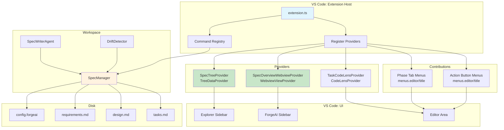

# ForgeAI Spec UI Architecture Design

## Kiro Spec UI — Complete Architecture Diagram

````
┌─────────────────────────────────────────────────────────────────────────────────────────────┐
│                                    VSCODE WINDOW                                            │
│                                                                                             │
│  ┌───────────────────────────────────────────────────────────────────────────────────────┐  │
│  │ ACTIVITY BAR                                                                          │  │
│  │  [ForgeAI]                                                                            │  │
│  │                                                                                       │  │
│  │  ┌───────────────────────────────────────────────────────────────────────────────┐   │  │
│  │  │ FORGEAI SIDEBAR PANEL (WebviewView)                                         │   │  │
│  │  │ ─────────────────────────────────────────                                   │   │  │
│  │  │                                                                               │   │  │
│  │  │  ┌─────────────────────────────────────┐                                    │   │  │
│  │  │  │ SPEC OVERVIEW                       │                                    │   │  │
│  │  │  │ ─────────────                       │                                    │   │  │
│  │  │  │  📝 browser-capability              │                                    │   │  │
│  │  │  │     Title: Browser Capability       │                                    │   │  │
│  │  │  │     Status: In Progress             │                                    │   │  │
│  │  │  │     Phase: 2 Design                 │                                    │   │  │
│  │  │  │                                     │                                    │   │  │
│  │  │  │  [Jump to latest]                   │                                    │   │  │
│  │  │  │  [Continue →]                       │                                    │   │  │
│  │  │  │                                     │                                    │   │  │
│  │  │  │  ⚠️ Drift detected (3 items)      │                                    │   │  │
│  │  │  └─────────────────────────────────────┘                                    │   │  │
│  │  │                                                                               │   │  │
│  │  │  ┌─────────────────────────────────────┐                                    │   │  │
│  │  │  │ AGENT HOOKS                         │                                    │   │  │
│  │  │  └─────────────────────────────────────┘                                    │   │  │
│  │  │                                                                               │   │  │
│  │  │  ┌─────────────────────────────────────┐                                    │   │  │
│  │  │  │ STEERING                            │                                    │   │  │
│  │  │  └─────────────────────────────────────┘                                    │   │  │
│  │  └───────────────────────────────────────────────────────────────────────────────┘   │  │
│  └───────────────────────────────────────────────────────────────────────────────────────┘  │
│                                                                                             │
│  ┌───────────────────────────────────────────────────────────────────────────────────────┐  │
│  │ EXPLORER SIDEBAR                                                                      │  │
│  │                                                                                       │  │
│  │  .forgeai/                                                                            │  │
│  │    specs/                                                                             │  │
│  │      browser-capability/                                                              │  │
│  │        config.forgeai                                                                 │  │
│  │        requirements.md                                                                │  │
│  │        design.md                                                                      │  │
│  │        tasks.md                                                                       │  │
│  │                                                                                       │  │
│  │  ┌─────────────────────────────────────┐                                             │  │
│  │  │ SPECS (TreeView)                    │ ← SpecTreeProvider                         │  │
│  │  │ ─────────────────                     │    forgeai.specTree                        │  │
│  │  │                                     │                                             │  │
│  │  │  ▼ browser-capability               │ ← SpecTreeItem                             │  │
│  │  │    ○ 1 Requirements ✓               │ ← PhaseTreeItem (completed)              │  │
│  │  │    ● 2 Design (current)               │ ← PhaseTreeItem (active)                   │  │
│  │  │    ○ 3 Task list                    │ ← PhaseTreeItem (pending)                  │  │
│  │  │    ⚠️ 3 drift items                │ ← DriftTreeItem                            │  │
│  │  │                                     │                                             │  │
│  │  │  ▼ simple-task-mgmt                 │                                             │  │
│  │  │    ● 1 Requirements (current)       │                                             │  │
│  │  │    ○ 2 Design                       │                                             │  │
│  │  │    ○ 3 Task list                    │                                             │  │
│  │  └─────────────────────────────────────┘                                             │  │
│  │                                                                                       │  │
│  │  OUTLINE                                                                              │  │
│  │  TIMELINE                                                                             │  │
│  └───────────────────────────────────────────────────────────────────────────────────────┘  │
│                                                                                             │
│  ┌───────────────────────────────────────────────────────────────────────────────────────┐  │
│  │ EDITOR AREA                                                                           │  │
│  │                                                                                       │  │
│  │  ┌───────────────────────────────────────────────────────────────────────────────┐   │  │
│  │  │ TAB BAR / BREADCRUMB                                                            │   │  │
│  │  │                                                                                 │   │  │
│  │  │  kiro > specs > browser-capability > design.md > Components                     │   │  │
│  │  │                                                                                 │   │  │
│  │  │  ┌─────────────────────────────────────────────────────────────────┬────────┬──────────┐ │   │  │
│  │  │  browser-capability    Requirements    >    2 Design    >    3 Task list    │ [Sync] │ [Continue│ │   │  │
│  │  │                       ↑ active (no #)   ↑ inactive    ↑ inactive           │  Files │   →]     │ │   │  │
│  │  │  └─────────────────────────────────────────────────────────────────┴────────┴──────────┘ │   │  │
│  │  │       ↑                                                          ↑          ↑            │   │  │
│  │  │   Spec name (req phase only)                                Editor Title     Editor Title  │   │  │
│  │  │   or first tab group                                         Phase Tabs       Action Buttons│   │  │
│  │  └───────────────────────────────────────────────────────────────────────────────┘   │  │
│  │                                                                                       │  │
│  │  ┌───────────────────────────────────────────────────────────────────────────────┐   │  │
│  │  │ NATIVE EDITOR — design.md                                                     │   │  │
│  │  │                                                                                 │   │  │
│  │  │  1  ## Components and Interfaces                                                │   │  │
│  │  │  2                                                                               │   │  │
│  │  │  3  ### ThemeToggle Component                                                   │   │  │
│  │  │  4  **Location**: `src/components/ThemeToggle.astro`                            │   │  │
│  │  │  5                                                                               │   │  │
│  │  │  6  **Features**:                                                               │   │  │
│  │  │  7  - Toggle button with sun/moon icons                                       │   │  │
│  │  │  8  - Smooth transition animations                                            │   │  │
│  │  │  9  - Accessible keyboard navigation                                          │   │  │
│  │  │  10                                                                               │   │  │
│  │  │  11 **Interface**:                                                              │   │  │
│  │  │  12 ```typescript                                                               │   │  │
│  │  │  13 interface ThemeToggleProps {                                              │   │  │
│  │  │  14   position?: 'fixed' | 'relative';                                        │   │  │
│  │  │  15   className?: string;                                                      │   │  │
│  │  │  16 }                                                                           │   │  │
│  │  │  17 ```                                                                         │   │  │
│  │  │                                                                                 │   │  │
│  │  │  ← All native VS Code: features:                                               │   │  │
│  │  │    Syntax highlighting, folding, search, edits                                  │   │  │
│  │  └───────────────────────────────────────────────────────────────────────────────┘   │  │
│  │                                                                                       │  │
│  └───────────────────────────────────────────────────────────────────────────────────────┘  │
│                                                                                             │
└─────────────────────────────────────────────────────────────────────────────────────────────┘
````

---

## When tasks.md is Active

```
┌─────────────────────────────────────────────────────────────────────┐
│ TAB BAR / BREADCRUMB                                                │
│                                                                     │
│  kiro > specs > browser-capability > tasks.md > Task 1              │
│                                                                     │
│  ┌───────────────────────────────────────────────────────────────┬────────┬──────────────┐ │
│  │ 1 Requirements    >    2 Design    >    Task list        │ [Sync] │ [▶ Run all  │ │
│  │  ↑ inactive (#)      ↑ inactive      ↑ active (no #)      │  Files │   tasks]    │ │
│  └───────────────────────────────────────────────────────────────┴────────┴──────────────┘ │
└─────────────────────────────────────────────────────────────────────┘

┌─────────────────────────────────────────────────────────────────────┐
│ NATIVE EDITOR — tasks.md                                            │
│                                                                     │
│  1  - [ ] 1. Implement ThemeToggle component                        │
│  2    - Create Astro component with toggle button                   │
│  3    - Add proper ARIA labels                                      │
│  4    [Start task]  ← CodeLens button                               │
│  5                                                                     │
│  6  - [x] 2. Update global styles                                   │
│  7    - Refactor color definitions                                  │
│  8    [Retry]  ← CodeLens button (completed)                        │
│  9                                                                     │
│  10 - [ ] 3. Add theme toggle to layout                             │
│  11   [Start task]  ← CodeLens button                               │
└─────────────────────────────────────────────────────────────────────┘
```

---

## Component Interaction Flow

```
┌─────────────────────────────────────────────────────────────────────────────┐
│                           DATA FLOW ARCHITECTURE                              │
└─────────────────────────────────────────────────────────────────────────────┘

  ┌──────────────┐
  │  USER CLICK  │
  │ Spec in Tree │
  └──────┬───────┘
         │
         ▼
  ┌──────────────────────────────────┐
  │  SpecTreeProvider.getChildren()  │
  │  Returns: SpecTreeItem[]         │
  │  - specId, title, phases[]       │
  │  - currentPhase, completed[]     │
  └──────┬───────────────────────────┘
         │
         │ click on phase
         ▼
  ┌──────────────────────────────────┐
  │  command: forgeai.spec.openPhase │
  │  arguments: [specId, phase]      │
  └──────┬───────────────────────────┘
         │
         ▼
  ┌──────────────────────────────────┐
  │  extension.openSpecPhase()       │
  │                                  │
  │  1. Get filePath from SpecManager │
  │     .forgeai/specs/{id}/{phase}.md│
  │                                  │
  │  2. vscode.workspace.            │
  │     openTextDocument(uri)        │
  │                                  │
  │  3. vscode.window.              │
  │     showTextDocument(doc)        │
  │     → Native editor opens        │
  └──────┬───────────────────────────┘
         │
         │ Editor becomes active
         ▼
  ┌──────────────────────────────────┐
  │  VS Code: evaluates when clause   │
  │                                  │
  │  resourcePath =~                  │
  │    /\.forgeai\/specs\/.*\/       │
  │    (requirements|design|tasks)     │
  │    \.md$/                        │
  │                                  │
  │  → TRUE: Show phase tabs         │
  │  → TRUE: Show action buttons     │
  └──────┬───────────────────────────┘
         │
         │ User clicks "Continue" or "Run all tasks"
         ▼
  ┌──────────────────────────────────┐
  │  Command executes:               │
  │  - forgeai.spec.continue         │
  │  - forgeai.spec.runAllTasks      │
  │                                  │
  │  1. Show progress notification   │
  │  2. Call SpecManager/Agent       │
  │  3. Generate next phase file     │
  │  4. Refresh SpecTreeProvider     │
  │  5. Open new phase file        │
  └──────┬───────────────────────────┘
         │
         ▼
  ┌──────────────────────────────────┐
  │  treeProvider.refresh()          │
  │  → Explorer tree updates         │
  │  → Phase icons update            │
  │  → Drift indicators refresh      │
  └──────────────────────────────────┘
```

---

## File Structure of Implementation

```
src/extension/
├── providers/
│   ├── SpecTreeProvider.ts          ← Explorer tree (EXISTS ✅)
│   ├── SpecOverviewWebviewProvider.ts ← ForgeAI sidebar panel (NEW)
│   └── TaskCodeLensProvider.ts      ← Inline task buttons (EXISTS ✅)
├── forgeaiWorkspace/
│   ├── SpecManager.ts               ← CRUD + metadata (EXISTS ✅)
│   ├── SpecWriterAgent.ts           ← AI generation (EXISTS ✅)
│   ├── DriftDetector.ts             ← Drift checking (EXISTS ✅)
│   └── DirectoryManager.ts          ← Workspace structure (EXISTS ✅)
├── extension.ts                     ← Commands + registration
└── package.json                     ← View contributions + menus
```

---

## Mermaid Diagram (Copy to Mermaid Live Editor)



---

## What I Got Wrong (Corrected)

### ❌ Mistake 1: SpecEditor Webview Panel

**Wrong:** Built `SpecEditorProvider.ts` as a full webview panel that replaces the native editor.

**Kiro Reality:** Uses **native VS Code: text editors** for all spec files. Phase navigation and action buttons are injected via `menus.editor/title` contributions.

**Fix:** Delete `SpecEditorProvider.ts`. Use `openTextDocument()` + `showTextDocument()` only.

---

### ❌ Mistake 2: Phase Tab Format

**Wrong:** Showed tabs side-by-side without separators, all with numbers.

**Kiro Reality (from images):**

- **Inactive phases:** `1 Requirements`, `2 Design`, `3 Task list` (with number prefix)
- **Active phase:** `Requirements`, `Design`, `Task list` (NO number prefix)
- **Separators:** `>` chevron between tabs
- Example (design active): `1 Requirements > Design > 3 Task list`
- Example (tasks active): `1 Requirements > 2 Design > Task list`

**Fix:** Use `menus.editor/title` with dynamic labels. Active command title = phase name only. Inactive command titles = `N Phase name`.

---

### ❌ Mistake 3: Spec Name in Title Bar

**Wrong:** Did not include the spec name in the editor title contribution.

**Kiro Reality (Image 1):** When on requirements phase, spec name `browser-capability` appears as a prefix before the phase tabs.

**Fix:** Add spec name label in editor title when spec file is active.

---

### ❌ Mistake 4: Action Button Icons

**Wrong:** Generic text buttons.

**Kiro Reality (Image 3):** `▶ Run all tasks` uses a play triangle icon, not just text.

**Fix:** Use `$(play)` icon for Run all tasks command in `package.json`.

---

## Corrected Component Map

| #   | UI Surface               | VS Code: API                                   | Implementation                   | Status         |
| --- | ------------------------ | ---------------------------------------------- | -------------------------------- | -------------- |
| 1   | Explorer Specs Tree      | `registerTreeDataProvider('forgeai.specTree')` | `SpecTreeProvider.ts`            | **✅ Built**   |
| 2   | Editor Phase Tabs        | `menus.editor/title` + `when` clauses          | `package.json` contributions     | **❌ Missing** |
| 3   | Editor Action Buttons    | `menus.editor/title` + commands                | `package.json` + `extension.ts`  | **❌ Missing** |
| 4   | Native Text Editor       | `workspace.openTextDocument()`                 | `extension.ts` `openSpecPhase()` | **✅ Built**   |
| 5   | Task CodeLens            | `registerCodeLensProvider()`                   | `TaskCodeLensProvider.ts`        | **✅ Built**   |
| 6   | ForgeAI Sidebar Overview | `registerWebviewViewProvider()`                | `SpecOverviewWebviewProvider.ts` | **❌ Missing** |

## Remaining Implementation Work

1. **Delete** `SpecEditorProvider.ts`
2. **Fix** `openSpecPhase()` — remove webview, always use native editor
3. **Add** editor title phase tab commands to `package.json`:
   - `forgeai.spec.phase.requirements` → label: `1 Requirements` or `Requirements` (when active)
   - `forgeai.spec.phase.design` → label: `2 Design` or `Design` (when active)
   - `forgeai.spec.phase.tasks` → label: `3 Task list` or `Task list` (when active)
4. **Add** `menus.editor/title` entries with `when` clauses matching `.forgeai/specs/*/{requirements,design,tasks}.md`
5. **Add** action buttons: `Sync Files`, `Continue →`, `▶ Run all tasks`
6. **Add** spec name label to editor title (when requirements phase active)
