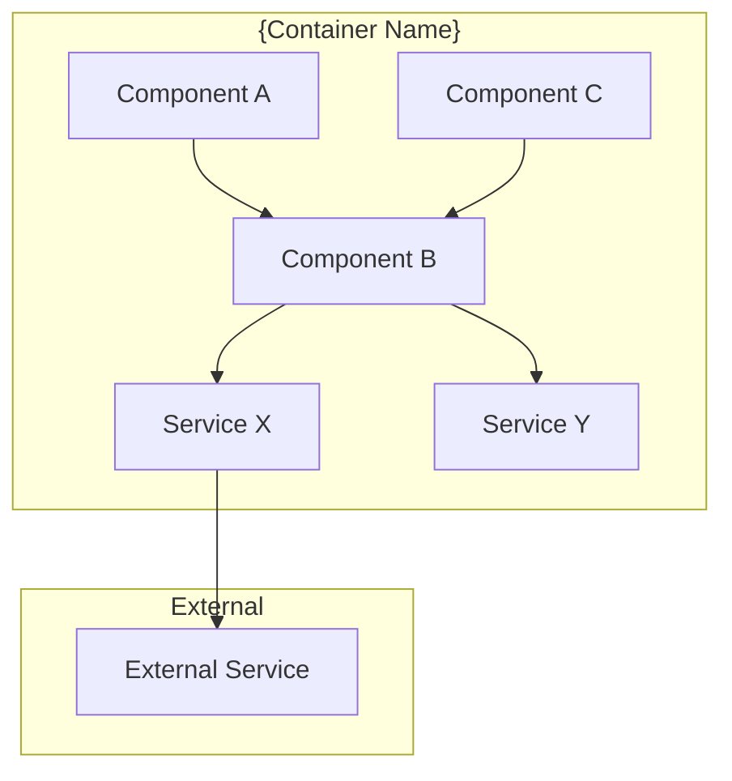
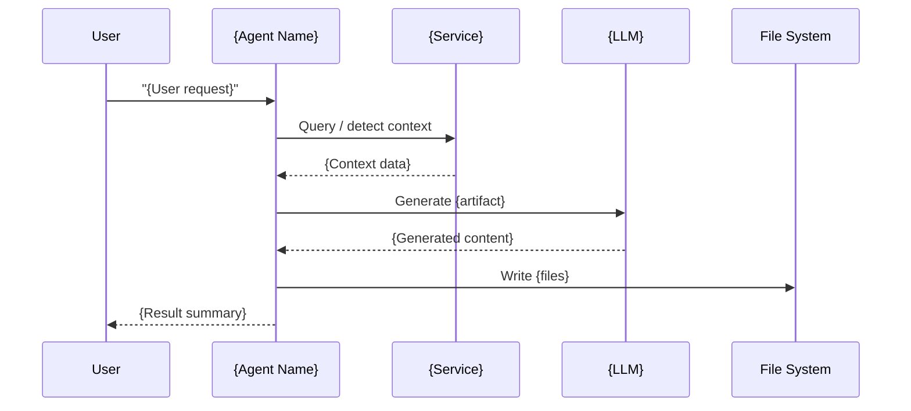

# Design Document: {SPEC_NAME}

## Overview

{One paragraph describing the high-level design approach.}

### Purpose

Enable {stakeholders} to:

- {First capability this design enables}
- {Second capability this design enables}
- {Third capability this design enables}
- {Continue as needed}

### Key Technical Decisions

| Decision              | Choice   | Rationale                  |
| --------------------- | -------- | -------------------------- |
| **{Technology Area}** | {Choice} | {Why this choice was made} |
| **{Technology Area}** | {Choice} | {Why this choice was made} |
| **{Technology Area}** | {Choice} | {Why this choice was made} |

### Constraints

- **{Constraint name}**: {Description}
- **{Constraint name}**: {Description}

---

## Architecture

### High-Level Architecture

```
┌─────────────────────────────────────────────────────────────────────────────┐
│                           {System Name}                                      │
│  ┌──────────────────┐  ┌──────────────────┐  ┌──────────────────┐            │
│  │   Component A    │  │   Component B    │  │   Component C    │            │
│  │  (Responsibility)│  │  (Responsibility)│  │  (Responsibility)│            │
│  └────────┬─────────┘  └────────▲─────────┘  └────────▲─────────┘            │
│           │                     │                     │                       │
│           ▼                     │                     │                       │
│  ┌────────────────────────────────────────────────────────────────┐         │
│  │                   Core Orchestrator                             │         │
│  └─────────────────────────┬───────────────────────────────────────┘         │
│                            │                                                  │
│           ┌────────────────┼────────────────┐                                 │
│           ▼                ▼                ▼                                 │
│  ┌──────────────┐  ┌──────────────┐  ┌──────────────┐                        │
│  │  Service X   │  │  Service Y   │  │  Service Z   │                        │
│  └──────────────┘  └──────────────┘  └──────────────┘                        │
└─────────────────────────────────────────────────────────────────────────────┘
```

### Component Diagram



### {Flow Name} Flow



---

## Components and Interfaces

### Core Components

#### 1. {Component Name}

{Description of what this component does.}

```typescript
/**
 * {Component Name} - {Brief description}
 *
 * Responsibilities:
 * - {First responsibility}
 * - {Second responsibility}
 * - {Third responsibility}
 */
export class {ComponentName} {
  readonly name = '{component-id}';
  readonly description = '{Human-readable description}';

  private {dependency}: {DependencyType};

  constructor(context: vscode.ExtensionContext) {
    this.{dependency} = new {DependencyType}();
  }

  /**
   * {What this method does}
   */
  {methodName}({params}: {Type}): {ReturnType} {
    // Implementation
  }
}
```

#### 2. {Component Name}

{Description}

```typescript
// Interface or class definition
```

---

## Data Model

### {Entity Name} Schema

- `{fieldName}`: `{Type}` — {Description}
- `{fieldName}`: `{Type}` — {Description}

---

## API Design

### {Endpoint/Tool Name}

- **Purpose**: {What this does}
- **Input**: {Schema}
- **Output**: {Schema}
- **Error cases**: {What can go wrong}

---

## Error Handling

### {Error Category}

- `{ErrorType}`: {When it occurs and how to handle it}

---

## Security Model

### Security Architecture

- **Layer 1: Input Validation**
  - Validate all URLs and inputs
  - Block file:// and internal IPs by default

- **Layer 2: Context Isolation**
  - Each session in isolated context
  - No cookie/session sharing between sessions
  - Clear all data on session close

- **Layer 3: Credential Protection**
  - Never auto-fill passwords
  - Never submit forms with password fields without consent
  - No external data transmission

- **Layer 4: Audit Logging**
  - Log all actions
  - Track history
  - Record security events

### Security Rules

1. **No External Transmission**
   - All operations execute locally
   - No data sent to cloud services
   - No telemetry on activity

2. **Credential Protection**
   - Never auto-fill passwords
   - Never submit forms with password fields without consent
   - Clear credential fields from memory after use

3. **Sensitive Site Detection**
   - Detect banking, email, healthcare sites
   - Prompt for user confirmation before navigation
   - Log sensitive site access attempts

4. **Context Isolation**
   - Each session in isolated context
   - No cookie/session sharing between contexts
   - Clear all data on session close

5. **URL Restrictions**
   - Block file:// URLs by default (configurable)
   - Block internal network IPs by default (configurable)
   - Validate URL scheme (http/https only)

---

## Performance Optimizations

### Resource Management

1. **Lazy Initialization**
   - Launch on first use, not on extension activation
   - Reduces startup time

2. **Context Reuse**
   - Reuse existing contexts when possible
   - Avoid creating new contexts for simple operations
   - Context pool for parallel operations

3. **Idle Cleanup**
   - Close after {N} minutes of inactivity
   - Configurable idle timeout
   - Clear resources on VS Code close

4. **Memory Limits**
   - Limit to {N}MB per instance
   - Close and restart if exceeded
   - Warn user if approaching limit

### Optimization Techniques

- Use accessibility snapshots instead of full HTML for AI context (4x token reduction)
- Parallel operations where possible with `Promise.all`
- Caching for repeated operations

---

## Testing Strategy

### Property-Based Tests

- **Property {N}: {Property Name}**
  - **Validates: Requirements {numbers}**
  - {Description of what this property checks}
